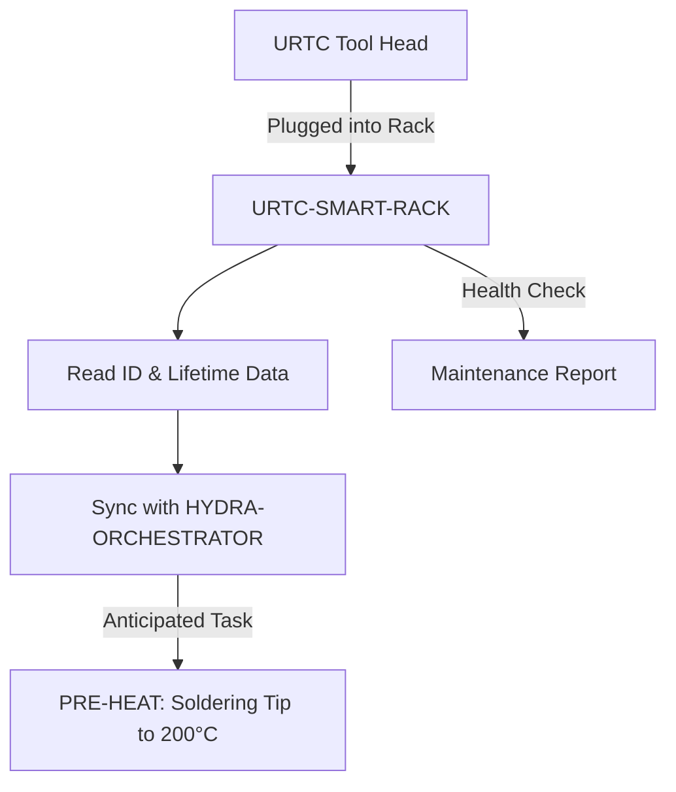

<p align="center">
  
</p>

# 🗄️ URTC-SMART-RACK

<p align="center">🇺🇸 <b>English</b> | <a href="README_spa.md">🇪🇸 Español</a> | <a href="README_fra.md">🇫🇷 Français</a> | <a href="README_ita.md">🇮🇹 Italiano</a> | <a href="README_deu.md">🇩🇪 Deutsch</a> | <a href="README_zho.md">🇨🇳 简体中文</a> | <a href="README_jpn.md">🇯🇵 日本語</a></p>

### 🤖 Intelligent End-Effector Management with Lifecycle & Thermal Tracking

<p align="left">
  
  
  
  
</p>

---

## 1. 🛠️ TECHNICAL OVERVIEW

**URTC-SMART-RACK** is an intelligent storage system for end-effectors within the HYDRA-UMC ecosystem. Based on the STM32G4 microcontroller, it monitors and prepares tools while they are not attached to a robot.

It enables "Smart Idle" modes, such as pre-heating T12 soldering tips just before a tool swap, and tracks the electronic ID, firmware version, and total usage cycles of every URTC head, ensuring optimal maintenance and zero-second deployment.

No PCB/schematic exists for this board yet (see `hardware/`), so nothing below can drive real GPIO/F-RAM/CAN hardware - but the *logic* those features boil down to (decoding an ID, tracking usage, deciding when to pre-heat and to what temperature) is real, pure C, unit-tested today.

### Key Features:
* ✅ **Real v0 - tool ID, lifecycle & pre-heat logic:** `tool_id.c` decodes a raw 5-bit ID reading into a tool identity; `lifecycle.c` tracks usage cycles/time and flags maintenance due; `preheat.c` decides when Smart Idle pre-heating should start and to what target temperature. 25 test assertions on the host's own C compiler - no PCB, GPIO driver, or F-RAM needed to run or test any of it.
* 🗄️ **Tool Tracking** — automatic identification of URTC heads via 5-bit ID jumpers or F-RAM. *(the ID-decoding logic itself is real - see above; reading real jumpers/F-RAM needs the PCB.)*
* 🌡️ **Pre-Heating Logic** — intelligent thermal management for soldering and hot-air tools. *(the activation decision and target temperatures are real - see above; driving a real heater needs the PCB.)*
* 📈 **Lifecycle Logs** — records total actuation cycles and hours of use into the tool's F-RAM. *(the counters and maintenance-due logic are real - see above; persisting them to real F-RAM needs the PCB.)*
* 📡 **CAN Integration** — communicates directly with the HYDRA-UMC Kinematic Brain for coordinated ATC (Auto Tool Change). *(the wire protocol itself - framing, CRC, command validation - is real, see below; a real CAN transceiver to actually carry it is still needed.)*
* 🔒 **Protocol Safety Limits** — real versioned framing with a CRC8 checksum, real actuation-range validation, and a real link-timeout/idempotency watchdog with a defined safe state. *(implemented)*
* ✅ **Cortex-M4F firmware toolchain** — a real bare-metal image (startup + linker + `main.c`) that cross-compiles and links with `arm-none-eabi-gcc`, the same toolchain sibling repo URTC uses. *(implemented — see BUILD below)*

---

## 2. 🔄 SMART RACK WORKFLOW



---

## 3. 🧱 ARCHITECTURE & DESIGN DECISIONS

* **Why this board has no real pinout/hardware ID defined yet.** There is no PCB for this board yet - `src/firmware_common.h` carries a version identity with no hardware ID, and the startup/linker files are hand-written placeholders standing in for ST's own CMSIS/HAL startup until a real STM32G4 part is pinned down.
* **Why it isn't a child of URTC itself.** URTC-SMART-RACK is a Complementary Tool, not a URTC-family child - it's a separate physical board (a tool storage rack, not a tool head) that happens to share URTC's own CAN bus and firmware conventions, not its integration hierarchy.
* **Why `bump_version.py` is a straight copy of URTC's own.** Same odometer versioning rule, same firmware-header format - reusing the exact script rather than reinventing it keeps the two in lockstep by construction.
* **Why `tool_id.c`/`lifecycle.c`/`preheat.c` ship before any GPIO/F-RAM/CAN driver.** Decoding an ID, accumulating usage, and deciding when to pre-heat are pure functions of data already in hand - they need no PCB to write or test, so v0 lands that logic first, host-tested with the machine's own C compiler rather than `arm-none-eabi-gcc`. The drivers that would actually source that data from real hardware come once the PCB exists.
* **How this fits the rest of the ecosystem.** Shares URTC's own CAN bus/tool ecosystem, and is a natural pairing with HYDRA-UMC-DETECTION-HEF for visually recognizing which tool is actually racked.
* **Why the protocol, command validation, and link watchdog are three separate modules.** `protocol.c` only knows about bytes, framing and a CRC - it has no idea what a "safe" temperature is. `rack_command.c` owns that judgment, decoding and range-checking a real command without caring how it arrived on the wire. `link_watchdog.c` tracks timeout/idempotency independently of both - a corrupted frame must never even reach it (see `test_rack_link_scenarios.c`'s own real assertion that a bad-CRC frame never revives the watchdog). Keeping these separate is what makes each one host-testable on its own, and keeps a future CAN receive handler thin - it calls each layer in order, it doesn't reimplement any of their judgment itself.
* **Why an unproven link is treated exactly like a dead one.** `link_watchdog_is_link_lost()` is true both after a real timeout AND before the very first frame has ever arrived - the promotion audit's own "estado seguro al arrancar". A rack that powers on with no host yet connected must start in the safe state, not silently assume "fine" until proven otherwise.

---

## 📂 DIRECTORY STRUCTURE

```text
URTC-SMART-RACK/
├── src/                            # Firmware source
│   ├── firmware_common.h           # FIRMWARE_VERSION_MAJOR/MINOR/PATCH
│   ├── tool_id.h / .c              # Real: 5-bit raw reading -> tool ID decoding
│   ├── lifecycle.h / .c            # Real: usage-cycle/time tracking, maintenance-due check
│   ├── preheat.h / .c              # Real: Smart Idle activation + target temperature + safe-state target
│   ├── protocol.h / .c             # Real: versioned frame format + CRC8 parse/encode
│   ├── rack_command.h / .c         # Real: command decode + actuation-limit validation
│   ├── link_watchdog.h / .c        # Real: link timeout + command idempotency
│   ├── main.c                      # Minimal entry point (proof-of-life heartbeat loop)
│   ├── startup_stm32g4_minimal.c   # Vector table + Reset_Handler (no ST HAL yet, see file header)
│   └── STM32G4_MINIMAL.ld          # Placeholder linker script (128K FLASH / 32K RAM floor)
├── tests/                          # Real host-native test harness (tool_id, lifecycle, preheat, protocol, rack_command, link_watchdog, rack link scenarios)
├── docs/                           # Documentation and user manual - empty, not created yet
├── hardware/                       # Hardware design files (PCB, 3D) - empty, no schematic yet
├── firmware/                       # Versioned build output (.bin/.elf/.hex), committed like sibling repo URTC
├── build/                          # Intermediate build objects (gitignored)
├── images/                         # Media and diagrams
├── tools/
│   ├── build_test.py               # Non-versioning build/compile check
│   └── ci_validate.py              # Manifest/CHANGELOG/docs validation used by CI
├── bump_version.py                 # Odometer-style version bump (generic, shared with URTC)
├── bump_manifest_version.py        # Syncs hydra-umc.project.json's version to the native one (--sync)
├── build_firmware.sh / .bat        # Real build: host tests + bump version + compile + link + publish
├── build-test.sh / .bat            # Non-versioning build/compile check
└── README.md
```

---

## 4. ⚙️ BUILD

Requires the ARM GNU Toolchain (`arm-none-eabi-gcc`, `arm-none-eabi-objcopy`, `arm-none-eabi-size`) and Python 3.

```bash
# Linux/macOS
chmod +x build_firmware.sh   # one-time
./build_firmware.sh

# Windows
build_firmware.bat
```

The build first compiles and runs `tests/` against the *host's own* C compiler (never `arm-none-eabi-gcc` - these are pure-logic tests, no MCU registers touched) and fails the whole build if any assertion fails. Only then does it bump `src/firmware_common.h`'s version (odometer rule, same as the rest of the ecosystem), compile `main.c` and `startup_stm32g4_minimal.c` for Cortex-M4F, link them against the placeholder `STM32G4_MINIMAL.ld` memory map, and publish versioned `.elf`/`.bin`/`.hex` files to `firmware/`.

There is nothing to flash to real hardware yet — no PCB exists to confirm the target STM32G4 part, pinout, or its real flash/RAM sizes. The linker script's memory map is a conservative placeholder (documented in its own header comment) that will be replaced once real hardware exists, the same point at which `startup_stm32g4_minimal.c`'s hand-written vector table gets replaced by ST's own CMSIS/HAL startup code (mirroring sibling repo URTC's `src/F303-master/` for its STM32F303 boards).

Real example - the host-side tests run standalone too, useful to check the logic without a full firmware build:

```bash
cc -std=c11 -Wall -Wextra -Isrc -Itests -o build/host_tests \
  tests/test_main.c tests/test_tool_id.c tests/test_lifecycle.c tests/test_preheat.c \
  tests/test_protocol.c tests/test_rack_command.c tests/test_link_watchdog.c tests/test_rack_link_scenarios.c \
  src/tool_id.c src/lifecycle.c src/preheat.c src/protocol.c src/rack_command.c src/link_watchdog.c
./build/host_tests
# All tests passed.
```

---

## 5. 📋 CHANGELOG

See [`CHANGELOG.md`](CHANGELOG.md) for the full version history — every real build bumps `src/firmware_common.h`'s version automatically (odometer rule, see BUILD above), and each bump gets its own entry there.

---

## 🔗 Related Projects

This project is part of the HYDRA-UMC robotics ecosystem by the same author (JuanenRac / Electro Hobby 3D). Worth knowing about, since a request might actually be about one of these rather than this repository.

**Directly Related**
- **[URTC](https://github.com/JuanenRac/URTC)** — firmware for the physical Universal Robot Tool Controller PCB, 25+ tool profiles over CAN bus — the same tool ecosystem, over the same CAN bus.
- **[HYDRA-UMC-DETECTION-HEF](https://github.com/JuanenRac/HYDRA-UMC-DETECTION-HEF)** — real compiled-model registry with Hailo-architecture/checksum safe-load verification — provides the visual recognition of the tools this rack stores.

**Also Part of the Ecosystem**

*Core Hardware & Platform*
- **[HYDRA-UMC](https://github.com/JuanenRac/HYDRA-UMC)** — the physical robot-arm motherboard: CM5 host + dual-core STM32H745, orchestrating up to 8 tool arms over CAN-OTA/SPI-OTA.
- **[HYDRA-UMC-OS](https://github.com/JuanenRac/HYDRA-UMC-OS)** — reproducible Raspberry Pi OS product layer for the CM5: read-only agent, validated config/profiles, WiFi first-contact provisioning.
- **[HYDRA-UMC-SDK](https://github.com/JuanenRac/HYDRA-UMC-SDK)** — the shared JSON-Schema contract and safety-gate boundary every bridge validates its commands against.

*Core Backend & Clients*
- **[HYDRA-UMC-SERVER](https://github.com/JuanenRac/HYDRA-UMC-SERVER)** — the real headless backend (REST/WebSocket) every control client actually talks to.
- **[HYDRA-UMC-STUDIO](https://github.com/JuanenRac/HYDRA-UMC-STUDIO)** — web control dashboard with real-time multi-robot 3D visualization.
- **[HYDRA-UMC-SUITE](https://github.com/JuanenRac/HYDRA-UMC-SUITE)** — desktop (PySide6) swarm command center for multiple servers at once, packaged as a standalone executable.
- **[HYDRA-UMC-ANDROID-CONTROL](https://github.com/JuanenRac/HYDRA-UMC-ANDROID-CONTROL)** — native Android control app with biometric login and a paired Wear OS companion.
- **[HYDRA-UMC-IOS-CONTROL](https://github.com/JuanenRac/HYDRA-UMC-IOS-CONTROL)** — iOS/iPadOS control app (Flutter) with real-time WebSocket sync.
- **[HYDRA-UMC-DSI](https://github.com/JuanenRac/HYDRA-UMC-DSI)** — native touch UI for the onboard 7" DSI touchscreen, embedded on the CM5 itself.
- **[HYDRA-UMC-EDITOR-URDF](https://github.com/JuanenRac/HYDRA-UMC-EDITOR-URDF)** — desktop graphical URDF creator/editor that pushes finished models into STUDIO's own catalog.
- **[HYDRA-UMC-BRIDGE-AMR](https://github.com/JuanenRac/HYDRA-UMC-BRIDGE-AMR)** — coordination boundary for AGV/AMR fleets via a real VDA 5050 MQTT publisher.
- **[HYDRA-UMC-BRIDGE-CNC](https://github.com/JuanenRac/HYDRA-UMC-BRIDGE-CNC)** — high-level CNC-cell coordinator with real GRBL status/control-byte access.
- **[HYDRA-UMC-BRIDGE-DROIDS](https://github.com/JuanenRac/HYDRA-UMC-BRIDGE-DROIDS)** — coordination boundary for legged/humanoid droids, with a real Boston Dynamics Spot command sender.
- **[HYDRA-UMC-BRIDGE-LASER](https://github.com/JuanenRac/HYDRA-UMC-BRIDGE-LASER)** — laser-cell safety coordinator reading 3 real key/enclosure/interlock GPIO safeguards.
- **[HYDRA-UMC-BRIDGE-OPENPNP](https://github.com/JuanenRac/HYDRA-UMC-BRIDGE-OPENPNP)** — safe high-level board-flow coordinator for OpenPnP pick-and-place.
- **[HYDRA-UMC-BRIDGE-PRINTER3D](https://github.com/JuanenRac/HYDRA-UMC-BRIDGE-PRINTER3D)** — safe coordination boundary for Moonraker/Klipper 3D printers, with real gated job commands.
- **[HYDRA-UMC-BRIDGE-ROS2](https://github.com/JuanenRac/HYDRA-UMC-BRIDGE-ROS2)** — safety coordinator with a real, lazily-imported rclpy ROS 2 transport.
- **[HYDRA-UMC-BRIDGE-UAV](https://github.com/JuanenRac/HYDRA-UMC-BRIDGE-UAV)** — coordination boundary for camera-equipped UAVs, with a real MAVLink command sender.

*URTC Tool Platform*
- **[URTC-FLASHER](https://github.com/JuanenRac/URTC-FLASHER)** — desktop GUI flashing tool for URTC boards, CAN-OTA plus full-chip SWD/JTAG.
- **[URTC-TESTER](https://github.com/JuanenRac/URTC-TESTER)** — desktop live CAN-bus diagnostic tool for URTC boards, one panel per tool profile.
- **[URTC-WEB-STUDIO](https://github.com/JuanenRac/URTC-WEB-STUDIO)** — browser-based alternative to URTC-TESTER via the Web Serial API, no local install needed.

*Vision AI Node (Hailo-8)*
- **[HYDRA-UMC-VISION-NODE](https://github.com/JuanenRac/HYDRA-UMC-VISION-NODE)** — integration hub for the Hailo-8 vision pipeline, with a real per-stage hardware-readiness check.
- **[HYDRA-UMC-VISION-STREAMER](https://github.com/JuanenRac/HYDRA-UMC-VISION-STREAMER)** — real GStreamer pipeline + MediaMTX config generator with a real HailoRT integration boundary.
- **[HYDRA-UMC-VISUAL-SERVOING-API](https://github.com/JuanenRac/HYDRA-UMC-VISUAL-SERVOING-API)** — real Position-Based Visual Servoing correction law, safety-gated on upstream zone state.
- **[HYDRA-UMC-SAFETY-ZONES](https://github.com/JuanenRac/HYDRA-UMC-SAFETY-ZONES)** — real zone-breach checking and E-STOP requesting, with calibration-freshness enforcement.

*Cognitive AI Node (Hailo-10)*
- **[HYDRA-UMC-COGNITIVE-NODE](https://github.com/JuanenRac/HYDRA-UMC-COGNITIVE-NODE)** — integration hub for the Hailo-10 cognitive pipeline (LLM/VLA/voice orchestration).
- **[HYDRA-UMC-VLA-ENGINE](https://github.com/JuanenRac/HYDRA-UMC-VLA-ENGINE)** — real action-token encoding/decoding and trajectory generation for a Vision-Language-Action model.
- **[HYDRA-UMC-VOICE-UI](https://github.com/JuanenRac/HYDRA-UMC-VOICE-UI)** — real voice front-end (VAD + intent parser) with a bounded, confirmation-gated Watch relay.
- **[HYDRA-UMC-SEMANTIC-PLANNER](https://github.com/JuanenRac/HYDRA-UMC-SEMANTIC-PLANNER)** — real rule-based task decomposition and semantic error recovery over MCU error codes.
- **[HYDRA-UMC-DOCS-QA](https://github.com/JuanenRac/HYDRA-UMC-DOCS-QA)** — real stdlib-only TF-IDF document search over this ecosystem's own Markdown docs.

*Orchestration & Swarm*
- **[HYDRA-UMC-ORCHESTRATOR](https://github.com/JuanenRac/HYDRA-UMC-ORCHESTRATOR)** — integration hub with a real gRPC/Protobuf health-report contract and mission state machine.
- **[HYDRA-UMC-JOB-DISPATCHER](https://github.com/JuanenRac/HYDRA-UMC-JOB-DISPATCHER)** — real priority-based job queue with deduplication, over a real HTTP API.
- **[HYDRA-UMC-NODE-HEALING](https://github.com/JuanenRac/HYDRA-UMC-NODE-HEALING)** — real gRPC-based fleet health watchdog with retry/backoff and identity-mismatch detection.
- **[HYDRA-UMC-PATH-PLANNER-3D](https://github.com/JuanenRac/HYDRA-UMC-PATH-PLANNER-3D)** — real RRT-based 3D path planner with real obstacle/workspace collision validation.
- **[HYDRA-UMC-SWARM-SYNC](https://github.com/JuanenRac/HYDRA-UMC-SWARM-SYNC)** — real CRDT LWW-Element-Map state sync, property-tested for multi-cell convergence.

*Digital Twin & Simulation*
- **[HYDRA-UMC-TWIN](https://github.com/JuanenRac/HYDRA-UMC-TWIN)** — integration hub for the digital-twin engine, with a real version-compatibility sync contract.
- **[HYDRA-UMC-HIL-BRIDGE](https://github.com/JuanenRac/HYDRA-UMC-HIL-BRIDGE)** — real hardware-in-the-loop safety interlock routing commands between simulation and real hardware.
- **[HYDRA-UMC-PHYSICS-REPLICA](https://github.com/JuanenRac/HYDRA-UMC-PHYSICS-REPLICA)** — real forward kinematics and joint-limit validation over a real URDF subset.
- **[HYDRA-UMC-SYNTHETIC-DATA-GEN](https://github.com/JuanenRac/HYDRA-UMC-SYNTHETIC-DATA-GEN)** — real procedural 2D scene generator with YOLO/COCO annotation export.

*Data & Analytics*
- **[HYDRA-UMC-DATALAKE](https://github.com/JuanenRac/HYDRA-UMC-DATALAKE)** — real sqlite3-backed time-series store with a real ingest/query HTTP API.
- **[HYDRA-UMC-ANOMALY-DETECTOR](https://github.com/JuanenRac/HYDRA-UMC-ANOMALY-DETECTOR)** — real FFT + statistical baseline anomaly detector with drift monitoring.
- **[HYDRA-UMC-PRODUCTION-REPORTS](https://github.com/JuanenRac/HYDRA-UMC-PRODUCTION-REPORTS)** — real OEE/availability calculation over DATALAKE history, with reproducible CSV export.
- **[HYDRA-UMC-TELEMETRY-COLLECTOR](https://github.com/JuanenRac/HYDRA-UMC-TELEMETRY-COLLECTOR)** — real CAN/WebSocket ingestion pipeline into DATALAKE, with sequence deduplication.

*Industrial Gateway*
- **[HYDRA-UMC-GATEWAY-INDUSTRIAL](https://github.com/JuanenRac/HYDRA-UMC-GATEWAY-INDUSTRIAL)** — integration hub relaying to industrial protocols, with a real command allowlist/backpressure layer.
- **[HYDRA-UMC-OPCUA-SERVER](https://github.com/JuanenRac/HYDRA-UMC-OPCUA-SERVER)** — real OPC-UA address space, verified with a real binary-protocol client session.
- **[HYDRA-UMC-MQTT-BROKER](https://github.com/JuanenRac/HYDRA-UMC-MQTT-BROKER)** — real MQTT broker with optional per-client authentication and topic ACLs.
- **[HYDRA-UMC-MTCONNECT-ADAPTER](https://github.com/JuanenRac/HYDRA-UMC-MTCONNECT-ADAPTER)** — real MTConnect `/probe` and `/current` XML endpoints with degraded-mode output.

*Complementary Tools & Ecosystem Operations*
- **[HYDRA-UMC-DASHBOARD-AI](https://github.com/JuanenRac/HYDRA-UMC-DASHBOARD-AI)** — Smart Summaries and Anomaly Highlighting panels over DATALAKE/ANOMALY-DETECTOR, with an honest statistical fallback.
- **[HYDRA-UMC-TOOL-CLI](https://github.com/JuanenRac/HYDRA-UMC-TOOL-CLI)** — fleet CLI with a real, stable exit-code contract, a genuine live client of HYDRA-UMC-SERVER's own API.
- **[HYDRA-UMC-WATCH](https://github.com/JuanenRac/HYDRA-UMC-WATCH)** — WearOS companion app with real haptic alerts and a paired-phone voice relay.
- **[URTC-VISION-TOOL](https://github.com/JuanenRac/URTC-VISION-TOOL)** — firmware plus a real Python vision companion for a thermal/RGB inspection tool head.
- **[HYDRA-UMC-UPDATER](https://github.com/JuanenRac/HYDRA-UMC-UPDATER)** — administrative desktop tool that discovers, clones and updates every repo in this ecosystem.
- **[HYDRA-UMC-OS-REBUILDER](https://github.com/JuanenRac/HYDRA-UMC-OS-REBUILDER)** — Windows/Linux desktop tool that builds a ready-to-flash CM5 image pre-loaded with the ecosystem's most current versions, with Raspberry-Pi-Imager-style first-boot Wi-Fi/user/SSH configuration.


---

## 📚 Documentation & Community

- **[CONTRIBUTING.md](CONTRIBUTING.md)** — tech stack and coding guidelines for a pull request.
- **[CODE_OF_CONDUCT.md](CODE_OF_CONDUCT.md)** — the standards of behavior expected in this community.
- **[SECURITY.md](SECURITY.md)** — how to report a vulnerability, and this project's own real security focus areas.
- **[SUPPORT.md](SUPPORT.md)** — where to ask questions and report bugs.
- **[LICENSE.md](LICENSE.md)** — this project's own license.

## 👤 AUTHOR
**JuanenRac** (Electro Hobby 3D)
📧 electrohobby3d@gmail.com
📺 [youtube.com/@electrohobby3d](https://youtube.com/@electrohobby3d)

## 📜 LICENSE
GPL-3.0 - See LICENSE for details.
