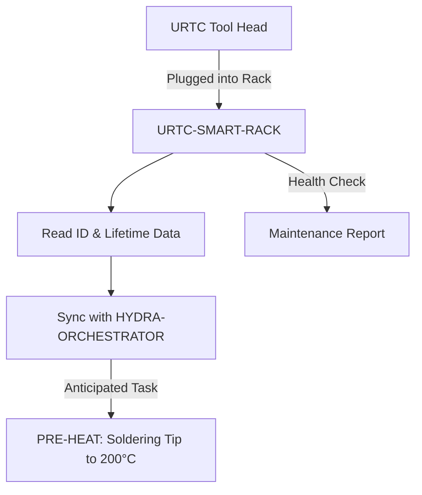

<p align="center">
  
</p>

# 🗄️ URTC-SMART-RACK

<p align="center">🇺🇸 <b>English</b> | <a href="README_spa.md">🇪🇸 Español</a> | <a href="README_fra.md">🇫🇷 Français</a> | <a href="README_ita.md">🇮🇹 Italiano</a> | <a href="README_deu.md">🇩🇪 Deutsch</a> | <a href="README_zho.md">🇨🇳 简体中文</a> | <a href="README_jpn.md">🇯🇵 日本語</a></p>

### 🤖 Intelligent End-Effector Management with Lifecycle & Thermal Tracking

<p align="left">
  
  
  
  
</p>

---

## 1. 🛠️ TECHNICAL OVERVIEW

**URTC-SMART-RACK** is an intelligent storage system for end-effectors within the HYDRA-UMC ecosystem. Based on the STM32G4 microcontroller, it monitors and prepares tools while they are not attached to a robot.

It enables "Smart Idle" modes, such as pre-heating T12 soldering tips just before a tool swap, and tracks the electronic ID, firmware version, and total usage cycles of every URTC head, ensuring optimal maintenance and zero-second deployment.

No PCB/schematic exists for this board yet (see `hardware/`) - the features below describe the target design; only the firmware toolchain itself is real today.

### Key Features:
* 🗄️ **Tool Tracking** — automatic identification of URTC heads via 5-bit ID jumpers or F-RAM. *(planned — needs the real PCB)*
* 🌡️ **Pre-Heating Logic** — intelligent thermal management for soldering and hot-air tools. *(planned)*
* 📈 **Lifecycle Logs** — records total actuation cycles and hours of use into the tool's F-RAM. *(planned)*
* 📡 **CAN Integration** — communicates directly with the HYDRA-UMC Kinematic Brain for coordinated ATC (Auto Tool Change). *(planned)*
* ✅ **Cortex-M4F firmware toolchain** — a real bare-metal image (startup + linker + `main.c`) that cross-compiles and links with `arm-none-eabi-gcc`, the same toolchain sibling repo URTC uses. *(implemented — see BUILD below)*

---

## 2. 🔄 SMART RACK WORKFLOW



---

## 3. 🧱 ARCHITECTURE & DESIGN DECISIONS

* **Why this board has no real pinout/hardware ID defined yet.** There is no PCB for this board yet - `src/firmware_common.h` carries a version identity with no hardware ID, and the startup/linker files are hand-written placeholders standing in for ST's own CMSIS/HAL startup until a real STM32G4 part is pinned down.
* **Why it isn't a child of URTC itself.** URTC-SMART-RACK is a Complementary Tool, not a URTC-family child - it's a separate physical board (a tool storage rack, not a tool head) that happens to share URTC's own CAN bus and firmware conventions, not its integration hierarchy.
* **Why `bump_version.py` is a straight copy of URTC's own.** Same odometer versioning rule, same firmware-header format - reusing the exact script rather than reinventing it keeps the two in lockstep by construction.
* **How this fits the rest of the ecosystem.** Shares URTC's own CAN bus/tool ecosystem, and is a natural pairing with HYDRA-UMC-DETECTION-HEF for visually recognizing which tool is actually racked.

---

## 📂 DIRECTORY STRUCTURE

```text
URTC-SMART-RACK/
├── src/                            # Firmware source
│   ├── firmware_common.h           # FIRMWARE_VERSION_MAJOR/MINOR/PATCH = 0.0.0
│   ├── main.c                      # Minimal entry point (proof-of-life heartbeat loop)
│   ├── startup_stm32g4_minimal.c   # Vector table + Reset_Handler (no ST HAL yet, see file header)
│   └── STM32G4_MINIMAL.ld          # Placeholder linker script (128K FLASH / 32K RAM floor)
├── docs/                           # Documentation and user manual
├── hardware/                       # Hardware design files (PCB, 3D) - empty, no schematic yet
├── firmware/                       # Versioned build output (.bin/.elf/.hex), committed like sibling repo URTC
├── build/                          # Intermediate build objects (gitignored)
├── images/                         # Media and diagrams
├── scripts/                        # Utility scripts
├── bump_version.py                 # Odometer-style version bump (generic, shared with URTC)
├── build_firmware.sh / .bat        # Real build: bump version + compile + link + publish to firmware/
└── README.md
```

---

## 4. ⚙️ BUILD

Requires the ARM GNU Toolchain (`arm-none-eabi-gcc`, `arm-none-eabi-objcopy`, `arm-none-eabi-size`) and Python 3.

```bash
# Linux/macOS
chmod +x build_firmware.sh   # one-time
./build_firmware.sh

# Windows
build_firmware.bat
```

The build bumps `src/firmware_common.h`'s version (odometer rule, same as the rest of the ecosystem), compiles `main.c` and `startup_stm32g4_minimal.c` for Cortex-M4F, links them against the placeholder `STM32G4_MINIMAL.ld` memory map, and publishes versioned `.elf`/`.bin`/`.hex` files to `firmware/`.

There is nothing to flash to real hardware yet — no PCB exists to confirm the target STM32G4 part, pinout, or its real flash/RAM sizes. The linker script's memory map is a conservative placeholder (documented in its own header comment) that will be replaced once real hardware exists, the same point at which `startup_stm32g4_minimal.c`'s hand-written vector table gets replaced by ST's own CMSIS/HAL startup code (mirroring sibling repo URTC's `src/F303-master/` for its STM32F303 boards).

---

## 🔗 Related Projects

This project is part of a larger robotics ecosystem by the same author (JuanenRac / Electro Hobby 3D), spanning firmware, control software, AI nodes, and fleet tooling. Worth knowing about, since a request might actually be about one of these rather than this repository.

### Directly Related

- **[URTC](https://github.com/JuanenRac/URTC)** — same tool ecosystem / CAN bus.
- **[HYDRA-UMC-DETECTION-HEF](https://github.com/JuanenRac/HYDRA-UMC-DETECTION-HEF)** — visual recognition of the tools this rack stores.

### Rest of the Ecosystem

**HYDRA-UMC platform** — the multi-robot micro-factory cell
- **[HYDRA-UMC](https://github.com/JuanenRac/HYDRA-UMC)** — the CM5 + STM32H745 motherboard orchestrating up to 8 robot arms.
- **[HYDRA-UMC-SERVER](https://github.com/JuanenRac/HYDRA-UMC-SERVER)** — the Express/WebSocket backend every control client talks to.
- **[HYDRA-UMC-STUDIO](https://github.com/JuanenRac/HYDRA-UMC-STUDIO)** — web-based control dashboard, multi-robot 3D visualization.
- **[HYDRA-UMC-ANDROID-CONTROL](https://github.com/JuanenRac/HYDRA-UMC-ANDROID-CONTROL)** — Android control app over Wi-Fi/Bluetooth.
- **[HYDRA-UMC-IOS-CONTROL](https://github.com/JuanenRac/HYDRA-UMC-IOS-CONTROL)** — iOS/iPadOS control app built in Flutter.
- **[HYDRA-UMC-SUITE](https://github.com/JuanenRac/HYDRA-UMC-SUITE)** — desktop swarm command center (Python/PySide6).
- **[HYDRA-UMC-EDITOR-URDF](https://github.com/JuanenRac/HYDRA-UMC-EDITOR-URDF)** — desktop URDF model editor for the robot catalog.
- **[HYDRA-UMC-DSI](https://github.com/JuanenRac/HYDRA-UMC-DSI)** — native touch UI for the onboard DSI touchscreen.

**URTC platform** — the tool head controller every HYDRA-UMC robot arm carries
- **[URTC](https://github.com/JuanenRac/URTC)** — CAN bus tool head controller, 25 tool profiles.
- **[URTC-FLASHER](https://github.com/JuanenRac/URTC-FLASHER)** — desktop CAN-OTA + SWD/JTAG flashing tool.
- **[URTC-TESTER](https://github.com/JuanenRac/URTC-TESTER)** — desktop live CAN-bus diagnostic tool.
- **[URTC-WEB-STUDIO](https://github.com/JuanenRac/URTC-WEB-STUDIO)** — browser-based alternative via Web Serial API.

**🎥 Vision AI Node (Hailo-8)**
- [HYDRA-UMC-VISION-NODE](https://github.com/JuanenRac/HYDRA-UMC-VISION-NODE)
- [HYDRA-UMC-VISION-STREAMER](https://github.com/JuanenRac/HYDRA-UMC-VISION-STREAMER)
- [HYDRA-UMC-DETECTION-HEF](https://github.com/JuanenRac/HYDRA-UMC-DETECTION-HEF)
- [HYDRA-UMC-SAFETY-ZONES](https://github.com/JuanenRac/HYDRA-UMC-SAFETY-ZONES)
- [HYDRA-UMC-VISUAL-SERVOING-API](https://github.com/JuanenRac/HYDRA-UMC-VISUAL-SERVOING-API)

**🧠 Cognitive AI Node (Hailo-10)**
- [HYDRA-UMC-COGNITIVE-NODE](https://github.com/JuanenRac/HYDRA-UMC-COGNITIVE-NODE)
- [HYDRA-UMC-VLA-ENGINE](https://github.com/JuanenRac/HYDRA-UMC-VLA-ENGINE)
- [HYDRA-UMC-VOICE-UI](https://github.com/JuanenRac/HYDRA-UMC-VOICE-UI)
- [HYDRA-UMC-SEMANTIC-PLANNER](https://github.com/JuanenRac/HYDRA-UMC-SEMANTIC-PLANNER)
- [HYDRA-UMC-DOCS-QA](https://github.com/JuanenRac/HYDRA-UMC-DOCS-QA)

**🐝 Orchestration & Swarm**
- [HYDRA-UMC-ORCHESTRATOR](https://github.com/JuanenRac/HYDRA-UMC-ORCHESTRATOR)
- [HYDRA-UMC-SWARM-SYNC](https://github.com/JuanenRac/HYDRA-UMC-SWARM-SYNC)
- [HYDRA-UMC-PATH-PLANNER-3D](https://github.com/JuanenRac/HYDRA-UMC-PATH-PLANNER-3D)
- [HYDRA-UMC-JOB-DISPATCHER](https://github.com/JuanenRac/HYDRA-UMC-JOB-DISPATCHER)
- [HYDRA-UMC-NODE-HEALING](https://github.com/JuanenRac/HYDRA-UMC-NODE-HEALING)

**🎮 Digital Twin & Simulation**
- [HYDRA-UMC-TWIN](https://github.com/JuanenRac/HYDRA-UMC-TWIN)
- [HYDRA-UMC-PHYSICS-REPLICA](https://github.com/JuanenRac/HYDRA-UMC-PHYSICS-REPLICA)
- [HYDRA-UMC-HIL-BRIDGE](https://github.com/JuanenRac/HYDRA-UMC-HIL-BRIDGE)
- [HYDRA-UMC-SYNTHETIC-DATA-GEN](https://github.com/JuanenRac/HYDRA-UMC-SYNTHETIC-DATA-GEN)

**📊 Data & Analytics**
- [HYDRA-UMC-DATALAKE](https://github.com/JuanenRac/HYDRA-UMC-DATALAKE)
- [HYDRA-UMC-TELEMETRY-COLLECTOR](https://github.com/JuanenRac/HYDRA-UMC-TELEMETRY-COLLECTOR)
- [HYDRA-UMC-ANOMALY-DETECTOR](https://github.com/JuanenRac/HYDRA-UMC-ANOMALY-DETECTOR)
- [HYDRA-UMC-PRODUCTION-REPORTS](https://github.com/JuanenRac/HYDRA-UMC-PRODUCTION-REPORTS)

**🏭 Industrial Gateway**
- [HYDRA-UMC-GATEWAY-INDUSTRIAL](https://github.com/JuanenRac/HYDRA-UMC-GATEWAY-INDUSTRIAL)
- [HYDRA-UMC-OPCUA-SERVER](https://github.com/JuanenRac/HYDRA-UMC-OPCUA-SERVER)
- [HYDRA-UMC-MQTT-BROKER](https://github.com/JuanenRac/HYDRA-UMC-MQTT-BROKER)
- [HYDRA-UMC-MTCONNECT-ADAPTER](https://github.com/JuanenRac/HYDRA-UMC-MTCONNECT-ADAPTER)

**🛠️ Complementary Tools**
- [URTC-VISION-TOOL](https://github.com/JuanenRac/URTC-VISION-TOOL)
- [HYDRA-UMC-WATCH](https://github.com/JuanenRac/HYDRA-UMC-WATCH)
- [HYDRA-UMC-TOOL-CLI](https://github.com/JuanenRac/HYDRA-UMC-TOOL-CLI)
- [HYDRA-UMC-DASHBOARD-AI](https://github.com/JuanenRac/HYDRA-UMC-DASHBOARD-AI)


## 👤 AUTHOR
**JuanenRac** (Electro Hobby 3D)
📧 electrohobby3d@gmail.com

## 📜 LICENSE
GPL-3.0 - See LICENSE for details.
