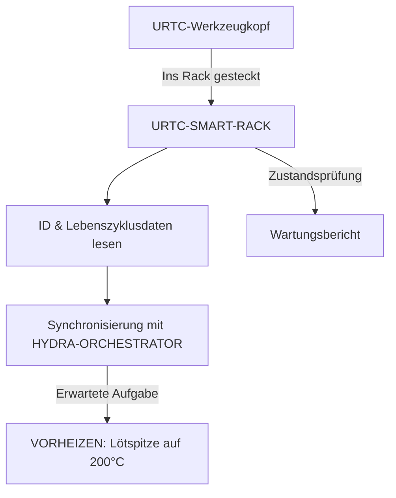

<p align="center">
  
</p>

# 🗄️ URTC-SMART-RACK

<p align="center"><a href="README.md">🇺🇸 English</a> | <a href="README_spa.md">🇪🇸 Español</a> | <a href="README_fra.md">🇫🇷 Français</a> | <a href="README_ita.md">🇮🇹 Italiano</a> | 🇩🇪 <b>Deutsch</b> | <a href="README_zho.md">🇨🇳 简体中文</a> | <a href="README_jpn.md">🇯🇵 日本語</a></p>

### 🤖 Intelligentes Werkzeugkopf-Management mit Lebenszyklus- und Temperaturüberwachung

<p align="left">
  
  
  
  
</p>

---

## 1. 🛠️ TECHNISCHER ÜBERBLICK

**URTC-SMART-RACK** ist ein intelligentes Lagersystem für Werkzeugköpfe innerhalb des HYDRA-UMC-Ökosystems. Basierend auf dem STM32G4-Mikrocontroller überwacht und bereitet es Werkzeuge vor, während sie nicht an einem Roboter angebracht sind.

Es ermöglicht "Smart Idle"-Modi, etwa das Vorheizen von T12-Lötspitzen kurz vor einem Werkzeugwechsel, und verfolgt die elektronische ID, Firmware-Version und die Gesamtzahl der Nutzungszyklen jedes URTC-Kopfes, was optimale Wartung und einen Einsatz in null Sekunden gewährleistet.

Für diese Platine existiert noch keine PCB/kein Schaltplan (siehe `hardware/`) - die unten beschriebenen Funktionen beschreiben das Zieldesign; heute ist nur die Firmware-Toolchain selbst real.

### Hauptmerkmale:
* 🗄️ **Werkzeugverfolgung** — automatische Identifikation von URTC-Köpfen über 5-Bit-ID-Jumper oder F-RAM. *(geplant — benötigt die echte PCB)*
* 🌡️ **Vorheiz-Logik** — intelligentes Temperaturmanagement für Löt- und Heißluftwerkzeuge. *(geplant)*
* 📈 **Lebenszyklus-Protokolle** — zeichnet die Gesamtzahl der Betätigungszyklen und Betriebsstunden im F-RAM des Werkzeugs auf. *(geplant)*
* 📡 **CAN-Integration** — kommuniziert direkt mit dem HYDRA-UMC-Kinematik-Gehirn für koordinierten ATC (automatischen Werkzeugwechsel). *(geplant)*
* ✅ **Cortex-M4F-Firmware-Toolchain** — ein echtes Bare-Metal-Image (Startup + Linker + `main.c`), das mit `arm-none-eabi-gcc` wirklich kompiliert und gelinkt wird, derselben Toolchain, die auch das Schwester-Repository URTC nutzt. *(implementiert — siehe BUILD unten)*

---

## 2. 🔄 SMART-RACK-WORKFLOW



---

## 3. 🧱 ARCHITEKTUR & DESIGNENTSCHEIDUNGEN

* **Warum diese Platine noch kein echtes Pinout/keine echte Hardware-ID definiert hat.** Es gibt noch keine PCB für diese Platine - `src/firmware_common.h` trägt eine Versionsidentität ohne Hardware-ID, und die Startup-/Linker-Dateien sind handgeschriebene Platzhalter, die den eigenen CMSIS/HAL-Start von ST ersetzen, bis ein echtes STM32G4-Bauteil feststeht.
* **Warum es kein Kind von URTC selbst ist.** URTC-SMART-RACK ist ein ergänzendes Werkzeug, kein Kind der URTC-Familie - es ist eine separate physische Platine (ein Werkzeug-Lagerregal, kein Werkzeugkopf), die den eigenen CAN-Bus und die Firmware-Konventionen von URTC teilt, nicht dessen Integrationshierarchie.
* **Warum `bump_version.py` eine direkte Kopie des eigenen Skripts von URTC ist.** Gleiche Kilometerzähler-Versionierungsregel, gleiches Firmware-Header-Format - das exakte Skript wiederzuverwenden statt es neu zu erfinden, hält beide durch Konstruktion synchron.
* **Wie sich das ins restliche Ökosystem einfügt.** Teilt den eigenen CAN-Bus/das Werkzeug-Ökosystem von URTC und bildet ein natürliches Paar mit HYDRA-UMC-DETECTION-HEF, um visuell zu erkennen, welches Werkzeug tatsächlich eingelagert ist.

---

## 📂 VERZEICHNISSTRUKTUR

```text
URTC-SMART-RACK/
├── src/                            # Firmware-Quellcode
│   ├── firmware_common.h           # FIRMWARE_VERSION_MAJOR/MINOR/PATCH = 0.0.0
│   ├── main.c                      # Minimaler Einstiegspunkt (Lebenszeichen-Schleife)
│   ├── startup_stm32g4_minimal.c   # Vektortabelle + Reset_Handler (noch keine ST-HAL, siehe Datei-Header)
│   └── STM32G4_MINIMAL.ld          # Platzhalter-Linkerskript (Untergrenze 128K FLASH / 32K RAM)
├── docs/                           # Dokumentation und Benutzerhandbuch
├── hardware/                       # Hardware-Design-Dateien (PCB, 3D) - leer, noch kein Schaltplan
├── firmware/                       # Versionierte Build-Ausgabe (.bin/.elf/.hex), eingecheckt wie im Schwester-Repo URTC
├── build/                          # Zwischen-Build-Objekte (von git ignoriert)
├── images/                         # Medien und Diagramme
├── scripts/                        # Hilfsskripte
├── bump_version.py                 # Versionserhöhung nach Kilometerzähler-Prinzip (generisch, geteilt mit URTC)
├── build_firmware.sh / .bat        # Echter Build: Version erhöhen + kompilieren + linken + nach firmware/ veröffentlichen
└── README.md
```

---

## 4. ⚙️ BUILD

Erfordert die ARM-GNU-Toolchain (`arm-none-eabi-gcc`, `arm-none-eabi-objcopy`, `arm-none-eabi-size`) und Python 3.

```bash
# Linux/macOS
chmod +x build_firmware.sh   # einmalig
./build_firmware.sh

# Windows
build_firmware.bat
```

Der Build erhöht die Version von `src/firmware_common.h` (Kilometerzähler-Regel, wie im übrigen Ökosystem), kompiliert `main.c` und `startup_stm32g4_minimal.c` für Cortex-M4F, linkt sie gegen die Platzhalter-Speicherkarte `STM32G4_MINIMAL.ld` und veröffentlicht versionierte `.elf`/`.bin`/`.hex`-Dateien in `firmware/`.

Es gibt noch nichts, was auf echte Hardware geflasht werden könnte - es existiert keine PCB, die das Ziel-STM32G4-Modell, das Pinout oder die realen Flash-/RAM-Größen bestätigt. Die Speicherkarte des Linkerskripts ist ein konservativer Platzhalter (in seinem eigenen Header dokumentiert), der ersetzt wird, sobald echte Hardware existiert - zu demselben Zeitpunkt, an dem die handgeschriebene Vektortabelle von `startup_stm32g4_minimal.c` durch STs eigenen CMSIS/HAL-Startupcode ersetzt wird (nach dem Muster des Schwester-Repos URTC in `src/F303-master/` für dessen STM32F303-Platinen).

---

## 🔗 Verwandte Projekte

Dieses Projekt ist Teil eines größeren Robotik-Ökosystems desselben Autors (JuanenRac / Electro Hobby 3D), das Firmware, Steuerungssoftware, KI-Knoten und Flotten-Tools umfasst. Gut zu wissen, denn eine Anfrage könnte tatsächlich eines dieser Projekte betreffen statt dieses Repository.

### Direkte Beziehung

- **[URTC](https://github.com/JuanenRac/URTC)** — gleiches Werkzeug-Ökosystem / CAN-Bus.
- **[HYDRA-UMC-DETECTION-HEF](https://github.com/JuanenRac/HYDRA-UMC-DETECTION-HEF)** — visuelle Erkennung der in diesem Rack gelagerten Werkzeuge.

### Restliches Ökosystem

**HYDRA-UMC-Plattform** — die Multi-Roboter-Mikrofabrikzelle
- **[HYDRA-UMC](https://github.com/JuanenRac/HYDRA-UMC)** — das CM5 + STM32H745-Motherboard, das bis zu 8 Roboterarme orchestriert.
- **[HYDRA-UMC-SERVER](https://github.com/JuanenRac/HYDRA-UMC-SERVER)** — das Express/WebSocket-Backend, mit dem jeder Steuerungsclient spricht.
- **[HYDRA-UMC-STUDIO](https://github.com/JuanenRac/HYDRA-UMC-STUDIO)** — webbasiertes Steuerungs-Dashboard, Multi-Roboter-3D-Visualisierung.
- **[HYDRA-UMC-ANDROID-CONTROL](https://github.com/JuanenRac/HYDRA-UMC-ANDROID-CONTROL)** — Android-Steuerungs-App über Wi-Fi/Bluetooth.
- **[HYDRA-UMC-IOS-CONTROL](https://github.com/JuanenRac/HYDRA-UMC-IOS-CONTROL)** — iOS/iPadOS-Steuerungs-App, gebaut in Flutter.
- **[HYDRA-UMC-SUITE](https://github.com/JuanenRac/HYDRA-UMC-SUITE)** — Desktop-Schwarm-Kommandozentrale (Python/PySide6).
- **[HYDRA-UMC-EDITOR-URDF](https://github.com/JuanenRac/HYDRA-UMC-EDITOR-URDF)** — Desktop-URDF-Modelleditor für den Roboterkatalog.
- **[HYDRA-UMC-DSI](https://github.com/JuanenRac/HYDRA-UMC-DSI)** — native Touch-UI für den eingebauten DSI-Touchscreen.

**URTC-Plattform** — der Werkzeugkopf-Controller, den jeder HYDRA-UMC-Roboterarm trägt
- **[URTC](https://github.com/JuanenRac/URTC)** — CAN-Bus-Werkzeugkopf-Controller, 25 Werkzeugprofile.
- **[URTC-FLASHER](https://github.com/JuanenRac/URTC-FLASHER)** — Desktop-Tool für CAN-OTA + SWD/JTAG-Flashing.
- **[URTC-TESTER](https://github.com/JuanenRac/URTC-TESTER)** — Desktop-Tool für Live-CAN-Bus-Diagnose.
- **[URTC-WEB-STUDIO](https://github.com/JuanenRac/URTC-WEB-STUDIO)** — browserbasierte Alternative über die Web-Serial-API.

**🎥 Vision AI Node (Hailo-8)**
- [HYDRA-UMC-VISION-NODE](https://github.com/JuanenRac/HYDRA-UMC-VISION-NODE)
- [HYDRA-UMC-VISION-STREAMER](https://github.com/JuanenRac/HYDRA-UMC-VISION-STREAMER)
- [HYDRA-UMC-DETECTION-HEF](https://github.com/JuanenRac/HYDRA-UMC-DETECTION-HEF)
- [HYDRA-UMC-SAFETY-ZONES](https://github.com/JuanenRac/HYDRA-UMC-SAFETY-ZONES)
- [HYDRA-UMC-VISUAL-SERVOING-API](https://github.com/JuanenRac/HYDRA-UMC-VISUAL-SERVOING-API)

**🧠 Cognitive AI Node (Hailo-10)**
- [HYDRA-UMC-COGNITIVE-NODE](https://github.com/JuanenRac/HYDRA-UMC-COGNITIVE-NODE)
- [HYDRA-UMC-VLA-ENGINE](https://github.com/JuanenRac/HYDRA-UMC-VLA-ENGINE)
- [HYDRA-UMC-VOICE-UI](https://github.com/JuanenRac/HYDRA-UMC-VOICE-UI)
- [HYDRA-UMC-SEMANTIC-PLANNER](https://github.com/JuanenRac/HYDRA-UMC-SEMANTIC-PLANNER)
- [HYDRA-UMC-DOCS-QA](https://github.com/JuanenRac/HYDRA-UMC-DOCS-QA)

**🐝 Orchestration & Swarm**
- [HYDRA-UMC-ORCHESTRATOR](https://github.com/JuanenRac/HYDRA-UMC-ORCHESTRATOR)
- [HYDRA-UMC-SWARM-SYNC](https://github.com/JuanenRac/HYDRA-UMC-SWARM-SYNC)
- [HYDRA-UMC-PATH-PLANNER-3D](https://github.com/JuanenRac/HYDRA-UMC-PATH-PLANNER-3D)
- [HYDRA-UMC-JOB-DISPATCHER](https://github.com/JuanenRac/HYDRA-UMC-JOB-DISPATCHER)
- [HYDRA-UMC-NODE-HEALING](https://github.com/JuanenRac/HYDRA-UMC-NODE-HEALING)

**🎮 Digital Twin & Simulation**
- [HYDRA-UMC-TWIN](https://github.com/JuanenRac/HYDRA-UMC-TWIN)
- [HYDRA-UMC-PHYSICS-REPLICA](https://github.com/JuanenRac/HYDRA-UMC-PHYSICS-REPLICA)
- [HYDRA-UMC-HIL-BRIDGE](https://github.com/JuanenRac/HYDRA-UMC-HIL-BRIDGE)
- [HYDRA-UMC-SYNTHETIC-DATA-GEN](https://github.com/JuanenRac/HYDRA-UMC-SYNTHETIC-DATA-GEN)

**📊 Data & Analytics**
- [HYDRA-UMC-DATALAKE](https://github.com/JuanenRac/HYDRA-UMC-DATALAKE)
- [HYDRA-UMC-TELEMETRY-COLLECTOR](https://github.com/JuanenRac/HYDRA-UMC-TELEMETRY-COLLECTOR)
- [HYDRA-UMC-ANOMALY-DETECTOR](https://github.com/JuanenRac/HYDRA-UMC-ANOMALY-DETECTOR)
- [HYDRA-UMC-PRODUCTION-REPORTS](https://github.com/JuanenRac/HYDRA-UMC-PRODUCTION-REPORTS)

**🏭 Industrial Gateway**
- [HYDRA-UMC-GATEWAY-INDUSTRIAL](https://github.com/JuanenRac/HYDRA-UMC-GATEWAY-INDUSTRIAL)
- [HYDRA-UMC-OPCUA-SERVER](https://github.com/JuanenRac/HYDRA-UMC-OPCUA-SERVER)
- [HYDRA-UMC-MQTT-BROKER](https://github.com/JuanenRac/HYDRA-UMC-MQTT-BROKER)
- [HYDRA-UMC-MTCONNECT-ADAPTER](https://github.com/JuanenRac/HYDRA-UMC-MTCONNECT-ADAPTER)

**🛠️ Complementary Tools**
- [URTC-VISION-TOOL](https://github.com/JuanenRac/URTC-VISION-TOOL)
- [HYDRA-UMC-WATCH](https://github.com/JuanenRac/HYDRA-UMC-WATCH)
- [HYDRA-UMC-TOOL-CLI](https://github.com/JuanenRac/HYDRA-UMC-TOOL-CLI)
- [HYDRA-UMC-DASHBOARD-AI](https://github.com/JuanenRac/HYDRA-UMC-DASHBOARD-AI)


## 👤 AUTOR
**JuanenRac** (Electro Hobby 3D)
📧 electrohobby3d@gmail.com

## 📜 LIZENZ
GPL-3.0 - Siehe LICENSE für Details.
