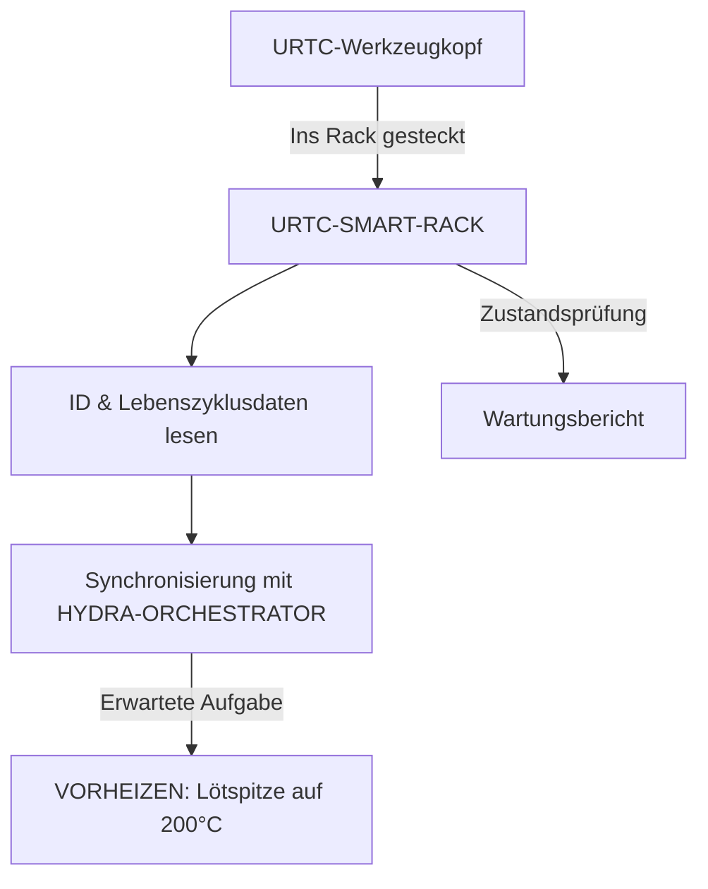

<p align="center">
  
</p>

# 🗄️ URTC-SMART-RACK

<p align="center"><a href="README.md">🇺🇸 English</a> | <a href="README_spa.md">🇪🇸 Español</a> | <a href="README_fra.md">🇫🇷 Français</a> | <a href="README_ita.md">🇮🇹 Italiano</a> | 🇩🇪 <b>Deutsch</b> | <a href="README_zho.md">🇨🇳 简体中文</a> | <a href="README_jpn.md">🇯🇵 日本語</a></p>

### 🤖 Intelligentes Werkzeugkopf-Management mit Lebenszyklus- und Temperaturüberwachung

<p align="left">
  
  
  
  
</p>

---

## 1. 🛠️ TECHNISCHER ÜBERBLICK

**URTC-SMART-RACK** ist ein intelligentes Lagersystem für Werkzeugköpfe innerhalb des HYDRA-UMC-Ökosystems. Basierend auf dem STM32G4-Mikrocontroller überwacht und bereitet es Werkzeuge vor, während sie nicht an einem Roboter angebracht sind.

Es ermöglicht "Smart Idle"-Modi, etwa das Vorheizen von T12-Lötspitzen kurz vor einem Werkzeugwechsel, und verfolgt die elektronische ID, Firmware-Version und die Gesamtzahl der Nutzungszyklen jedes URTC-Kopfes, was optimale Wartung und einen Einsatz in null Sekunden gewährleistet.

Für diese Platine existiert noch keine PCB/kein Schaltplan (siehe `hardware/`), also kann nichts davon echte GPIO/F-RAM/CAN-Hardware ansteuern - aber die *Logik*, auf die sich diese Funktionen reduzieren (eine ID dekodieren, die Nutzung verfolgen, entscheiden, wann und auf welche Temperatur vorgeheizt werden soll), ist real, reines C, heute unit-getestet.

### Hauptmerkmale:
* ✅ **Echtes v0 - ID-, Lebenszyklus- & Vorheiz-Logik:** `tool_id.c` dekodiert eine rohe 5-Bit-ID-Ablesung in eine Werkzeugidentität; `lifecycle.c` verfolgt Nutzungszyklen/-zeit und markiert fällige Wartung; `preheat.c` entscheidet, wann das Smart-Idle-Vorheizen starten soll und auf welche Zieltemperatur. 25 Test-Assertions mit dem eigenen C-Compiler des Hosts - keine PCB, kein GPIO-Treiber, kein F-RAM nötig, um all das auszuführen oder zu testen.
* 🗄️ **Werkzeugverfolgung** — automatische Identifikation von URTC-Köpfen über 5-Bit-ID-Jumper oder F-RAM. *(die ID-Dekodierlogik selbst ist real - siehe oben; echte Jumper/F-RAM auszulesen benötigt die PCB.)*
* 🌡️ **Vorheiz-Logik** — intelligentes Temperaturmanagement für Löt- und Heißluftwerkzeuge. *(die Aktivierungsentscheidung und Zieltemperaturen sind real - siehe oben; einen echten Heizer anzusteuern benötigt die PCB.)*
* 📈 **Lebenszyklus-Protokolle** — zeichnet die Gesamtzahl der Betätigungszyklen und Betriebsstunden im F-RAM des Werkzeugs auf. *(die Zähler und die Logik für fällige Wartung sind real - siehe oben; sie in echtem F-RAM zu persistieren benötigt die PCB.)*
* 📡 **CAN-Integration** — kommuniziert direkt mit dem HYDRA-UMC-Kinematik-Gehirn für koordinierten ATC (automatischen Werkzeugwechsel). *(das Drahtprotokoll selbst - Framing, CRC, Befehlsvalidierung - ist real, siehe unten; ein echter CAN-Transceiver, um es tatsächlich zu übertragen, wird noch benötigt.)*
* 🔒 **Protokoll-Sicherheitsgrenzen** — echtes versioniertes Framing mit einer CRC8-Prüfsumme, echte Aktuierungsbereichs-Validierung und ein echter Link-Timeout-/Idempotenz-Watchdog mit einem definierten sicheren Zustand. *(implementiert)*
* ✅ **Cortex-M4F-Firmware-Toolchain** — ein echtes Bare-Metal-Image (Startup + Linker + `main.c`), das mit `arm-none-eabi-gcc` wirklich kompiliert und gelinkt wird, derselben Toolchain, die auch das Schwester-Repository URTC nutzt. *(implementiert — siehe BUILD unten)*

---

## 2. 🔄 SMART-RACK-WORKFLOW



---

## 3. 🧱 ARCHITEKTUR & DESIGNENTSCHEIDUNGEN

* **Warum diese Platine noch kein echtes Pinout/keine echte Hardware-ID definiert hat.** Es gibt noch keine PCB für diese Platine - `src/firmware_common.h` trägt eine Versionsidentität ohne Hardware-ID, und die Startup-/Linker-Dateien sind handgeschriebene Platzhalter, die den eigenen CMSIS/HAL-Start von ST ersetzen, bis ein echtes STM32G4-Bauteil feststeht.
* **Warum es kein Kind von URTC selbst ist.** URTC-SMART-RACK ist ein ergänzendes Werkzeug, kein Kind der URTC-Familie - es ist eine separate physische Platine (ein Werkzeug-Lagerregal, kein Werkzeugkopf), die den eigenen CAN-Bus und die Firmware-Konventionen von URTC teilt, nicht dessen Integrationshierarchie.
* **Warum `bump_version.py` eine direkte Kopie des eigenen Skripts von URTC ist.** Gleiche Kilometerzähler-Versionierungsregel, gleiches Firmware-Header-Format - das exakte Skript wiederzuverwenden statt es neu zu erfinden, hält beide durch Konstruktion synchron.
* **Warum `tool_id.c`/`lifecycle.c`/`preheat.c` vor jedem GPIO/F-RAM/CAN-Treiber kommen.** Eine ID zu dekodieren, Nutzung zu akkumulieren und zu entscheiden, wann vorgeheizt werden soll, sind reine Funktionen bereits vorhandener Daten - sie brauchen keine PCB, um geschrieben oder getestet zu werden, also liefert v0 diese Logik zuerst, host-getestet mit dem eigenen C-Compiler der Maschine statt `arm-none-eabi-gcc`. Die Treiber, die diese Daten tatsächlich von echter Hardware beziehen würden, kommen, sobald die PCB existiert.
* **Wie sich das ins restliche Ökosystem einfügt.** Teilt den eigenen CAN-Bus/das Werkzeug-Ökosystem von URTC und bildet ein natürliches Paar mit HYDRA-UMC-DETECTION-HEF, um visuell zu erkennen, welches Werkzeug tatsächlich eingelagert ist.
* **Warum Protokoll, Befehlsvalidierung und Link-Watchdog drei getrennte Module sind.** `protocol.c` kennt nur Bytes, Framing und eine CRC - es hat keine Ahnung, was eine "sichere" Temperatur ist. `rack_command.c` besitzt dieses Urteil, dekodiert und prüft den Bereich eines echten Befehls, ohne sich darum zu kümmern, wie er auf der Leitung ankam. `link_watchdog.c` verfolgt Timeout/Idempotenz unabhängig von beiden - ein beschädigter Frame darf ihn niemals überhaupt erreichen (siehe die eigene echte Assertion von `test_rack_link_scenarios.c`, dass ein Frame mit falscher CRC den Watchdog niemals wiederbelebt). Sie getrennt zu halten macht jedes einzeln host-testbar und hält einen künftigen CAN-Empfangshandler schlank - er ruft jede Schicht der Reihe nach auf, er implementiert das Urteil keiner von ihnen neu.
* **Warum eine unbewiesene Verbindung genau wie eine tote behandelt wird.** `link_watchdog_is_link_lost()` ist sowohl nach einem echten Timeout wahr ALS AUCH bevor der allererste Frame überhaupt angekommen ist - das eigene Promotion-Audit nennt es "estado seguro al arrancar". Ein Rack, das ohne bereits verbundenen Host hochfährt, muss im sicheren Zustand starten, statt stillschweigend "alles in Ordnung" anzunehmen, bis das Gegenteil bewiesen ist.

---

## 📂 VERZEICHNISSTRUKTUR

```text
URTC-SMART-RACK/
├── src/                            # Firmware-Quellcode
│   ├── firmware_common.h           # FIRMWARE_VERSION_MAJOR/MINOR/PATCH
│   ├── tool_id.h / .c              # Echt: Dekodierung roher 5-Bit-Ablesung -> Werkzeug-ID
│   ├── lifecycle.h / .c            # Echt: Verfolgung Nutzungszyklen/-zeit, Prüfung fälliger Wartung
│   ├── preheat.h / .c              # Echt: Smart-Idle-Aktivierung + Zieltemperatur + Ziel für sicheren Zustand
│   ├── protocol.h / .c             # Echt: versioniertes Frame-Format + CRC8-Parsing/-Kodierung
│   ├── rack_command.h / .c         # Echt: Befehlsdekodierung + Aktuierungsgrenzen-Validierung
│   ├── link_watchdog.h / .c        # Echt: Link-Timeout + Befehls-Idempotenz
│   ├── main.c                      # Minimaler Einstiegspunkt (Lebenszeichen-Schleife)
│   ├── startup_stm32g4_minimal.c   # Vektortabelle + Reset_Handler (noch keine ST-HAL, siehe Datei-Header)
│   └── STM32G4_MINIMAL.ld          # Platzhalter-Linkerskript (Untergrenze 128K FLASH / 32K RAM)
├── tests/                          # Echtes host-natives Test-Harness (tool_id, lifecycle, preheat, protocol, rack_command, link_watchdog, Rack-Link-Szenarien)
├── docs/                           # Dokumentation und Benutzerhandbuch - leer, noch nicht angelegt
├── hardware/                       # Hardware-Design-Dateien (PCB, 3D) - leer, noch kein Schaltplan
├── firmware/                       # Versionierte Build-Ausgabe (.bin/.elf/.hex), eingecheckt wie im Schwester-Repo URTC
├── build/                          # Zwischen-Build-Objekte (von git ignoriert)
├── images/                         # Medien und Diagramme
├── tools/
│   ├── build_test.py               # Build-/Kompilierprüfung ohne Versionserhöhung
│   └── ci_validate.py              # Manifest-/CHANGELOG-/Doku-Validierung, von der CI genutzt
├── bump_version.py                 # Versionserhöhung nach Kilometerzähler-Prinzip (generisch, geteilt mit URTC)
├── bump_manifest_version.py        # Synchronisiert die Version von hydra-umc.project.json mit der nativen (--sync)
├── build_firmware.sh / .bat        # Echter Build: Host-Tests + Version erhöhen + kompilieren + linken + veröffentlichen
├── build-test.sh / .bat            # Build-/Kompilierprüfung ohne Versionserhöhung
└── README.md
```

---

## 4. ⚙️ BUILD

Erfordert die ARM-GNU-Toolchain (`arm-none-eabi-gcc`, `arm-none-eabi-objcopy`, `arm-none-eabi-size`) und Python 3.

```bash
# Linux/macOS
chmod +x build_firmware.sh   # einmalig
./build_firmware.sh

# Windows
build_firmware.bat
```

Der Build kompiliert und führt zuerst `tests/` mit dem C-Compiler des *Hosts selbst* aus (nie `arm-none-eabi-gcc` - das sind reine Logik-Tests, keine MCU-Register werden angefasst) und lässt den gesamten Build fehlschlagen, falls eine Assertion fehlschlägt. Erst danach erhöht er die Version von `src/firmware_common.h` (Kilometerzähler-Regel, wie im übrigen Ökosystem), kompiliert `main.c` und `startup_stm32g4_minimal.c` für Cortex-M4F, linkt sie gegen die Platzhalter-Speicherkarte `STM32G4_MINIMAL.ld` und veröffentlicht versionierte `.elf`/`.bin`/`.hex`-Dateien in `firmware/`.

Es gibt noch nichts, was auf echte Hardware geflasht werden könnte - es existiert keine PCB, die das Ziel-STM32G4-Modell, das Pinout oder die realen Flash-/RAM-Größen bestätigt. Die Speicherkarte des Linkerskripts ist ein konservativer Platzhalter (in seinem eigenen Header dokumentiert), der ersetzt wird, sobald echte Hardware existiert - zu demselben Zeitpunkt, an dem die handgeschriebene Vektortabelle von `startup_stm32g4_minimal.c` durch STs eigenen CMSIS/HAL-Startupcode ersetzt wird (nach dem Muster des Schwester-Repos URTC in `src/F303-master/` für dessen STM32F303-Platinen).

Echtes Beispiel - die Host-seitigen Tests laufen auch eigenständig, nützlich um die Logik ohne vollständigen Firmware-Build zu prüfen:

```bash
cc -std=c11 -Wall -Wextra -Isrc -Itests -o build/host_tests \
  tests/test_main.c tests/test_tool_id.c tests/test_lifecycle.c tests/test_preheat.c \
  tests/test_protocol.c tests/test_rack_command.c tests/test_link_watchdog.c tests/test_rack_link_scenarios.c \
  src/tool_id.c src/lifecycle.c src/preheat.c src/protocol.c src/rack_command.c src/link_watchdog.c
./build/host_tests
# All tests passed.
```

---

## 5. 📋 CHANGELOG

Siehe [`CHANGELOG.md`](CHANGELOG.md) für die vollständige Versionshistorie — jeder echte Build erhöht automatisch die Version von `src/firmware_common.h` (Kilometerzähler-Regel, siehe BUILD oben), und jede Erhöhung hat dort ihren eigenen Eintrag.

---

## 🔗 Verwandte Projekte

Dieses Projekt ist Teil des HYDRA-UMC-Robotik-Ökosystems desselben Autors (JuanenRac / Electro Hobby 3D). Gut zu wissen, da eine Anfrage eigentlich eines dieser Projekte betreffen könnte statt dieses Repositorys.

**Direkt verwandt**
- **[URTC](https://github.com/JuanenRac/URTC)** — Firmware für die physische Universal-Robot-Tool-Controller-Platine, 25+ Werkzeugprofile über CAN-Bus — dasselbe Werkzeug-Ökosystem, über denselben CAN-Bus.
- **[HYDRA-UMC-DETECTION-HEF](https://github.com/JuanenRac/HYDRA-UMC-DETECTION-HEF)** — echte Registry für kompilierte Modelle mit Hailo-Architektur-/Prüfsummen-Safe-Load-Verifizierung — liefert die visuelle Erkennung der Werkzeuge, die dieses Regal lagert.

**Ebenfalls Teil des Ökosystems**

*Kern-Hardware & Plattform*
- **[HYDRA-UMC](https://github.com/JuanenRac/HYDRA-UMC)** — das physische Motherboard des Roboterarms: CM5-Host + Dual-Core-STM32H745, koordiniert bis zu 8 Werkzeugarme über CAN-OTA/SPI-OTA.
- **[HYDRA-UMC-OS](https://github.com/JuanenRac/HYDRA-UMC-OS)** — reproduzierbare Raspberry-Pi-OS-Produktschicht für den CM5: schreibgeschützter Agent, validierte Konfiguration/Profile, WiFi-Ersteinrichtung.
- **[HYDRA-UMC-SDK](https://github.com/JuanenRac/HYDRA-UMC-SDK)** — der gemeinsame JSON-Schema-Vertrag und die Sicherheitsschranke, gegen die jede Bridge ihre Befehle validiert.

*Kern-Backend & Clients*
- **[HYDRA-UMC-SERVER](https://github.com/JuanenRac/HYDRA-UMC-SERVER)** — das reale Headless-Backend (REST/WebSocket), mit dem jeder Steuerungsclient tatsächlich spricht.
- **[HYDRA-UMC-STUDIO](https://github.com/JuanenRac/HYDRA-UMC-STUDIO)** — Web-Steuerungs-Dashboard mit Echtzeit-3D-Visualisierung mehrerer Roboter.
- **[HYDRA-UMC-SUITE](https://github.com/JuanenRac/HYDRA-UMC-SUITE)** — Desktop-Schwarmleitstand (PySide6) für mehrere Server gleichzeitig, verpackt als eigenständige ausführbare Datei.
- **[HYDRA-UMC-ANDROID-CONTROL](https://github.com/JuanenRac/HYDRA-UMC-ANDROID-CONTROL)** — native Android-Steuerungs-App mit biometrischem Login und einer gekoppelten Wear-OS-Begleit-App.
- **[HYDRA-UMC-IOS-CONTROL](https://github.com/JuanenRac/HYDRA-UMC-IOS-CONTROL)** — iOS/iPadOS-Steuerungs-App (Flutter) mit Echtzeit-WebSocket-Synchronisierung.
- **[HYDRA-UMC-DSI](https://github.com/JuanenRac/HYDRA-UMC-DSI)** — native Touch-UI für das eingebaute 7"-DSI-Touchscreen, direkt auf dem CM5 eingebettet.
- **[HYDRA-UMC-EDITOR-URDF](https://github.com/JuanenRac/HYDRA-UMC-EDITOR-URDF)** — grafischer Desktop-URDF-Ersteller/-Editor, der fertige Modelle in STUDIOs eigenen Katalog überträgt.
- **[HYDRA-UMC-BRIDGE-AMR](https://github.com/JuanenRac/HYDRA-UMC-BRIDGE-AMR)** — Koordinationsschranke für AGV-/AMR-Flotten über einen echten VDA-5050-MQTT-Publisher.
- **[HYDRA-UMC-BRIDGE-CNC](https://github.com/JuanenRac/HYDRA-UMC-BRIDGE-CNC)** — High-Level-Koordinator für CNC-Zellen mit echtem GRBL-Status-/Steuerbyte-Zugriff.
- **[HYDRA-UMC-BRIDGE-DROIDS](https://github.com/JuanenRac/HYDRA-UMC-BRIDGE-DROIDS)** — Koordinationsschranke für laufende/humanoide Droiden, mit einem echten Boston-Dynamics-Spot-Befehlssender.
- **[HYDRA-UMC-BRIDGE-LASER](https://github.com/JuanenRac/HYDRA-UMC-BRIDGE-LASER)** — Sicherheitskoordinator für Laserzellen, liest 3 echte Schlüssel-/Gehäuse-/Verriegelungs-GPIO-Sicherungen.
- **[HYDRA-UMC-BRIDGE-OPENPNP](https://github.com/JuanenRac/HYDRA-UMC-BRIDGE-OPENPNP)** — sicherer High-Level-Koordinator für den Leiterplattenfluss von OpenPnP Pick-and-Place.
- **[HYDRA-UMC-BRIDGE-PRINTER3D](https://github.com/JuanenRac/HYDRA-UMC-BRIDGE-PRINTER3D)** — sichere Koordinationsschranke für Moonraker/Klipper-3D-Drucker, mit echten gesicherten Job-Befehlen.
- **[HYDRA-UMC-BRIDGE-ROS2](https://github.com/JuanenRac/HYDRA-UMC-BRIDGE-ROS2)** — Sicherheitskoordinator mit einem echten, träge importierten rclpy-ROS-2-Transport.
- **[HYDRA-UMC-BRIDGE-UAV](https://github.com/JuanenRac/HYDRA-UMC-BRIDGE-UAV)** — Koordinationsschranke für kameraausgestattete UAVs, mit einem echten MAVLink-Befehlssender.

*URTC-Werkzeugplattform*
- **[URTC-FLASHER](https://github.com/JuanenRac/URTC-FLASHER)** — Desktop-GUI-Flash-Tool für URTC-Platinen, CAN-OTA plus Full-Chip-SWD/JTAG.
- **[URTC-TESTER](https://github.com/JuanenRac/URTC-TESTER)** — Desktop-Live-CAN-Bus-Diagnosetool für URTC-Platinen, ein Panel pro Werkzeugprofil.
- **[URTC-WEB-STUDIO](https://github.com/JuanenRac/URTC-WEB-STUDIO)** — browserbasierte Alternative zu URTC-TESTER über die Web-Serial-API, ohne lokale Installation.

*Vision-KI-Knoten (Hailo-8)*
- **[HYDRA-UMC-VISION-NODE](https://github.com/JuanenRac/HYDRA-UMC-VISION-NODE)** — Integrationsknoten für die Hailo-8-Vision-Pipeline, mit einer echten stufenweisen Hardware-Bereitschaftsprüfung.
- **[HYDRA-UMC-VISION-STREAMER](https://github.com/JuanenRac/HYDRA-UMC-VISION-STREAMER)** — echter GStreamer-Pipeline- + MediaMTX-Konfigurationsgenerator mit einer echten HailoRT-Integrationsschranke.
- **[HYDRA-UMC-VISUAL-SERVOING-API](https://github.com/JuanenRac/HYDRA-UMC-VISUAL-SERVOING-API)** — echtes Position-Based-Visual-Servoing-Korrekturgesetz, sicherheitsgesteuert nach vorgelagertem Zonenstatus.
- **[HYDRA-UMC-SAFETY-ZONES](https://github.com/JuanenRac/HYDRA-UMC-SAFETY-ZONES)** — echte Zonenverletzungsprüfung und E-STOP-Anforderung, mit erzwungener Kalibrierungsaktualität.

*Kognitiver KI-Knoten (Hailo-10)*
- **[HYDRA-UMC-COGNITIVE-NODE](https://github.com/JuanenRac/HYDRA-UMC-COGNITIVE-NODE)** — Integrationsknoten für die Hailo-10-Cognitive-Pipeline (LLM-/VLA-/Sprach-Orchestrierung).
- **[HYDRA-UMC-VLA-ENGINE](https://github.com/JuanenRac/HYDRA-UMC-VLA-ENGINE)** — echte Aktions-Token-Kodierung/-Dekodierung und Trajektoriengenerierung für ein Vision-Language-Action-Modell.
- **[HYDRA-UMC-VOICE-UI](https://github.com/JuanenRac/HYDRA-UMC-VOICE-UI)** — echtes Sprach-Frontend (VAD + Intent-Parser) mit einem begrenzten, bestätigungsgesicherten Watch-Relay.
- **[HYDRA-UMC-SEMANTIC-PLANNER](https://github.com/JuanenRac/HYDRA-UMC-SEMANTIC-PLANNER)** — echte regelbasierte Aufgabenzerlegung und semantische Fehlerbehebung über MCU-Fehlercodes.
- **[HYDRA-UMC-DOCS-QA](https://github.com/JuanenRac/HYDRA-UMC-DOCS-QA)** — echte, nur auf der Standardbibliothek basierende TF-IDF-Dokumentensuche über die eigenen Markdown-Dokumente dieses Ökosystems.

*Orchestrierung & Schwarm*
- **[HYDRA-UMC-ORCHESTRATOR](https://github.com/JuanenRac/HYDRA-UMC-ORCHESTRATOR)** — Integrationsknoten mit einem echten gRPC/Protobuf-Health-Report-Vertrag und einer Missions-Zustandsmaschine.
- **[HYDRA-UMC-JOB-DISPATCHER](https://github.com/JuanenRac/HYDRA-UMC-JOB-DISPATCHER)** — echte prioritätsbasierte Job-Queue mit Deduplizierung, über eine echte HTTP-API.
- **[HYDRA-UMC-NODE-HEALING](https://github.com/JuanenRac/HYDRA-UMC-NODE-HEALING)** — echter gRPC-basierter Flotten-Health-Watchdog mit Retry/Backoff und Identitäts-Mismatch-Erkennung.
- **[HYDRA-UMC-PATH-PLANNER-3D](https://github.com/JuanenRac/HYDRA-UMC-PATH-PLANNER-3D)** — echter RRT-basierter 3D-Pfadplaner mit echter Hindernis-/Arbeitsraum-Kollisionsvalidierung.
- **[HYDRA-UMC-SWARM-SYNC](https://github.com/JuanenRac/HYDRA-UMC-SWARM-SYNC)** — echte CRDT-LWW-Element-Map-Zustandssynchronisation, eigenschaftsgetestet auf Multi-Zellen-Konvergenz.

*Digitaler Zwilling & Simulation*
- **[HYDRA-UMC-TWIN](https://github.com/JuanenRac/HYDRA-UMC-TWIN)** — Integrationsknoten für die Digital-Twin-Engine, mit einem echten Versionskompatibilitäts-Sync-Vertrag.
- **[HYDRA-UMC-HIL-BRIDGE](https://github.com/JuanenRac/HYDRA-UMC-HIL-BRIDGE)** — echte Hardware-in-the-Loop-Sicherheitsverriegelung, die Befehle zwischen Simulation und echter Hardware routet.
- **[HYDRA-UMC-PHYSICS-REPLICA](https://github.com/JuanenRac/HYDRA-UMC-PHYSICS-REPLICA)** — echte Vorwärtskinematik und Gelenkgrenzenvalidierung über eine echte URDF-Teilmenge.
- **[HYDRA-UMC-SYNTHETIC-DATA-GEN](https://github.com/JuanenRac/HYDRA-UMC-SYNTHETIC-DATA-GEN)** — echter prozeduraler 2D-Szenengenerator mit YOLO/COCO-Annotationsexport.

*Daten & Analytik*
- **[HYDRA-UMC-DATALAKE](https://github.com/JuanenRac/HYDRA-UMC-DATALAKE)** — echter sqlite3-gestützter Zeitreihenspeicher mit einer echten Ingest-/Abfrage-HTTP-API.
- **[HYDRA-UMC-ANOMALY-DETECTOR](https://github.com/JuanenRac/HYDRA-UMC-ANOMALY-DETECTOR)** — echter FFT- + statistischer Basislinien-Anomaliedetektor mit Drift-Überwachung.
- **[HYDRA-UMC-PRODUCTION-REPORTS](https://github.com/JuanenRac/HYDRA-UMC-PRODUCTION-REPORTS)** — echte OEE-/Verfügbarkeitsberechnung über den DATALAKE-Verlauf, mit reproduzierbarem CSV-Export.
- **[HYDRA-UMC-TELEMETRY-COLLECTOR](https://github.com/JuanenRac/HYDRA-UMC-TELEMETRY-COLLECTOR)** — echte CAN/WebSocket-Ingestion-Pipeline in DATALAKE, mit Sequenz-Deduplizierung.

*Industrie-Gateway*
- **[HYDRA-UMC-GATEWAY-INDUSTRIAL](https://github.com/JuanenRac/HYDRA-UMC-GATEWAY-INDUSTRIAL)** — Integrationsknoten, der zu Industrieprotokollen weiterleitet, mit einer echten Befehls-Allowlist-/Backpressure-Schicht.
- **[HYDRA-UMC-OPCUA-SERVER](https://github.com/JuanenRac/HYDRA-UMC-OPCUA-SERVER)** — echter OPC-UA-Adressraum, verifiziert mit einer echten Binärprotokoll-Client-Session.
- **[HYDRA-UMC-MQTT-BROKER](https://github.com/JuanenRac/HYDRA-UMC-MQTT-BROKER)** — echter MQTT-Broker mit optionaler Pro-Client-Authentifizierung und Topic-ACLs.
- **[HYDRA-UMC-MTCONNECT-ADAPTER](https://github.com/JuanenRac/HYDRA-UMC-MTCONNECT-ADAPTER)** — echte MTConnect-`/probe`- und `/current`-XML-Endpunkte mit Degraded-Mode-Ausgabe.

*Ergänzende Tools & Ökosystembetrieb*
- **[HYDRA-UMC-DASHBOARD-AI](https://github.com/JuanenRac/HYDRA-UMC-DASHBOARD-AI)** — Smart-Summaries- und Anomaly-Highlighting-Panels über DATALAKE/ANOMALY-DETECTOR, mit einem ehrlichen statistischen Fallback.
- **[HYDRA-UMC-TOOL-CLI](https://github.com/JuanenRac/HYDRA-UMC-TOOL-CLI)** — Flotten-CLI mit einem echten, stabilen Exit-Code-Vertrag, ein echter Live-Client der eigenen API von HYDRA-UMC-SERVER.
- **[HYDRA-UMC-WATCH](https://github.com/JuanenRac/HYDRA-UMC-WATCH)** — WearOS-Begleit-App mit echten haptischen Alarmen und einem Sprach-Relay zum gekoppelten Telefon.
- **[URTC-VISION-TOOL](https://github.com/JuanenRac/URTC-VISION-TOOL)** — Firmware plus ein echter Python-Vision-Begleiter für einen Thermal-/RGB-Inspektionswerkzeugkopf.
- **[HYDRA-UMC-UPDATER](https://github.com/JuanenRac/HYDRA-UMC-UPDATER)** — administratives Desktop-Tool, das jedes Repository in diesem Ökosystem entdeckt, klont und aktualisiert.
- **[HYDRA-UMC-OS-REBUILDER](https://github.com/JuanenRac/HYDRA-UMC-OS-REBUILDER)** — Windows/Linux-Desktop-Tool, das ein flashbereites CM5-Image baut, vorgeladen mit den aktuellsten Versionen des Ökosystems, mit Ersteinrichtungs-Konfiguration für WLAN/Benutzer/SSH im Stil von Raspberry Pi Imager.


---

## 📚 Dokumentation & Community

- **[CONTRIBUTING.md](CONTRIBUTING.md)** — Technologie-Stack und Coding-Richtlinien für einen Pull Request.
- **[CODE_OF_CONDUCT.md](CODE_OF_CONDUCT.md)** — die in dieser Community erwarteten Verhaltensstandards.
- **[SECURITY.md](SECURITY.md)** — wie man eine Schwachstelle meldet, und die echten Sicherheitsschwerpunkte dieses Projekts.
- **[SUPPORT.md](SUPPORT.md)** — wo man Fragen stellt und Fehler meldet.
- **[LICENSE.md](LICENSE.md)** — die eigene Lizenz dieses Projekts.

## 👤 AUTOR
**JuanenRac** (Electro Hobby 3D)
📧 electrohobby3d@gmail.com
📺 [youtube.com/@electrohobby3d](https://youtube.com/@electrohobby3d)

## 📜 LIZENZ
GPL-3.0 - Siehe LICENSE für Details.
