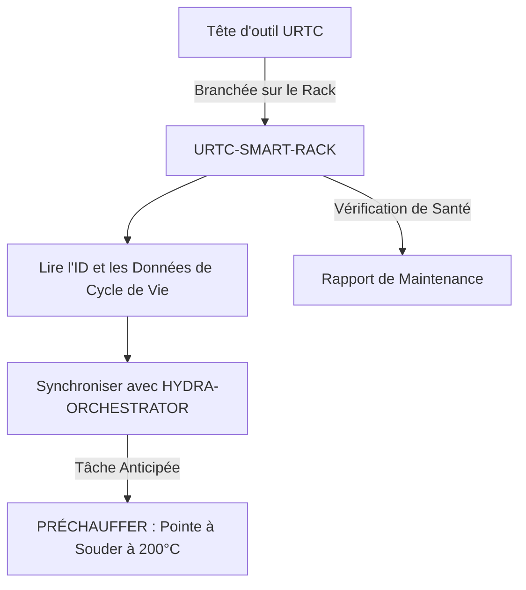

<p align="center">
  
</p>

# 🗄️ URTC-SMART-RACK

<p align="center"><a href="README.md">🇺🇸 English</a> | <a href="README_spa.md">🇪🇸 Español</a> | 🇫🇷 <b>Français</b> | <a href="README_ita.md">🇮🇹 Italiano</a> | <a href="README_deu.md">🇩🇪 Deutsch</a> | <a href="README_zho.md">🇨🇳 简体中文</a> | <a href="README_jpn.md">🇯🇵 日本語</a></p>

### 🤖 Gestion Intelligente des Têtes d'Outil avec Suivi du Cycle de Vie et Thermique

<p align="left">
  
  
  
  
</p>

---

## 1. 🛠️ APERÇU TECHNIQUE

**URTC-SMART-RACK** est un système de stockage intelligent pour les têtes d'outil au sein de l'écosystème HYDRA-UMC. Basé sur le microcontrôleur STM32G4, il surveille et prépare les outils tant qu'ils ne sont pas fixés à un robot.

Il permet des modes « Smart Idle », comme préchauffer des pointes à souder T12 juste avant un changement d'outil, et suit l'identifiant électronique, la version de firmware et le nombre total de cycles d'utilisation de chaque tête URTC, garantissant une maintenance optimale et un déploiement instantané.

Aucun PCB/schéma n'existe encore pour cette carte (voir `hardware/`), donc rien ci-dessous ne peut piloter du GPIO/F-RAM/CAN réel - mais la *logique* à laquelle ces fonctionnalités se résument (décoder un ID, suivre l'utilisation, décider quand préchauffer et à quelle température) est réelle, en C pur, testée unitairement dès aujourd'hui.

### Fonctionnalités Clés :
* ✅ **v0 réelle - logique d'ID, cycle de vie & préchauffage :** `tool_id.c` décode une lecture d'ID brute sur 5 bits en une identité d'outil ; `lifecycle.c` suit les cycles/temps d'utilisation et signale la maintenance due ; `preheat.c` décide quand le préchauffage Smart Idle doit démarrer et à quelle température cible. 25 assertions de test sur le propre compilateur C de l'hôte - aucun PCB, driver GPIO ou F-RAM nécessaire pour exécuter ou tester tout cela.
* 🗄️ **Suivi des Outils** — identification automatique des têtes URTC via cavaliers d'ID 5 bits ou F-RAM. *(la logique de décodage d'ID elle-même est réelle - voir ci-dessus ; lire de vrais cavaliers/F-RAM nécessite le PCB.)*
* 🌡️ **Logique de Préchauffage** — gestion thermique intelligente pour les outils de soudure et d'air chaud. *(la décision d'activation et les températures cibles sont réelles - voir ci-dessus ; piloter un vrai chauffage nécessite le PCB.)*
* 📈 **Journaux de Cycle de Vie** — enregistre le nombre total de cycles d'actionnement et d'heures d'utilisation dans la F-RAM de l'outil. *(les compteurs et la logique de maintenance due sont réels - voir ci-dessus ; les persister dans une vraie F-RAM nécessite le PCB.)*
* 📡 **Intégration CAN** — communique directement avec le Cerveau Cinématique HYDRA-UMC pour un ATC coordonné (changement d'outil automatique). *(le protocole filaire lui-même - framing, CRC, validation des commandes - est réel, voir ci-dessous ; un vrai transceiver CAN pour le transporter réellement reste nécessaire.)*
* 🔒 **Limites de Sécurité du Protocole** — un vrai framing versionné avec une somme de contrôle CRC8, une vraie validation de plage d'actionnement, et un vrai watchdog de timeout de liaison/idempotence avec un état sûr défini. *(implémenté)*
* ✅ **Chaîne d'outils firmware Cortex-M4F** — une image bare-metal réelle (démarrage + linker + `main.c`) qui compile et se lie réellement avec `arm-none-eabi-gcc`, la même chaîne d'outils que le dépôt frère URTC. *(implémenté — voir COMPILATION ci-dessous)*

---

## 2. 🔄 FLUX DE TRAVAIL DU SMART RACK



---

## 3. 🧱 ARCHITECTURE & DÉCISIONS DE CONCEPTION

* **Pourquoi cette carte n'a pas encore de brochage/ID matériel réel défini.** Il n'existe pas encore de PCB pour cette carte - `src/firmware_common.h` porte une identité de version sans ID matériel, et les fichiers de démarrage/éditeur de liens sont écrits à la main comme substituts en attendant qu'une vraie puce STM32G4 soit fixée.
* **Pourquoi ce n'est pas un enfant d'URTC lui-même.** URTC-SMART-RACK est un Outil Complémentaire, pas un enfant de la famille URTC - c'est une carte physique séparée (un rack de stockage d'outils, pas une tête d'outil) qui partage le bus CAN et les conventions de firmware d'URTC, mais pas sa hiérarchie d'intégration.
* **Pourquoi `bump_version.py` est une copie directe de celui d'URTC.** Même règle de versionnage compteur kilométrique, même format d'en-tête firmware - réutiliser le script exact plutôt que de le réinventer garde les deux synchronisés par construction.
* **Pourquoi `tool_id.c`/`lifecycle.c`/`preheat.c` arrivent avant tout driver GPIO/F-RAM/CAN.** Décoder un ID, cumuler l'utilisation et décider quand préchauffer sont des fonctions pures de données déjà en main - elles n'ont besoin d'aucun PCB pour être écrites ou testées, donc la v0 livre d'abord cette logique, testée avec le compilateur C de la machine elle-même plutôt qu'`arm-none-eabi-gcc`. Les drivers qui iraient réellement chercher ces données sur du matériel réel arriveront une fois le PCB existant.
* **Comment cela s'intègre dans le reste de l'écosystème.** Partage le propre bus CAN/écosystème d'outils d'URTC, et forme une paire naturelle avec HYDRA-UMC-DETECTION-HEF pour reconnaître visuellement quel outil est réellement stocké.
* **Pourquoi le protocole, la validation des commandes et le watchdog de liaison sont trois modules séparés.** `protocol.c` ne connaît que les octets, le framing et un CRC - il n'a aucune idée de ce qu'est une température "sûre". `rack_command.c` porte ce jugement, décodant et vérifiant la plage d'une commande réelle sans se soucier de la façon dont elle est arrivée sur le fil. `link_watchdog.c` suit le timeout/l'idempotence indépendamment des deux - une trame corrompue ne doit jamais même l'atteindre (voir la propre assertion réelle de `test_rack_link_scenarios.c` selon laquelle une trame à CRC invalide ne relance jamais le watchdog). Les garder séparés est ce qui rend chacun testable indépendamment sur l'hôte, et garde mince un futur gestionnaire de réception CAN - il appelle chaque couche dans l'ordre, il ne réimplémente le jugement d'aucune d'elles.
* **Pourquoi une liaison non prouvée est traitée exactement comme une liaison morte.** `link_watchdog_is_link_lost()` est vrai à la fois après un vrai timeout ET avant même que la toute première trame ne soit jamais arrivée - le propre audit de promotion l'appelle "estado seguro al arrancar". Un rack qui démarre sans qu'aucun hôte ne soit encore connecté doit démarrer dans l'état sûr, et non supposer silencieusement que c'est "bon" jusqu'à preuve du contraire.

---

## 📂 STRUCTURE DES DOSSIERS

```text
URTC-SMART-RACK/
├── src/                            # Code source du firmware
│   ├── firmware_common.h           # FIRMWARE_VERSION_MAJOR/MINOR/PATCH
│   ├── tool_id.h / .c              # Réel : décodage lecture brute 5 bits -> ID d'outil
│   ├── lifecycle.h / .c            # Réel : suivi cycles/temps d'utilisation, vérification maintenance due
│   ├── preheat.h / .c              # Réel : activation Smart Idle + température cible + cible d'état sûr
│   ├── protocol.h / .c             # Réel : format de trame versionné + parsing/encodage CRC8
│   ├── rack_command.h / .c         # Réel : décodage de commande + validation des limites d'actionnement
│   ├── link_watchdog.h / .c        # Réel : timeout de liaison + idempotence des commandes
│   ├── main.c                      # Point d'entrée minimal (boucle de battement de vie)
│   ├── startup_stm32g4_minimal.c   # Table des vecteurs + Reset_Handler (pas de HAL ST pour l'instant, voir l'en-tête du fichier)
│   └── STM32G4_MINIMAL.ld          # Script de liaison provisoire (plancher 128K FLASH / 32K RAM)
├── tests/                          # Harnais de tests réel host-native (tool_id, lifecycle, preheat, protocol, rack_command, link_watchdog, scénarios de liaison du rack)
├── docs/                           # Documentation et manuel utilisateur - vide, pas encore créé
├── hardware/                       # Fichiers de conception matérielle (PCB, 3D) - vide, pas de schéma pour l'instant
├── firmware/                       # Sortie de build versionnée (.bin/.elf/.hex), commitée comme le dépôt frère URTC
├── build/                          # Objets de build intermédiaires (ignoré par git)
├── images/                         # Médias et diagrammes
├── tools/
│   ├── build_test.py               # Contrôle build/compilation sans gestion de version
│   └── ci_validate.py              # Validation manifest/CHANGELOG/docs utilisée par la CI
├── bump_version.py                 # Incrémentation de version façon compteur kilométrique (générique, partagé avec URTC)
├── bump_manifest_version.py        # Synchronise la version de hydra-umc.project.json avec la version native (--sync)
├── build_firmware.sh / .bat        # Build réel : tests hôte + incrémente la version + compile + lie + publie
├── build-test.sh / .bat            # Contrôle build/compilation sans gestion de version
└── README.md
```

---

## 4. ⚙️ COMPILATION

Nécessite la chaîne d'outils ARM GNU (`arm-none-eabi-gcc`, `arm-none-eabi-objcopy`, `arm-none-eabi-size`) et Python 3.

```bash
# Linux/macOS
chmod +x build_firmware.sh   # une seule fois
./build_firmware.sh

# Windows
build_firmware.bat
```

Le build compile et exécute d'abord `tests/` avec le compilateur C de *l'hôte lui-même* (jamais `arm-none-eabi-gcc` - ce sont des tests de logique pure, aucun registre MCU touché) et fait échouer tout le build si une assertion échoue. Ce n'est qu'ensuite qu'il incrémente la version de `src/firmware_common.h` (règle du compteur kilométrique, comme le reste de l'écosystème), compile `main.c` et `startup_stm32g4_minimal.c` pour Cortex-M4F, les lie avec la carte mémoire provisoire `STM32G4_MINIMAL.ld`, et publie des fichiers `.elf`/`.bin`/`.hex` versionnés dans `firmware/`.

Il n'y a encore rien à flasher sur du matériel réel - aucun PCB n'existe pour confirmer la référence STM32G4 cible, le brochage, ou ses tailles réelles de flash/RAM. La carte mémoire du script de liaison est un placeholder prudent (documenté dans son propre en-tête) qui sera remplacé une fois le matériel réel existant, au même moment où la table des vecteurs écrite à la main de `startup_stm32g4_minimal.c` sera remplacée par le code de démarrage CMSIS/HAL propre à ST (suivant le modèle du dépôt frère URTC dans `src/F303-master/` pour ses cartes STM32F303).

Exemple réel - les tests côté hôte s'exécutent aussi seuls, utile pour vérifier la logique sans un build de firmware complet :

```bash
cc -std=c11 -Wall -Wextra -Isrc -Itests -o build/host_tests \
  tests/test_main.c tests/test_tool_id.c tests/test_lifecycle.c tests/test_preheat.c \
  tests/test_protocol.c tests/test_rack_command.c tests/test_link_watchdog.c tests/test_rack_link_scenarios.c \
  src/tool_id.c src/lifecycle.c src/preheat.c src/protocol.c src/rack_command.c src/link_watchdog.c
./build/host_tests
# All tests passed.
```

---

## 5. 📋 CHANGELOG

Consultez [`CHANGELOG.md`](CHANGELOG.md) pour l'historique complet des versions — chaque build réel incrémente automatiquement la version de `src/firmware_common.h` (règle de l'odomètre, voir COMPILATION ci-dessus), et chaque incrément y a sa propre entrée.

---

## 🔗 Projets Liés

Ce projet fait partie de l'écosystème robotique HYDRA-UMC du même auteur (JuanenRac / Electro Hobby 3D). Bon à savoir, car une demande pourrait en réalité concerner l'un de ceux-ci plutôt que ce dépôt.

**Directement Liés**
- **[URTC](https://github.com/JuanenRac/URTC)** — firmware pour la carte physique Universal Robot Tool Controller, plus de 25 profils d'outil sur bus CAN — le même écosystème d'outils, sur le même bus CAN.
- **[HYDRA-UMC-DETECTION-HEF](https://github.com/JuanenRac/HYDRA-UMC-DETECTION-HEF)** — registre réel de modèles compilés avec vérification de chargement sécurisé par architecture Hailo/checksum — fournit la reconnaissance visuelle des outils que ce rack stocke.

**Fait Également Partie de l'Écosystème**

*Matériel & Plateforme de Base*
- **[HYDRA-UMC](https://github.com/JuanenRac/HYDRA-UMC)** — la carte mère physique du bras robotique : hôte CM5 + coprocesseur STM32H745 double cœur, coordonnant jusqu'à 8 bras-outils via CAN-OTA/SPI-OTA.
- **[HYDRA-UMC-OS](https://github.com/JuanenRac/HYDRA-UMC-OS)** — couche produit reproductible sur Raspberry Pi OS pour le CM5 : agent en lecture seule, config/profils validés, provisionnement WiFi de premier contact.
- **[HYDRA-UMC-SDK](https://github.com/JuanenRac/HYDRA-UMC-SDK)** — le contrat JSON-Schema partagé et la barrière de sécurité contre laquelle chaque bridge valide ses commandes.

*Backend Central & Clients*
- **[HYDRA-UMC-SERVER](https://github.com/JuanenRac/HYDRA-UMC-SERVER)** — le vrai backend headless (REST/WebSocket) auquel parle réellement chaque client de contrôle.
- **[HYDRA-UMC-STUDIO](https://github.com/JuanenRac/HYDRA-UMC-STUDIO)** — tableau de bord de contrôle web avec visualisation 3D multi-robot en temps réel.
- **[HYDRA-UMC-SUITE](https://github.com/JuanenRac/HYDRA-UMC-SUITE)** — centre de commande d'essaim de bureau (PySide6) pour plusieurs serveurs à la fois, empaqueté en exécutable autonome.
- **[HYDRA-UMC-ANDROID-CONTROL](https://github.com/JuanenRac/HYDRA-UMC-ANDROID-CONTROL)** — application de contrôle Android native avec connexion biométrique et un compagnon Wear OS jumelé.
- **[HYDRA-UMC-IOS-CONTROL](https://github.com/JuanenRac/HYDRA-UMC-IOS-CONTROL)** — application de contrôle iOS/iPadOS (Flutter) avec synchronisation WebSocket en temps réel.
- **[HYDRA-UMC-DSI](https://github.com/JuanenRac/HYDRA-UMC-DSI)** — interface tactile native pour l'écran tactile DSI 7" embarqué, intégrée directement sur le CM5.
- **[HYDRA-UMC-EDITOR-URDF](https://github.com/JuanenRac/HYDRA-UMC-EDITOR-URDF)** — créateur/éditeur graphique de bureau pour URDF qui envoie les modèles terminés vers le propre catalogue de STUDIO.
- **[HYDRA-UMC-BRIDGE-AMR](https://github.com/JuanenRac/HYDRA-UMC-BRIDGE-AMR)** — frontière de coordination pour les flottes AGV/AMR via un éditeur MQTT VDA 5050 réel.
- **[HYDRA-UMC-BRIDGE-CNC](https://github.com/JuanenRac/HYDRA-UMC-BRIDGE-CNC)** — coordinateur haut niveau pour cellules CNC avec accès réel au statut/octets de contrôle GRBL.
- **[HYDRA-UMC-BRIDGE-DROIDS](https://github.com/JuanenRac/HYDRA-UMC-BRIDGE-DROIDS)** — frontière de coordination pour droïdes à pattes/humanoïdes, avec un véritable émetteur de commandes Boston Dynamics Spot.
- **[HYDRA-UMC-BRIDGE-LASER](https://github.com/JuanenRac/HYDRA-UMC-BRIDGE-LASER)** — coordinateur de sécurité pour cellules laser lisant 3 vraies sécurités GPIO de clé/enceinte/verrouillage.
- **[HYDRA-UMC-BRIDGE-OPENPNP](https://github.com/JuanenRac/HYDRA-UMC-BRIDGE-OPENPNP)** — coordinateur haut niveau sûr pour le flux de cartes du pick-and-place OpenPnP.
- **[HYDRA-UMC-BRIDGE-PRINTER3D](https://github.com/JuanenRac/HYDRA-UMC-BRIDGE-PRINTER3D)** — frontière de coordination sûre pour imprimantes 3D Moonraker/Klipper, avec de vraies commandes de tâche contrôlées.
- **[HYDRA-UMC-BRIDGE-ROS2](https://github.com/JuanenRac/HYDRA-UMC-BRIDGE-ROS2)** — coordinateur de sécurité avec un vrai transport ROS 2 rclpy à importation paresseuse.
- **[HYDRA-UMC-BRIDGE-UAV](https://github.com/JuanenRac/HYDRA-UMC-BRIDGE-UAV)** — frontière de coordination pour UAV équipés de caméra, avec un véritable émetteur de commandes MAVLink.

*Plateforme d'Outils URTC*
- **[URTC-FLASHER](https://github.com/JuanenRac/URTC-FLASHER)** — outil de bureau à interface graphique pour flasher les cartes URTC, CAN-OTA plus SWD/JTAG puce complète.
- **[URTC-TESTER](https://github.com/JuanenRac/URTC-TESTER)** — outil de bureau de diagnostic CAN-bus en direct pour cartes URTC, un panneau par profil d'outil.
- **[URTC-WEB-STUDIO](https://github.com/JuanenRac/URTC-WEB-STUDIO)** — alternative basée navigateur à URTC-TESTER via la Web Serial API, sans installation locale.

*Nœud IA de Vision (Hailo-8)*
- **[HYDRA-UMC-VISION-NODE](https://github.com/JuanenRac/HYDRA-UMC-VISION-NODE)** — hub d'intégration pour le pipeline de vision Hailo-8, avec une vraie vérification de disponibilité matérielle par étape.
- **[HYDRA-UMC-VISION-STREAMER](https://github.com/JuanenRac/HYDRA-UMC-VISION-STREAMER)** — générateur réel de pipeline GStreamer + config MediaMTX, avec une vraie frontière d'intégration HailoRT.
- **[HYDRA-UMC-VISUAL-SERVOING-API](https://github.com/JuanenRac/HYDRA-UMC-VISUAL-SERVOING-API)** — vraie loi de correction Position-Based Visual Servoing, verrouillée sur l'état de zone en amont.
- **[HYDRA-UMC-SAFETY-ZONES](https://github.com/JuanenRac/HYDRA-UMC-SAFETY-ZONES)** — vraie vérification de violation de zone et demande d'E-STOP, avec application de la fraîcheur de calibration.

*Nœud IA Cognitif (Hailo-10)*
- **[HYDRA-UMC-COGNITIVE-NODE](https://github.com/JuanenRac/HYDRA-UMC-COGNITIVE-NODE)** — hub d'intégration pour le pipeline cognitif Hailo-10 (orchestration LLM/VLA/voix).
- **[HYDRA-UMC-VLA-ENGINE](https://github.com/JuanenRac/HYDRA-UMC-VLA-ENGINE)** — vrai encodage/décodage de jetons d'action et génération de trajectoire pour un modèle Vision-Language-Action.
- **[HYDRA-UMC-VOICE-UI](https://github.com/JuanenRac/HYDRA-UMC-VOICE-UI)** — vrai front-end vocal (VAD + analyseur d'intention) avec un relais Watch borné et soumis à confirmation.
- **[HYDRA-UMC-SEMANTIC-PLANNER](https://github.com/JuanenRac/HYDRA-UMC-SEMANTIC-PLANNER)** — vraie décomposition de tâches basée sur des règles et récupération sémantique d'erreurs sur les codes d'erreur MCU.
- **[HYDRA-UMC-DOCS-QA](https://github.com/JuanenRac/HYDRA-UMC-DOCS-QA)** — vraie recherche documentaire TF-IDF (bibliothèque standard uniquement) sur les propres documents Markdown de cet écosystème.

*Orchestration & Essaim*
- **[HYDRA-UMC-ORCHESTRATOR](https://github.com/JuanenRac/HYDRA-UMC-ORCHESTRATOR)** — hub d'intégration avec un vrai contrat de rapport de santé gRPC/Protobuf et une machine à états de mission.
- **[HYDRA-UMC-JOB-DISPATCHER](https://github.com/JuanenRac/HYDRA-UMC-JOB-DISPATCHER)** — vraie file de tâches basée sur la priorité avec déduplication, via une vraie API HTTP.
- **[HYDRA-UMC-NODE-HEALING](https://github.com/JuanenRac/HYDRA-UMC-NODE-HEALING)** — vrai chien de garde de santé de flotte basé sur gRPC, avec retry/backoff et détection d'incohérence d'identité.
- **[HYDRA-UMC-PATH-PLANNER-3D](https://github.com/JuanenRac/HYDRA-UMC-PATH-PLANNER-3D)** — vrai planificateur de trajectoire 3D basé sur RRT, avec vraie validation des collisions obstacle/espace de travail.
- **[HYDRA-UMC-SWARM-SYNC](https://github.com/JuanenRac/HYDRA-UMC-SWARM-SYNC)** — vraie synchronisation d'état CRDT LWW-Element-Map, testée par propriétés pour la convergence multi-cellule.

*Jumeau Numérique & Simulation*
- **[HYDRA-UMC-TWIN](https://github.com/JuanenRac/HYDRA-UMC-TWIN)** — hub d'intégration pour le moteur de jumeau numérique, avec un vrai contrat de synchronisation par compatibilité de version.
- **[HYDRA-UMC-HIL-BRIDGE](https://github.com/JuanenRac/HYDRA-UMC-HIL-BRIDGE)** — vrai verrouillage de sécurité hardware-in-the-loop routant les commandes entre simulation et matériel réel.
- **[HYDRA-UMC-PHYSICS-REPLICA](https://github.com/JuanenRac/HYDRA-UMC-PHYSICS-REPLICA)** — vraie cinématique directe et validation des limites articulaires sur un vrai sous-ensemble URDF.
- **[HYDRA-UMC-SYNTHETIC-DATA-GEN](https://github.com/JuanenRac/HYDRA-UMC-SYNTHETIC-DATA-GEN)** — vrai générateur procédural de scènes 2D avec export d'annotations YOLO/COCO.

*Données & Analytique*
- **[HYDRA-UMC-DATALAKE](https://github.com/JuanenRac/HYDRA-UMC-DATALAKE)** — vrai magasin de séries temporelles basé sur sqlite3, avec une vraie API HTTP d'ingestion/requête.
- **[HYDRA-UMC-ANOMALY-DETECTOR](https://github.com/JuanenRac/HYDRA-UMC-ANOMALY-DETECTOR)** — vrai détecteur d'anomalies FFT + ligne de base statistique, avec surveillance de dérive.
- **[HYDRA-UMC-PRODUCTION-REPORTS](https://github.com/JuanenRac/HYDRA-UMC-PRODUCTION-REPORTS)** — vrai calcul OEE/disponibilité sur l'historique de DATALAKE, avec export CSV reproductible.
- **[HYDRA-UMC-TELEMETRY-COLLECTOR](https://github.com/JuanenRac/HYDRA-UMC-TELEMETRY-COLLECTOR)** — vrai pipeline d'ingestion CAN/WebSocket vers DATALAKE, avec déduplication par séquence.

*Passerelle Industrielle*
- **[HYDRA-UMC-GATEWAY-INDUSTRIAL](https://github.com/JuanenRac/HYDRA-UMC-GATEWAY-INDUSTRIAL)** — hub d'intégration relayant vers les protocoles industriels, avec une vraie couche de liste blanche de commandes/contre-pression.
- **[HYDRA-UMC-OPCUA-SERVER](https://github.com/JuanenRac/HYDRA-UMC-OPCUA-SERVER)** — vrai espace d'adressage OPC-UA, vérifié avec une vraie session client du protocole binaire.
- **[HYDRA-UMC-MQTT-BROKER](https://github.com/JuanenRac/HYDRA-UMC-MQTT-BROKER)** — vrai broker MQTT avec authentification par client optionnelle et ACL de sujets.
- **[HYDRA-UMC-MTCONNECT-ADAPTER](https://github.com/JuanenRac/HYDRA-UMC-MTCONNECT-ADAPTER)** — vrais points de terminaison XML MTConnect `/probe` et `/current`, avec sortie en mode dégradé.

*Outils Complémentaires & Opérations de l'Écosystème*
- **[HYDRA-UMC-DASHBOARD-AI](https://github.com/JuanenRac/HYDRA-UMC-DASHBOARD-AI)** — panneaux Smart Summaries et Anomaly Highlighting sur DATALAKE/ANOMALY-DETECTOR, avec un repli statistique honnête.
- **[HYDRA-UMC-TOOL-CLI](https://github.com/JuanenRac/HYDRA-UMC-TOOL-CLI)** — CLI de flotte avec un vrai contrat de codes de sortie stable, un vrai client en direct de la propre API de HYDRA-UMC-SERVER.
- **[HYDRA-UMC-WATCH](https://github.com/JuanenRac/HYDRA-UMC-WATCH)** — application compagnon WearOS avec de vraies alertes haptiques et un relais vocal vers le téléphone jumelé.
- **[URTC-VISION-TOOL](https://github.com/JuanenRac/URTC-VISION-TOOL)** — firmware plus un vrai compagnon de vision Python pour une tête d'outil d'inspection thermique/RGB.
- **[HYDRA-UMC-UPDATER](https://github.com/JuanenRac/HYDRA-UMC-UPDATER)** — outil administratif de bureau qui découvre, clone et met à jour chaque dépôt de cet écosystème.
- **[HYDRA-UMC-OS-REBUILDER](https://github.com/JuanenRac/HYDRA-UMC-OS-REBUILDER)** — outil de bureau Windows/Linux qui construit une image de la CM5 prête à graver, préchargée avec les versions les plus actuelles de l'écosystème, avec une configuration de premier démarrage Wi-Fi/utilisateur/SSH façon Raspberry Pi Imager.


---

## 📚 Documentation & Communauté

- **[CONTRIBUTING.md](CONTRIBUTING.md)** — pile technologique et lignes directrices de codage pour une pull request.
- **[CODE_OF_CONDUCT.md](CODE_OF_CONDUCT.md)** — les normes de comportement attendues dans cette communauté.
- **[SECURITY.md](SECURITY.md)** — comment signaler une vulnérabilité, et les véritables axes de sécurité de ce projet.
- **[SUPPORT.md](SUPPORT.md)** — où poser des questions et signaler des bugs.
- **[LICENSE.md](LICENSE.md)** — la licence propre de ce projet.

## 👤 AUTEUR
**JuanenRac** (Electro Hobby 3D)
📧 electrohobby3d@gmail.com
📺 [youtube.com/@electrohobby3d](https://youtube.com/@electrohobby3d)

## 📜 LICENCE
GPL-3.0 - Voir LICENSE pour plus de détails.
