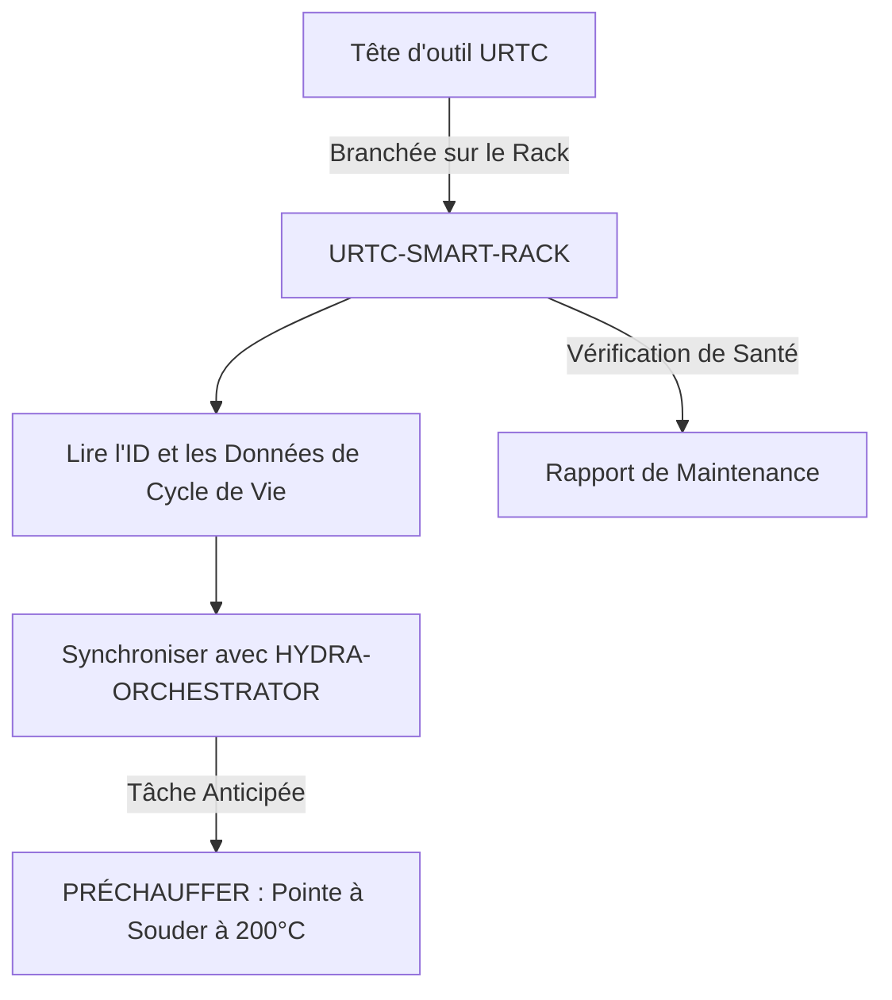

<p align="center">
  
</p>

# 🗄️ URTC-SMART-RACK

<p align="center"><a href="README.md">🇺🇸 English</a> | <a href="README_spa.md">🇪🇸 Español</a> | 🇫🇷 <b>Français</b> | <a href="README_ita.md">🇮🇹 Italiano</a> | <a href="README_deu.md">🇩🇪 Deutsch</a> | <a href="README_zho.md">🇨🇳 简体中文</a> | <a href="README_jpn.md">🇯🇵 日本語</a></p>

### 🤖 Gestion Intelligente des Têtes d'Outil avec Suivi du Cycle de Vie et Thermique

<p align="left">
  
  
  
  
</p>

---

## 1. 🛠️ APERÇU TECHNIQUE

**URTC-SMART-RACK** est un système de stockage intelligent pour les têtes d'outil au sein de l'écosystème HYDRA-UMC. Basé sur le microcontrôleur STM32G4, il surveille et prépare les outils tant qu'ils ne sont pas fixés à un robot.

Il permet des modes « Smart Idle », comme préchauffer des pointes à souder T12 juste avant un changement d'outil, et suit l'identifiant électronique, la version de firmware et le nombre total de cycles d'utilisation de chaque tête URTC, garantissant une maintenance optimale et un déploiement instantané.

Aucun PCB/schéma n'existe encore pour cette carte (voir `hardware/`) - les fonctionnalités ci-dessous décrivent la conception cible ; seule la chaîne d'outils firmware elle-même est réelle aujourd'hui.

### Fonctionnalités Clés :
* 🗄️ **Suivi des Outils** — identification automatique des têtes URTC via cavaliers d'ID 5 bits ou F-RAM. *(prévu — nécessite le PCB réel)*
* 🌡️ **Logique de Préchauffage** — gestion thermique intelligente pour les outils de soudure et d'air chaud. *(prévu)*
* 📈 **Journaux de Cycle de Vie** — enregistre le nombre total de cycles d'actionnement et d'heures d'utilisation dans la F-RAM de l'outil. *(prévu)*
* 📡 **Intégration CAN** — communique directement avec le Cerveau Cinématique HYDRA-UMC pour un ATC coordonné (changement d'outil automatique). *(prévu)*
* ✅ **Chaîne d'outils firmware Cortex-M4F** — une image bare-metal réelle (démarrage + linker + `main.c`) qui compile et se lie réellement avec `arm-none-eabi-gcc`, la même chaîne d'outils que le dépôt frère URTC. *(implémenté — voir COMPILATION ci-dessous)*

---

## 2. 🔄 FLUX DE TRAVAIL DU SMART RACK



---

## 3. 🧱 ARCHITECTURE & DÉCISIONS DE CONCEPTION

* **Pourquoi cette carte n'a pas encore de brochage/ID matériel réel défini.** Il n'existe pas encore de PCB pour cette carte - `src/firmware_common.h` porte une identité de version sans ID matériel, et les fichiers de démarrage/éditeur de liens sont écrits à la main comme substituts en attendant qu'une vraie puce STM32G4 soit fixée.
* **Pourquoi ce n'est pas un enfant d'URTC lui-même.** URTC-SMART-RACK est un Outil Complémentaire, pas un enfant de la famille URTC - c'est une carte physique séparée (un rack de stockage d'outils, pas une tête d'outil) qui partage le bus CAN et les conventions de firmware d'URTC, mais pas sa hiérarchie d'intégration.
* **Pourquoi `bump_version.py` est une copie directe de celui d'URTC.** Même règle de versionnage compteur kilométrique, même format d'en-tête firmware - réutiliser le script exact plutôt que de le réinventer garde les deux synchronisés par construction.
* **Comment cela s'intègre dans le reste de l'écosystème.** Partage le propre bus CAN/écosystème d'outils d'URTC, et forme une paire naturelle avec HYDRA-UMC-DETECTION-HEF pour reconnaître visuellement quel outil est réellement stocké.

---

## 📂 STRUCTURE DES DOSSIERS

```text
URTC-SMART-RACK/
├── src/                            # Code source du firmware
│   ├── firmware_common.h           # FIRMWARE_VERSION_MAJOR/MINOR/PATCH = 0.0.0
│   ├── main.c                      # Point d'entrée minimal (boucle de battement de vie)
│   ├── startup_stm32g4_minimal.c   # Table des vecteurs + Reset_Handler (pas de HAL ST pour l'instant, voir l'en-tête du fichier)
│   └── STM32G4_MINIMAL.ld          # Script de liaison provisoire (plancher 128K FLASH / 32K RAM)
├── docs/                           # Documentation et manuel utilisateur
├── hardware/                       # Fichiers de conception matérielle (PCB, 3D) - vide, pas de schéma pour l'instant
├── firmware/                       # Sortie de build versionnée (.bin/.elf/.hex), commitée comme le dépôt frère URTC
├── build/                          # Objets de build intermédiaires (ignoré par git)
├── images/                         # Médias et diagrammes
├── scripts/                        # Scripts utilitaires
├── bump_version.py                 # Incrémentation de version façon compteur kilométrique (générique, partagé avec URTC)
├── build_firmware.sh / .bat        # Build réel : incrémente la version + compile + lie + publie dans firmware/
└── README.md
```

---

## 4. ⚙️ COMPILATION

Nécessite la chaîne d'outils ARM GNU (`arm-none-eabi-gcc`, `arm-none-eabi-objcopy`, `arm-none-eabi-size`) et Python 3.

```bash
# Linux/macOS
chmod +x build_firmware.sh   # une seule fois
./build_firmware.sh

# Windows
build_firmware.bat
```

Le build incrémente la version de `src/firmware_common.h` (règle du compteur kilométrique, comme le reste de l'écosystème), compile `main.c` et `startup_stm32g4_minimal.c` pour Cortex-M4F, les lie avec la carte mémoire provisoire `STM32G4_MINIMAL.ld`, et publie des fichiers `.elf`/`.bin`/`.hex` versionnés dans `firmware/`.

Il n'y a encore rien à flasher sur du matériel réel - aucun PCB n'existe pour confirmer la référence STM32G4 cible, le brochage, ou ses tailles réelles de flash/RAM. La carte mémoire du script de liaison est un placeholder prudent (documenté dans son propre en-tête) qui sera remplacé une fois le matériel réel existant, au même moment où la table des vecteurs écrite à la main de `startup_stm32g4_minimal.c` sera remplacée par le code de démarrage CMSIS/HAL propre à ST (suivant le modèle du dépôt frère URTC dans `src/F303-master/` pour ses cartes STM32F303).

---

## 🔗 Projets Liés

Ce projet fait partie d'un écosystème robotique plus large du même auteur (JuanenRac / Electro Hobby 3D), couvrant firmware, logiciel de contrôle, nœuds IA et outillage de flotte. Bon à savoir, car une demande pourrait en réalité concerner l'un de ces projets plutôt que ce dépôt.

### Relation Directe

- **[URTC](https://github.com/JuanenRac/URTC)** — même écosystème d'outils / bus CAN.
- **[HYDRA-UMC-DETECTION-HEF](https://github.com/JuanenRac/HYDRA-UMC-DETECTION-HEF)** — reconnaissance visuelle des outils stockés par ce rack.

### Reste de l'Écosystème

**Plateforme HYDRA-UMC** — la cellule de micro-usine multi-robot
- **[HYDRA-UMC](https://github.com/JuanenRac/HYDRA-UMC)** — la carte mère CM5 + STM32H745 orchestrant jusqu'à 8 bras robotiques.
- **[HYDRA-UMC-SERVER](https://github.com/JuanenRac/HYDRA-UMC-SERVER)** — le backend Express/WebSocket auquel parle chaque client de contrôle.
- **[HYDRA-UMC-STUDIO](https://github.com/JuanenRac/HYDRA-UMC-STUDIO)** — tableau de bord de contrôle web, visualisation 3D multi-robot.
- **[HYDRA-UMC-ANDROID-CONTROL](https://github.com/JuanenRac/HYDRA-UMC-ANDROID-CONTROL)** — application de contrôle Android via Wi-Fi/Bluetooth.
- **[HYDRA-UMC-IOS-CONTROL](https://github.com/JuanenRac/HYDRA-UMC-IOS-CONTROL)** — application de contrôle iOS/iPadOS construite en Flutter.
- **[HYDRA-UMC-SUITE](https://github.com/JuanenRac/HYDRA-UMC-SUITE)** — centre de commande d'essaim de bureau (Python/PySide6).
- **[HYDRA-UMC-EDITOR-URDF](https://github.com/JuanenRac/HYDRA-UMC-EDITOR-URDF)** — éditeur de modèles URDF de bureau pour le catalogue de robots.
- **[HYDRA-UMC-DSI](https://github.com/JuanenRac/HYDRA-UMC-DSI)** — interface tactile native pour l'écran DSI embarqué.

**Plateforme URTC** — le contrôleur de tête d'outil que porte chaque bras HYDRA-UMC
- **[URTC](https://github.com/JuanenRac/URTC)** — contrôleur de tête d'outil sur bus CAN, 25 profils d'outil.
- **[URTC-FLASHER](https://github.com/JuanenRac/URTC-FLASHER)** — outil de bureau de flashage CAN-OTA + SWD/JTAG.
- **[URTC-TESTER](https://github.com/JuanenRac/URTC-TESTER)** — outil de bureau de diagnostic CAN en direct.
- **[URTC-WEB-STUDIO](https://github.com/JuanenRac/URTC-WEB-STUDIO)** — alternative basée navigateur via l'API Web Serial.

**🎥 Vision AI Node (Hailo-8)**
- [HYDRA-UMC-VISION-NODE](https://github.com/JuanenRac/HYDRA-UMC-VISION-NODE)
- [HYDRA-UMC-VISION-STREAMER](https://github.com/JuanenRac/HYDRA-UMC-VISION-STREAMER)
- [HYDRA-UMC-DETECTION-HEF](https://github.com/JuanenRac/HYDRA-UMC-DETECTION-HEF)
- [HYDRA-UMC-SAFETY-ZONES](https://github.com/JuanenRac/HYDRA-UMC-SAFETY-ZONES)
- [HYDRA-UMC-VISUAL-SERVOING-API](https://github.com/JuanenRac/HYDRA-UMC-VISUAL-SERVOING-API)

**🧠 Cognitive AI Node (Hailo-10)**
- [HYDRA-UMC-COGNITIVE-NODE](https://github.com/JuanenRac/HYDRA-UMC-COGNITIVE-NODE)
- [HYDRA-UMC-VLA-ENGINE](https://github.com/JuanenRac/HYDRA-UMC-VLA-ENGINE)
- [HYDRA-UMC-VOICE-UI](https://github.com/JuanenRac/HYDRA-UMC-VOICE-UI)
- [HYDRA-UMC-SEMANTIC-PLANNER](https://github.com/JuanenRac/HYDRA-UMC-SEMANTIC-PLANNER)
- [HYDRA-UMC-DOCS-QA](https://github.com/JuanenRac/HYDRA-UMC-DOCS-QA)

**🐝 Orchestration & Swarm**
- [HYDRA-UMC-ORCHESTRATOR](https://github.com/JuanenRac/HYDRA-UMC-ORCHESTRATOR)
- [HYDRA-UMC-SWARM-SYNC](https://github.com/JuanenRac/HYDRA-UMC-SWARM-SYNC)
- [HYDRA-UMC-PATH-PLANNER-3D](https://github.com/JuanenRac/HYDRA-UMC-PATH-PLANNER-3D)
- [HYDRA-UMC-JOB-DISPATCHER](https://github.com/JuanenRac/HYDRA-UMC-JOB-DISPATCHER)
- [HYDRA-UMC-NODE-HEALING](https://github.com/JuanenRac/HYDRA-UMC-NODE-HEALING)

**🎮 Digital Twin & Simulation**
- [HYDRA-UMC-TWIN](https://github.com/JuanenRac/HYDRA-UMC-TWIN)
- [HYDRA-UMC-PHYSICS-REPLICA](https://github.com/JuanenRac/HYDRA-UMC-PHYSICS-REPLICA)
- [HYDRA-UMC-HIL-BRIDGE](https://github.com/JuanenRac/HYDRA-UMC-HIL-BRIDGE)
- [HYDRA-UMC-SYNTHETIC-DATA-GEN](https://github.com/JuanenRac/HYDRA-UMC-SYNTHETIC-DATA-GEN)

**📊 Data & Analytics**
- [HYDRA-UMC-DATALAKE](https://github.com/JuanenRac/HYDRA-UMC-DATALAKE)
- [HYDRA-UMC-TELEMETRY-COLLECTOR](https://github.com/JuanenRac/HYDRA-UMC-TELEMETRY-COLLECTOR)
- [HYDRA-UMC-ANOMALY-DETECTOR](https://github.com/JuanenRac/HYDRA-UMC-ANOMALY-DETECTOR)
- [HYDRA-UMC-PRODUCTION-REPORTS](https://github.com/JuanenRac/HYDRA-UMC-PRODUCTION-REPORTS)

**🏭 Industrial Gateway**
- [HYDRA-UMC-GATEWAY-INDUSTRIAL](https://github.com/JuanenRac/HYDRA-UMC-GATEWAY-INDUSTRIAL)
- [HYDRA-UMC-OPCUA-SERVER](https://github.com/JuanenRac/HYDRA-UMC-OPCUA-SERVER)
- [HYDRA-UMC-MQTT-BROKER](https://github.com/JuanenRac/HYDRA-UMC-MQTT-BROKER)
- [HYDRA-UMC-MTCONNECT-ADAPTER](https://github.com/JuanenRac/HYDRA-UMC-MTCONNECT-ADAPTER)

**🛠️ Complementary Tools**
- [URTC-VISION-TOOL](https://github.com/JuanenRac/URTC-VISION-TOOL)
- [HYDRA-UMC-WATCH](https://github.com/JuanenRac/HYDRA-UMC-WATCH)
- [HYDRA-UMC-TOOL-CLI](https://github.com/JuanenRac/HYDRA-UMC-TOOL-CLI)
- [HYDRA-UMC-DASHBOARD-AI](https://github.com/JuanenRac/HYDRA-UMC-DASHBOARD-AI)


## 👤 AUTEUR
**JuanenRac** (Electro Hobby 3D)
📧 electrohobby3d@gmail.com

## 📜 LICENCE
GPL-3.0 - Voir LICENSE pour plus de détails.

## 🛠️ BUILD & RUN

Utilisez la vérification de compilation sans versionnement avant une compilation de publication :

| Action | Windows | Linux / macOS |
|---|---|---|
| Vérification de compilation (sans modifier la version ni le CHANGELOG) | `build-test.bat` | `./build-test.sh` |
| Exécution / développement (si disponible) | `run*.bat` ou `dev*.bat` | `./run*.sh` ou `./dev*.sh` |

`build-test.bat` et `build-test.sh` compilent ou valident la pile du projet sans incrémenter `hydra-umc.project.json` ni modifier `CHANGELOG.md`. Ils peuvent uniquement créer les sorties normales du compilateur. Les scripts existants `build*.bat`, `build*.sh`, `run*` et `dev*` conservent leur comportement spécifique de versionnement ou d'exécution ; utilisez-les lorsque ce comportement est requis.