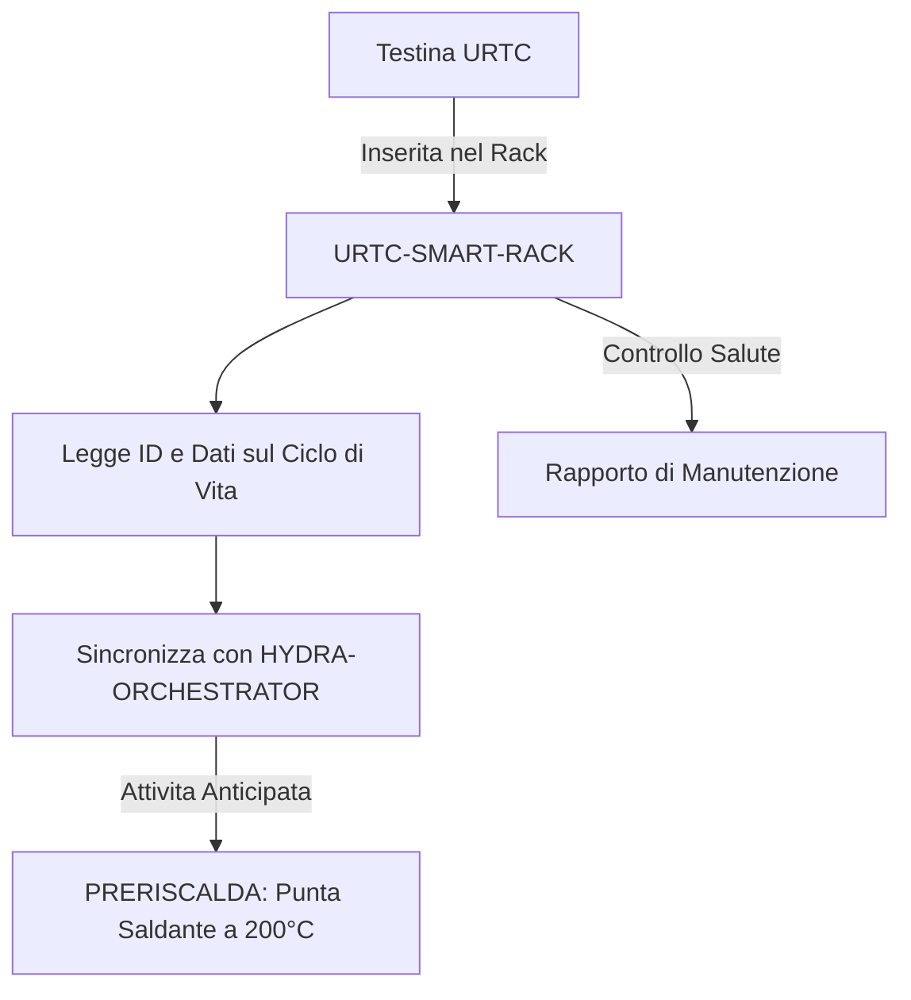

<p align="center">
  
</p>

# 🗄️ URTC-SMART-RACK

<p align="center"><a href="README.md">🇺🇸 English</a> | <a href="README_spa.md">🇪🇸 Español</a> | <a href="README_fra.md">🇫🇷 Français</a> | 🇮🇹 <b>Italiano</b> | <a href="README_deu.md">🇩🇪 Deutsch</a> | <a href="README_zho.md">🇨🇳 简体中文</a> | <a href="README_jpn.md">🇯🇵 日本語</a></p>

### 🤖 Gestione Intelligente delle Testine Utensile con Tracciamento del Ciclo di Vita e Termico

<p align="left">
  
  
  
  
</p>

---

## 1. 🛠️ PANORAMICA TECNICA

**URTC-SMART-RACK** è un sistema di stoccaggio intelligente per testine utensile all'interno dell'ecosistema HYDRA-UMC. Basato sul microcontrollore STM32G4, monitora e prepara gli utensili mentre non sono collegati a un robot.

Abilita modalità "Smart Idle", come il preriscaldamento delle punte saldanti T12 poco prima di un cambio utensile, e traccia l'ID elettronico, la versione del firmware e i cicli totali di utilizzo di ogni testina URTC, garantendo una manutenzione ottimale e un dispiegamento a zero secondi.

Non esiste ancora un PCB/schematico per questa scheda (vedi `hardware/`) - le funzionalità sottostanti descrivono il design obiettivo; solo la toolchain del firmware in sé è reale oggi.

### Caratteristiche Principali:
* 🗄️ **Tracciamento Utensili** — identificazione automatica delle testine URTC tramite jumper ID a 5 bit o F-RAM. *(pianificato — richiede il PCB reale)*
* 🌡️ **Logica di Preriscaldamento** — gestione termica intelligente per utensili di saldatura e aria calda. *(pianificato)*
* 📈 **Registri del Ciclo di Vita** — registra i cicli totali di attuazione e le ore di utilizzo nella F-RAM dell'utensile. *(pianificato)*
* 📡 **Integrazione CAN** — comunica direttamente con il Cervello Cinematico di HYDRA-UMC per un ATC coordinato (cambio utensile automatico). *(pianificato)*
* ✅ **Toolchain firmware Cortex-M4F** — un'immagine bare-metal reale (avvio + linker + `main.c`) che compila e collega davvero con `arm-none-eabi-gcc`, la stessa toolchain usata dal repository gemello URTC. *(implementato — vedi COMPILAZIONE sotto)*

---

## 2. 🔄 FLUSSO DI LAVORO DELLO SMART RACK



---

## 3. 🧱 ARCHITETTURA E DECISIONI DI PROGETTAZIONE

* **Perché questa scheda non ha ancora un pinout/ID hardware reale definito.** Non esiste ancora un PCB per questa scheda - `src/firmware_common.h` porta un'identità di versione senza ID hardware, e i file di avvio/linker sono scritti a mano come segnaposto in sostituzione dell'avvio CMSIS/HAL proprio di ST finché non viene fissato un vero componente STM32G4.
* **Perché non è un figlio di URTC stesso.** URTC-SMART-RACK è uno Strumento Complementare, non un figlio della famiglia URTC - è una scheda fisica separata (un rack di stoccaggio utensili, non una testa utensile) che condivide il bus CAN e le convenzioni firmware di URTC, ma non la sua gerarchia di integrazione.
* **Perché `bump_version.py` è una copia diretta di quello proprio di URTC.** Stessa regola di versionamento contachilometri, stesso formato di intestazione firmware - riutilizzare lo script esatto invece di reinventarlo mantiene i due sincronizzati per costruzione.
* **Come si inserisce nel resto dell'ecosistema.** Condivide il bus CAN/ecosistema utensili proprio di URTC, e forma un abbinamento naturale con HYDRA-UMC-DETECTION-HEF per riconoscere visivamente quale utensile è realmente in rastrelliera.

---

## 📂 STRUTTURA DELLE DIRECTORY

```text
URTC-SMART-RACK/
├── src/                            # Codice sorgente del firmware
│   ├── firmware_common.h           # FIRMWARE_VERSION_MAJOR/MINOR/PATCH = 0.0.0
│   ├── main.c                      # Punto di ingresso minimo (ciclo di battito di vita)
│   ├── startup_stm32g4_minimal.c   # Tabella dei vettori + Reset_Handler (ancora senza HAL ST, vedi intestazione del file)
│   └── STM32G4_MINIMAL.ld          # Linker script placeholder (base 128K FLASH / 32K RAM)
├── docs/                           # Documentazione e manuale utente
├── hardware/                       # File di progettazione hardware (PCB, 3D) - vuoto, nessuno schematico ancora
├── firmware/                       # Output di build versionato (.bin/.elf/.hex), commesso come il repository gemello URTC
├── build/                          # Oggetti di build intermedi (ignorato da git)
├── images/                         # Media e diagrammi
├── scripts/                        # Script di utilità
├── bump_version.py                 # Incremento versione stile contachilometri (generico, condiviso con URTC)
├── build_firmware.sh / .bat        # Build reale: incrementa versione + compila + collega + pubblica in firmware/
└── README.md
```

---

## 4. ⚙️ COMPILAZIONE

Richiede la toolchain ARM GNU (`arm-none-eabi-gcc`, `arm-none-eabi-objcopy`, `arm-none-eabi-size`) e Python 3.

```bash
# Linux/macOS
chmod +x build_firmware.sh   # una tantum
./build_firmware.sh

# Windows
build_firmware.bat
```

Il build incrementa la versione di `src/firmware_common.h` (regola contachilometri, come il resto dell'ecosistema), compila `main.c` e `startup_stm32g4_minimal.c` per Cortex-M4F, li collega con la mappa di memoria placeholder `STM32G4_MINIMAL.ld`, e pubblica file `.elf`/`.bin`/`.hex` versionati in `firmware/`.

Non c'è ancora nulla da flashare su hardware reale - non esiste un PCB che confermi la parte STM32G4 target, il pinout, o le sue reali dimensioni di flash/RAM. La mappa di memoria del linker script è un placeholder prudente (documentato nella propria intestazione) che verrà sostituito quando esisterà hardware reale, lo stesso momento in cui la tabella dei vettori scritta a mano di `startup_stm32g4_minimal.c` verrà sostituita dal codice di avvio CMSIS/HAL proprio di ST (seguendo il modello del repository gemello URTC in `src/F303-master/` per le sue schede STM32F303).

---

## 🔗 Progetti Correlati

Questo progetto fa parte di un ecosistema robotico più ampio dello stesso autore (JuanenRac / Electro Hobby 3D), che copre firmware, software di controllo, nodi IA e strumenti di flotta. Utile saperlo, perché una richiesta potrebbe in realtà riguardare uno di questi progetti anziché questo repository.

### Relazione Diretta

- **[URTC](https://github.com/JuanenRac/URTC)** — stesso ecosistema di strumenti / bus CAN.
- **[HYDRA-UMC-DETECTION-HEF](https://github.com/JuanenRac/HYDRA-UMC-DETECTION-HEF)** — riconoscimento visivo degli strumenti conservati in questo rack.

### Resto dell'Ecosistema

**Piattaforma HYDRA-UMC** — la cella di micro-fabbrica multi-robot
- **[HYDRA-UMC](https://github.com/JuanenRac/HYDRA-UMC)** — la scheda madre CM5 + STM32H745 che orchestra fino a 8 bracci robotici.
- **[HYDRA-UMC-SERVER](https://github.com/JuanenRac/HYDRA-UMC-SERVER)** — il backend Express/WebSocket con cui parla ogni client di controllo.
- **[HYDRA-UMC-STUDIO](https://github.com/JuanenRac/HYDRA-UMC-STUDIO)** — dashboard di controllo web, visualizzazione 3D multi-robot.
- **[HYDRA-UMC-ANDROID-CONTROL](https://github.com/JuanenRac/HYDRA-UMC-ANDROID-CONTROL)** — app di controllo Android via Wi-Fi/Bluetooth.
- **[HYDRA-UMC-IOS-CONTROL](https://github.com/JuanenRac/HYDRA-UMC-IOS-CONTROL)** — app di controllo iOS/iPadOS costruita in Flutter.
- **[HYDRA-UMC-SUITE](https://github.com/JuanenRac/HYDRA-UMC-SUITE)** — centro di comando sciame desktop (Python/PySide6).
- **[HYDRA-UMC-EDITOR-URDF](https://github.com/JuanenRac/HYDRA-UMC-EDITOR-URDF)** — editor desktop di modelli URDF per il catalogo robot.
- **[HYDRA-UMC-DSI](https://github.com/JuanenRac/HYDRA-UMC-DSI)** — interfaccia touch nativa per lo schermo DSI a bordo.

**Piattaforma URTC** — il controller della testa utensile che ogni braccio HYDRA-UMC porta con sé
- **[URTC](https://github.com/JuanenRac/URTC)** — controller testa utensile su bus CAN, 25 profili utensile.
- **[URTC-FLASHER](https://github.com/JuanenRac/URTC-FLASHER)** — strumento desktop di flashing CAN-OTA + SWD/JTAG.
- **[URTC-TESTER](https://github.com/JuanenRac/URTC-TESTER)** — strumento desktop di diagnostica CAN live.
- **[URTC-WEB-STUDIO](https://github.com/JuanenRac/URTC-WEB-STUDIO)** — alternativa basata su browser via Web Serial API.

**🎥 Vision AI Node (Hailo-8)**
- [HYDRA-UMC-VISION-NODE](https://github.com/JuanenRac/HYDRA-UMC-VISION-NODE)
- [HYDRA-UMC-VISION-STREAMER](https://github.com/JuanenRac/HYDRA-UMC-VISION-STREAMER)
- [HYDRA-UMC-DETECTION-HEF](https://github.com/JuanenRac/HYDRA-UMC-DETECTION-HEF)
- [HYDRA-UMC-SAFETY-ZONES](https://github.com/JuanenRac/HYDRA-UMC-SAFETY-ZONES)
- [HYDRA-UMC-VISUAL-SERVOING-API](https://github.com/JuanenRac/HYDRA-UMC-VISUAL-SERVOING-API)

**🧠 Cognitive AI Node (Hailo-10)**
- [HYDRA-UMC-COGNITIVE-NODE](https://github.com/JuanenRac/HYDRA-UMC-COGNITIVE-NODE)
- [HYDRA-UMC-VLA-ENGINE](https://github.com/JuanenRac/HYDRA-UMC-VLA-ENGINE)
- [HYDRA-UMC-VOICE-UI](https://github.com/JuanenRac/HYDRA-UMC-VOICE-UI)
- [HYDRA-UMC-SEMANTIC-PLANNER](https://github.com/JuanenRac/HYDRA-UMC-SEMANTIC-PLANNER)
- [HYDRA-UMC-DOCS-QA](https://github.com/JuanenRac/HYDRA-UMC-DOCS-QA)

**🐝 Orchestration & Swarm**
- [HYDRA-UMC-ORCHESTRATOR](https://github.com/JuanenRac/HYDRA-UMC-ORCHESTRATOR)
- [HYDRA-UMC-SWARM-SYNC](https://github.com/JuanenRac/HYDRA-UMC-SWARM-SYNC)
- [HYDRA-UMC-PATH-PLANNER-3D](https://github.com/JuanenRac/HYDRA-UMC-PATH-PLANNER-3D)
- [HYDRA-UMC-JOB-DISPATCHER](https://github.com/JuanenRac/HYDRA-UMC-JOB-DISPATCHER)
- [HYDRA-UMC-NODE-HEALING](https://github.com/JuanenRac/HYDRA-UMC-NODE-HEALING)

**🎮 Digital Twin & Simulation**
- [HYDRA-UMC-TWIN](https://github.com/JuanenRac/HYDRA-UMC-TWIN)
- [HYDRA-UMC-PHYSICS-REPLICA](https://github.com/JuanenRac/HYDRA-UMC-PHYSICS-REPLICA)
- [HYDRA-UMC-HIL-BRIDGE](https://github.com/JuanenRac/HYDRA-UMC-HIL-BRIDGE)
- [HYDRA-UMC-SYNTHETIC-DATA-GEN](https://github.com/JuanenRac/HYDRA-UMC-SYNTHETIC-DATA-GEN)

**📊 Data & Analytics**
- [HYDRA-UMC-DATALAKE](https://github.com/JuanenRac/HYDRA-UMC-DATALAKE)
- [HYDRA-UMC-TELEMETRY-COLLECTOR](https://github.com/JuanenRac/HYDRA-UMC-TELEMETRY-COLLECTOR)
- [HYDRA-UMC-ANOMALY-DETECTOR](https://github.com/JuanenRac/HYDRA-UMC-ANOMALY-DETECTOR)
- [HYDRA-UMC-PRODUCTION-REPORTS](https://github.com/JuanenRac/HYDRA-UMC-PRODUCTION-REPORTS)

**🏭 Industrial Gateway**
- [HYDRA-UMC-GATEWAY-INDUSTRIAL](https://github.com/JuanenRac/HYDRA-UMC-GATEWAY-INDUSTRIAL)
- [HYDRA-UMC-OPCUA-SERVER](https://github.com/JuanenRac/HYDRA-UMC-OPCUA-SERVER)
- [HYDRA-UMC-MQTT-BROKER](https://github.com/JuanenRac/HYDRA-UMC-MQTT-BROKER)
- [HYDRA-UMC-MTCONNECT-ADAPTER](https://github.com/JuanenRac/HYDRA-UMC-MTCONNECT-ADAPTER)

**🛠️ Complementary Tools**
- [URTC-VISION-TOOL](https://github.com/JuanenRac/URTC-VISION-TOOL)
- [HYDRA-UMC-WATCH](https://github.com/JuanenRac/HYDRA-UMC-WATCH)
- [HYDRA-UMC-TOOL-CLI](https://github.com/JuanenRac/HYDRA-UMC-TOOL-CLI)
- [HYDRA-UMC-DASHBOARD-AI](https://github.com/JuanenRac/HYDRA-UMC-DASHBOARD-AI)


## 👤 AUTORE
**JuanenRac** (Electro Hobby 3D)
📧 electrohobby3d@gmail.com

## 📜 LICENZA
GPL-3.0 - Vedi LICENSE per i dettagli.

## Progetti correlati

> Mappa canonica delle relazioni URTC.

**Core URTC e strumenti correlati:**
[URTC](https://github.com/JuanenRac/URTC) · [URTC-FLASHER](https://github.com/JuanenRac/URTC-FLASHER) · [URTC-TESTER](https://github.com/JuanenRac/URTC-TESTER) · [URTC-WEB-STUDIO](https://github.com/JuanenRac/URTC-WEB-STUDIO) · [URTC-VISION-TOOL](https://github.com/JuanenRac/URTC-VISION-TOOL)

**Integrazione HYDRA-UMC opzionale:**
[HYDRA-UMC](https://github.com/JuanenRac/HYDRA-UMC) · [HYDRA-UMC-SDK](https://github.com/JuanenRac/HYDRA-UMC-SDK)

URTC è un sottosistema di controllo indipendente. La sua integrazione con HYDRA-UMC usa contratti pubblici SDK e non rende URTC parte del core HYDRA-UMC.

**Resto dell’ecosistema:**
Gli altri progetti pubblici sono disponibili nella [dashboard dell’ecosistema JuanenRac](https://juanenrac.github.io/JuanenRac/).
