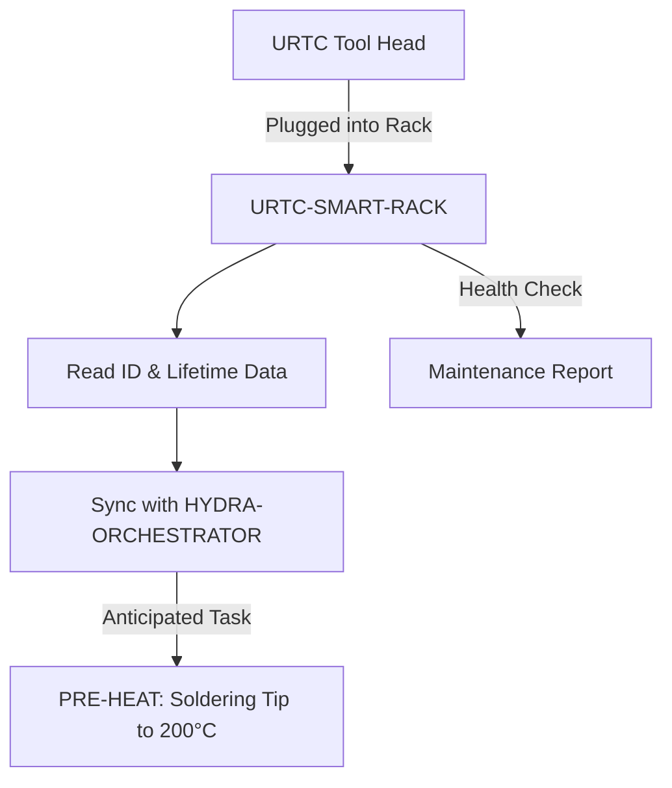

<p align="center">
  
</p>

# 🗄️ URTC-SMART-RACK

<p align="center"><a href="README.md">🇺🇸 English</a> | <a href="README_spa.md">🇪🇸 Español</a> | <a href="README_fra.md">🇫🇷 Français</a> | <a href="README_ita.md">🇮🇹 Italiano</a> | <a href="README_deu.md">🇩🇪 Deutsch</a> | <a href="README_zho.md">🇨🇳 简体中文</a> | 🇯🇵 <b>日本語</b></p>

### 🤖 ライフサイクルおよび温度追跡機能を備えたインテリジェントなエンドエフェクター管理システム

<p align="left">
  
  
  
  
</p>

---

## 1. 🛠️ 技術概要

**URTC-SMART-RACK** は、HYDRA-UMC エコシステム内のエンドエフェクター向け
インテリジェント収納システムです。STM32G4 マイクロコントローラーを基盤
とし、工具がロボットに装着されていない間、それを監視し準備します。

工具交換の直前に T12 はんだごて先を予熱するといった「スマートアイドル」
モードを可能にし、すべての URTC ヘッドの電子 ID、ファームウェアバージョン、
総使用サイクル数を追跡することで、最適なメンテナンスとゼロ秒デプロイを
実現します。

この基板にはまだ PCB/回路図が存在しないため（`hardware/` 参照）、以下の
どの機能も実際の GPIO/F-RAM/CAN ハードウェアを駆動することはできません——
しかし、それらの機能が帰着する*ロジック*（ID のデコード、使用状況の追跡、
いつ・何度で予熱すべきかの判断）は本物であり、純粋な C で書かれ、今日
すでに単体テスト済みです。

### 主な機能：
* ✅ **本物の v0 —— ID・ライフサイクル・予熱ロジック：** `tool_id.c` は生の 5 ビット ID 読み取り値を工具の識別情報にデコードします。`lifecycle.c` は使用サイクル/時間を追跡し、メンテナンス期限を通知します。`preheat.c` はスマートアイドル予熱をいつ開始すべきか、目標温度は何度かを決定します。ホスト自身の C コンパイラで 25 件のテストアサーションを実施——これらすべての実行・テストに PCB、GPIO ドライバー、F-RAM は不要です。
* 🗄️ **工具追跡** — 5 ビット ID ジャンパーまたは F-RAM 経由での URTC ヘッドの自動識別。*（ID デコードロジック自体は本物です——上記参照。実際のジャンパー/F-RAM の読み取りには PCB が必要です。）*
* 🌡️ **予熱ロジック** — はんだ付けおよび熱風工具向けのインテリジェントな温度管理。*（起動判断と目標温度は本物です——上記参照。実際のヒーターの駆動には PCB が必要です。）*
* 📈 **ライフサイクルログ** — 総アクチュエーションサイクル数と使用時間を工具の F-RAM に記録します。*（カウンターとメンテナンス期限ロジックは本物です——上記参照。実際の F-RAM への永続化には PCB が必要です。）*
* 📡 **CAN 統合** — HYDRA-UMC 運動学ブレインと直接通信し、協調した ATC（自動工具交換）を実現します。*（ワイヤープロトコル自体——フレーミング、CRC、コマンド検証——は本物です。以下を参照。ただし実際にそれを伝送するための本物の CAN トランシーバーはまだ必要です。）*
* 🔒 **プロトコル安全限界** — 本物のバージョン化されたフレーミングと CRC8 チェックサム、本物のアクチュエーション範囲検証、そして明確な安全状態を持つ本物のリンクタイムアウト/冪等性ウォッチドッグ。*（実装済み）*
* ✅ **Cortex-M4F ファームウェアツールチェーン** — 兄弟リポジトリ URTC が使用するのと同じツールチェーンを用いて、`arm-none-eabi-gcc` でクロスコンパイルおよびリンクされる、実際のベアメタルイメージ（起動コード + リンカ + `main.c`）。*（実装済み——下記の「ビルド」を参照）*

---

## 2. 🔄 スマートラックのワークフロー



---

## 3. 🧱 アーキテクチャと設計上の決定

* **この基板にまだ実際のピン配置/ハードウェア ID が定義されていない理由。** この基板にはまだ PCB が存在しません——`src/firmware_common.h` はハードウェア ID を持たないバージョン識別情報を携えており、起動/リンカファイルは、実際の STM32G4 部品が確定するまで ST 自身の CMSIS/HAL 起動コードの代わりを務める手書きのプレースホルダーです。
* **URTC 自体の子プロジェクトではない理由。** URTC-SMART-RACK は URTC ファミリーの子プロジェクトではなく、補完ツールです——独立した物理基板（工具ヘッドではなく工具保管ラック）でありながら、URTC 自身の CAN バスとファームウェアの慣例を共有していますが、その統合階層は共有していません。
* **`bump_version.py` が URTC 自身のものをそのままコピーしている理由。** 同じオドメーター式バージョニング規則、同じファームウェアヘッダー形式——スクリプトを再発明するのではなく正確に再利用することで、両者が構造的に自動的に同期を保ちます。
* **`tool_id.c`/`lifecycle.c`/`preheat.c` が GPIO/F-RAM/CAN ドライバーより先に実装される理由。** ID のデコード、使用状況の累積、予熱タイミングの判断は、すでに手元にあるデータに対する純粋な関数であり、書くにもテストするにも PCB を必要としません。そのため v0 ではまずこのロジックを実装し、`arm-none-eabi-gcc` ではなくマシン自身の C コンパイラでホストテストを行います。実際のハードウェアからこれらのデータを取得するドライバーは、PCB が存在するようになってから実装されます。
* **エコシステムの他の部分との関係。** URTC 自身の CAN バス/工具エコシステムを共有しており、実際にどの工具がラックに収納されているかを視覚的に認識する HYDRA-UMC-DETECTION-HEF と自然に組み合わされます。
* **プロトコル、コマンド検証、リンクウォッチドッグが 3 つの独立したモジュールである理由。** `protocol.c` はバイト、フレーミング、CRC しか知らず、何が「安全」な温度なのかは一切知りません。`rack_command.c` がその判断を担い、実際のコマンドをデコードして範囲チェックします。それがワイヤー上でどのように届いたかは気にしません。`link_watchdog.c` は両者とは独立してタイムアウト/冪等性を追跡します——壊れたフレームは決してそこにさえ届いてはなりません（`test_rack_link_scenarios.c` 自身の実際のアサーションで、CRC 不正なフレームがウォッチドッグを決して復活させないことを参照）。これらを分離しておくことで、それぞれをホスト上で単独にテストできるようになり、将来の CAN 受信ハンドラを薄く保てます——各レイヤーを順番に呼び出すだけで、どの判断も自分で再実装しません。
* **検証されていないリンクが、死んだリンクと完全に同じとして扱われる理由。** `link_watchdog_is_link_lost()` は、実際のタイムアウト後も、最初のフレームがまだ一度も到着していない段階も、両方とも真です——昇格監査自身がそれを「estado seguro al arrancar」と呼んでいます。まだホストが一度も接続されていない状態で起動するラックは、安全状態で起動しなければならず、証明されるまで黙って「大丈夫」だと仮定してはなりません。

---

## 📂 リポジトリ構成

```text
URTC-SMART-RACK/
├── src/                            # ファームウェアソース
│   ├── firmware_common.h           # FIRMWARE_VERSION_MAJOR/MINOR/PATCH
│   ├── tool_id.h / .c              # 本物：生の 5 ビット読み取り値のデコード -> 工具 ID
│   ├── lifecycle.h / .c            # 本物：使用サイクル/時間の追跡、メンテナンス期限チェック
│   ├── preheat.h / .c              # 本物：スマートアイドル起動 + 目標温度 + 安全状態ターゲット
│   ├── protocol.h / .c             # 本物：バージョン化されたフレーム形式 + CRC8 パース/エンコード
│   ├── rack_command.h / .c         # 本物：コマンドデコード + アクチュエーション限界検証
│   ├── link_watchdog.h / .c        # 本物：リンクタイムアウト + コマンド冪等性
│   ├── main.c                      # 最小限のエントリポイント（生存証明のハートビートループ）
│   ├── startup_stm32g4_minimal.c   # ベクターテーブル + Reset_Handler（ST HAL はまだなし、ファイルヘッダー参照）
│   └── STM32G4_MINIMAL.ld          # プレースホルダーリンカスクリプト（128K FLASH / 32K RAM の下限）
├── tests/                          # 本物のホストネイティブテストハーネス（tool_id、lifecycle、preheat、protocol、rack_command、link_watchdog、ラックリンクシナリオ）
├── docs/                           # ドキュメントとユーザーマニュアル
├── hardware/                       # ハードウェア設計ファイル（PCB、3D）—— 現時点では空、回路図なし
├── firmware/                       # バージョン管理されたビルド出力（.bin/.elf/.hex）、兄弟リポジトリ URTC と同様にコミットされる
├── build/                          # 中間ビルドオブジェクト（gitignore 対象）
├── images/                         # メディアと図表
├── tools/
│   ├── build_test.py               # バージョンを更新しないビルド/コンパイル確認
│   └── ci_validate.py              # CI が使用する manifest/CHANGELOG/docs の検証
├── bump_version.py                 # オドメーター式バージョンインクリメント（汎用スクリプト、URTC と共有）
├── bump_manifest_version.py        # hydra-umc.project.json のバージョンをネイティブ側と同期（--sync）
├── build_firmware.sh / .bat        # 実際のビルド：ホストテスト + バージョンインクリメント + コンパイル + リンク + 公開
├── build-test.sh / .bat            # バージョンを更新しないビルド/コンパイル確認
└── README.md
```

---

## 4. ⚙️ ビルド

ARM GNU ツールチェーン（`arm-none-eabi-gcc`、`arm-none-eabi-objcopy`、
`arm-none-eabi-size`）と Python 3 が必要です。

```bash
# Linux/macOS
chmod +x build_firmware.sh   # 初回のみ
./build_firmware.sh

# Windows
build_firmware.bat
```

このビルドはまず *ホスト自身* の C コンパイラ（`arm-none-eabi-gcc` では
ありません——これらは純粋なロジックテストであり、MCU レジスタには一切
触れません）で `tests/` をコンパイルして実行し、アサーションが一つでも
失敗すればビルド全体を失敗させます。それが終わって初めて `src/firmware_common.h`
のバージョンを増加させ（オドメーター規則、エコシステムの他の部分と同じ）、
`main.c` と `startup_stm32g4_minimal.c` を Cortex-M4F 向けにコンパイルし、
プレースホルダーである `STM32G4_MINIMAL.ld` のメモリマップとリンクし、
バージョン管理された `.elf`/`.bin`/`.hex` ファイルを `firmware/` に公開します。

実際のハードウェアにフラッシュできるものは今のところ何もありません——
対象の STM32G4 部品、ピン配置、実際の flash/RAM サイズを確認できる PCB が
存在しないためです。リンカスクリプトのメモリマップは保守的なプレース
ホルダー（そのファイル自身のヘッダーコメントに記載）であり、実際の
ハードウェアが存在するようになった時点で置き換えられます。それと同じ
タイミングで、`startup_stm32g4_minimal.c` の手書きのベクターテーブルも
ST 自身の CMSIS/HAL 起動コードに置き換えられます（兄弟リポジトリ URTC の
STM32F303 基板向け `src/F303-master/` を踏襲）。

実例——ホスト側のテストは単独でも実行でき、完全なファームウェアビルドを
行わずにロジックを確認するのに便利です：

```bash
cc -std=c11 -Wall -Wextra -Isrc -Itests -o build/host_tests \
  tests/test_main.c tests/test_tool_id.c tests/test_lifecycle.c tests/test_preheat.c \
  tests/test_protocol.c tests/test_rack_command.c tests/test_link_watchdog.c tests/test_rack_link_scenarios.c \
  src/tool_id.c src/lifecycle.c src/preheat.c src/protocol.c src/rack_command.c src/link_watchdog.c
./build/host_tests
# All tests passed.
```

---

## 🔗 関連プロジェクト

本プロジェクトは、同じ作者(JuanenRac / Electro Hobby 3D)による HYDRA-UMC ロボティクスエコシステムの一部です。リクエストが実はこの中のどれかについてのものである可能性があるため、知っておく価値があります。

**直接関連**
- **[URTC](https://github.com/JuanenRac/URTC)** — 物理的な Universal Robot Tool Controller 基板向けファームウェア、CAN バス経由の 25 以上のツールプロファイル ——同じ CAN バス上の、同じツールエコシステム。
- **[HYDRA-UMC-DETECTION-HEF](https://github.com/JuanenRac/HYDRA-UMC-DETECTION-HEF)** — Hailo アーキテクチャ/チェックサムによる安全読み込み検証を備えた、実際のコンパイル済みモデルレジストリ ——本ラックが収納するツールの視覚認識を提供する。

**エコシステムの他のプロジェクト**

*コアハードウェア&プラットフォーム*
- **[HYDRA-UMC](https://github.com/JuanenRac/HYDRA-UMC)** — 実際のロボットアームのマザーボード——CM5 ホスト + デュアルコア STM32H745、CAN-OTA/SPI-OTA 経由で最大 8 本のツールアームを統括。
- **[HYDRA-UMC-OS](https://github.com/JuanenRac/HYDRA-UMC-OS)** — CM5 向けの再現可能な Raspberry Pi OS プロダクト層——読み取り専用エージェント、検証済み設定/プロファイル、WiFi 初回接続プロビジョニング。
- **[HYDRA-UMC-SDK](https://github.com/JuanenRac/HYDRA-UMC-SDK)** — すべてのブリッジが自身のコマンドを検証する共有 JSON-Schema 契約と安全ゲートの境界。

*コアバックエンド&クライアント*
- **[HYDRA-UMC-SERVER](https://github.com/JuanenRac/HYDRA-UMC-SERVER)** — すべての制御クライアントが実際に通信する、本物のヘッドレスバックエンド(REST/WebSocket)。
- **[HYDRA-UMC-STUDIO](https://github.com/JuanenRac/HYDRA-UMC-STUDIO)** — リアルタイムのマルチロボット 3D 可視化を備えたウェブ制御ダッシュボード。
- **[HYDRA-UMC-SUITE](https://github.com/JuanenRac/HYDRA-UMC-SUITE)** — 複数のサーバーを同時に扱えるデスクトップ(PySide6)スウォームコマンドセンター、スタンドアロン実行ファイルとしてパッケージ化。
- **[HYDRA-UMC-ANDROID-CONTROL](https://github.com/JuanenRac/HYDRA-UMC-ANDROID-CONTROL)** — 生体認証ログインとペアリングされた Wear OS コンパニオンを備えたネイティブ Android 制御アプリ。
- **[HYDRA-UMC-IOS-CONTROL](https://github.com/JuanenRac/HYDRA-UMC-IOS-CONTROL)** — リアルタイム WebSocket 同期を備えた iOS/iPadOS 制御アプリ(Flutter)。
- **[HYDRA-UMC-DSI](https://github.com/JuanenRac/HYDRA-UMC-DSI)** — 本体搭載の 7 インチ DSI タッチスクリーン向けネイティブタッチ UI、CM5 自体に組み込み。
- **[HYDRA-UMC-EDITOR-URDF](https://github.com/JuanenRac/HYDRA-UMC-EDITOR-URDF)** — 完成したモデルを STUDIO 自身のカタログへ送信するデスクトップ用グラフィカル URDF 作成/編集ツール。
- **[HYDRA-UMC-BRIDGE-AMR](https://github.com/JuanenRac/HYDRA-UMC-BRIDGE-AMR)** — 実際の VDA 5050 MQTT パブリッシャーによる AGV/AMR フリートの調整境界。
- **[HYDRA-UMC-BRIDGE-CNC](https://github.com/JuanenRac/HYDRA-UMC-BRIDGE-CNC)** — 実際の GRBL ステータス/制御バイトへのアクセスを持つ、CNC セルの高レベルコーディネーター。
- **[HYDRA-UMC-BRIDGE-DROIDS](https://github.com/JuanenRac/HYDRA-UMC-BRIDGE-DROIDS)** — 実際の Boston Dynamics Spot コマンド送信機能を持つ、脚型/ヒューマノイドドロイドの調整境界。
- **[HYDRA-UMC-BRIDGE-LASER](https://github.com/JuanenRac/HYDRA-UMC-BRIDGE-LASER)** — 実際のキー/筐体/インターロック GPIO セーフガード 3 系統を読み取る、レーザーセルの安全コーディネーター。
- **[HYDRA-UMC-BRIDGE-OPENPNP](https://github.com/JuanenRac/HYDRA-UMC-BRIDGE-OPENPNP)** — OpenPnP ピックアンドプレースの基板フローを安全に統括する高レベルコーディネーター。
- **[HYDRA-UMC-BRIDGE-PRINTER3D](https://github.com/JuanenRac/HYDRA-UMC-BRIDGE-PRINTER3D)** — 実際にゲート制御されたジョブコマンドを持つ、Moonraker/Klipper 3D プリンター向けの安全な調整境界。
- **[HYDRA-UMC-BRIDGE-ROS2](https://github.com/JuanenRac/HYDRA-UMC-BRIDGE-ROS2)** — 実際の遅延インポート rclpy ROS 2 トランスポートを持つ安全コーディネーター。
- **[HYDRA-UMC-BRIDGE-UAV](https://github.com/JuanenRac/HYDRA-UMC-BRIDGE-UAV)** — 実際の MAVLink コマンド送信機能を持つ、カメラ搭載 UAV の調整境界。

*URTC ツールプラットフォーム*
- **[URTC-FLASHER](https://github.com/JuanenRac/URTC-FLASHER)** — URTC 基板用のデスクトップ GUI 書き込みツール、CAN-OTA およびフルチップ SWD/JTAG。
- **[URTC-TESTER](https://github.com/JuanenRac/URTC-TESTER)** — URTC 基板向けのデスクトップ CAN バスライブ診断ツール、ツールプロファイルごとに 1 パネル。
- **[URTC-WEB-STUDIO](https://github.com/JuanenRac/URTC-WEB-STUDIO)** — Web Serial API を使ったブラウザベースの URTC-TESTER の代替、ローカルインストール不要。

*ビジョン AI ノード(Hailo-8)*
- **[HYDRA-UMC-VISION-NODE](https://github.com/JuanenRac/HYDRA-UMC-VISION-NODE)** — Hailo-8 ビジョンパイプラインの統合ハブ、段階ごとの実際のハードウェア準備状況チェック付き。
- **[HYDRA-UMC-VISION-STREAMER](https://github.com/JuanenRac/HYDRA-UMC-VISION-STREAMER)** — 実際の HailoRT 統合境界を持つ、実際の GStreamer パイプライン + MediaMTX 設定生成器。
- **[HYDRA-UMC-VISUAL-SERVOING-API](https://github.com/JuanenRac/HYDRA-UMC-VISUAL-SERVOING-API)** — 上流のゾーン状態に応じて安全ゲート制御される、実際の Position-Based Visual Servoing 補正則。
- **[HYDRA-UMC-SAFETY-ZONES](https://github.com/JuanenRac/HYDRA-UMC-SAFETY-ZONES)** — キャリブレーションの鮮度を強制する、実際のゾーン侵入チェックと E-STOP 要求。

*コグニティブ AI ノード(Hailo-10)*
- **[HYDRA-UMC-COGNITIVE-NODE](https://github.com/JuanenRac/HYDRA-UMC-COGNITIVE-NODE)** — Hailo-10 コグニティブパイプライン(LLM/VLA/音声オーケストレーション)の統合ハブ。
- **[HYDRA-UMC-VLA-ENGINE](https://github.com/JuanenRac/HYDRA-UMC-VLA-ENGINE)** — Vision-Language-Action モデル向けの、実際のアクショントークンのエンコード/デコードと軌道生成。
- **[HYDRA-UMC-VOICE-UI](https://github.com/JuanenRac/HYDRA-UMC-VOICE-UI)** — 確認ゲート付きの限定的な Watch リレーを備えた、実際の音声フロントエンド(VAD + 意図解析)。
- **[HYDRA-UMC-SEMANTIC-PLANNER](https://github.com/JuanenRac/HYDRA-UMC-SEMANTIC-PLANNER)** — MCU エラーコードに対する、実際のルールベースのタスク分解と意味的エラー復旧。
- **[HYDRA-UMC-DOCS-QA](https://github.com/JuanenRac/HYDRA-UMC-DOCS-QA)** — このエコシステム自身の Markdown ドキュメントに対する、標準ライブラリのみの実際の TF-IDF 文書検索。

*オーケストレーション&スウォーム*
- **[HYDRA-UMC-ORCHESTRATOR](https://github.com/JuanenRac/HYDRA-UMC-ORCHESTRATOR)** — 実際の gRPC/Protobuf ヘルスレポート契約とミッションステートマシンを持つ統合ハブ。
- **[HYDRA-UMC-JOB-DISPATCHER](https://github.com/JuanenRac/HYDRA-UMC-JOB-DISPATCHER)** — 実際の HTTP API 上に構築された、優先度ベースの実際のジョブキュー(重複排除付き)。
- **[HYDRA-UMC-NODE-HEALING](https://github.com/JuanenRac/HYDRA-UMC-NODE-HEALING)** — リトライ/バックオフとアイデンティティ不一致検出を備えた、実際の gRPC ベースのフリートヘルスウォッチドッグ。
- **[HYDRA-UMC-PATH-PLANNER-3D](https://github.com/JuanenRac/HYDRA-UMC-PATH-PLANNER-3D)** — 実際の障害物/ワークスペース衝突検証を備えた、実際の RRT ベースの 3D 経路プランナー。
- **[HYDRA-UMC-SWARM-SYNC](https://github.com/JuanenRac/HYDRA-UMC-SWARM-SYNC)** — 複数セルの収束についてプロパティテストされた、実際の CRDT LWW-Element-Map 状態同期。

*デジタルツイン&シミュレーション*
- **[HYDRA-UMC-TWIN](https://github.com/JuanenRac/HYDRA-UMC-TWIN)** — 実際のバージョン互換性同期契約を持つ、デジタルツインエンジンの統合ハブ。
- **[HYDRA-UMC-HIL-BRIDGE](https://github.com/JuanenRac/HYDRA-UMC-HIL-BRIDGE)** — シミュレーションと実際のハードウェアの間でコマンドをルーティングする、実際のハードウェア・イン・ザ・ループ安全インターロック。
- **[HYDRA-UMC-PHYSICS-REPLICA](https://github.com/JuanenRac/HYDRA-UMC-PHYSICS-REPLICA)** — 実際の URDF サブセットに対する、実際の順運動学と関節限界検証。
- **[HYDRA-UMC-SYNTHETIC-DATA-GEN](https://github.com/JuanenRac/HYDRA-UMC-SYNTHETIC-DATA-GEN)** — YOLO/COCO アノテーションのエクスポート機能を持つ、実際のプロシージャル 2D シーンジェネレーター。

*データ&分析*
- **[HYDRA-UMC-DATALAKE](https://github.com/JuanenRac/HYDRA-UMC-DATALAKE)** — 実際の取り込み/クエリ HTTP API を備えた、実際の sqlite3 ベースの時系列ストア。
- **[HYDRA-UMC-ANOMALY-DETECTOR](https://github.com/JuanenRac/HYDRA-UMC-ANOMALY-DETECTOR)** — ドリフト監視を備えた、実際の FFT + 統計ベースラインによる異常検知器。
- **[HYDRA-UMC-PRODUCTION-REPORTS](https://github.com/JuanenRac/HYDRA-UMC-PRODUCTION-REPORTS)** — DATALAKE の履歴に対する実際の OEE/稼働率計算、再現可能な CSV エクスポート付き。
- **[HYDRA-UMC-TELEMETRY-COLLECTOR](https://github.com/JuanenRac/HYDRA-UMC-TELEMETRY-COLLECTOR)** — シーケンス重複排除機能を備えた、DATALAKE への実際の CAN/WebSocket 取り込みパイプライン。

*産業用ゲートウェイ*
- **[HYDRA-UMC-GATEWAY-INDUSTRIAL](https://github.com/JuanenRac/HYDRA-UMC-GATEWAY-INDUSTRIAL)** — 実際のコマンド許可リスト/バックプレッシャー層を持つ、産業用プロトコルへ中継する統合ハブ。
- **[HYDRA-UMC-OPCUA-SERVER](https://github.com/JuanenRac/HYDRA-UMC-OPCUA-SERVER)** — 実際のバイナリプロトコルクライアントセッションで検証された、実際の OPC-UA アドレス空間。
- **[HYDRA-UMC-MQTT-BROKER](https://github.com/JuanenRac/HYDRA-UMC-MQTT-BROKER)** — クライアント単位のオプション認証とトピック ACL を備えた、実際の MQTT ブローカー。
- **[HYDRA-UMC-MTCONNECT-ADAPTER](https://github.com/JuanenRac/HYDRA-UMC-MTCONNECT-ADAPTER)** — 縮退モード出力を備えた、実際の MTConnect `/probe` および `/current` XML エンドポイント。

*補完ツール&エコシステム運用*
- **[HYDRA-UMC-DASHBOARD-AI](https://github.com/JuanenRac/HYDRA-UMC-DASHBOARD-AI)** — 誠実な統計フォールバックを備えた、DATALAKE/ANOMALY-DETECTOR 上のスマートサマリーと異常ハイライトパネル。
- **[HYDRA-UMC-TOOL-CLI](https://github.com/JuanenRac/HYDRA-UMC-TOOL-CLI)** — 実際の安定した終了コード契約を持つフリート CLI、HYDRA-UMC-SERVER 自身の API の本物のライブクライアント。
- **[HYDRA-UMC-WATCH](https://github.com/JuanenRac/HYDRA-UMC-WATCH)** — 実際の触覚アラートとペアリングされたスマートフォンへの音声リレーを備えた WearOS コンパニオンアプリ。
- **[URTC-VISION-TOOL](https://github.com/JuanenRac/URTC-VISION-TOOL)** — サーマル/RGB 検査ツールヘッド向けの、ファームウェアと実際の Python ビジョンコンパニオン。
- **[HYDRA-UMC-UPDATER](https://github.com/JuanenRac/HYDRA-UMC-UPDATER)** — このエコシステム内のすべてのリポジトリを検出・クローン・更新する、管理用デスクトップツール。


---

## 📚 ドキュメント & コミュニティ

- **[CONTRIBUTING.md](CONTRIBUTING.md)** —— プルリクエストのための技術スタックとコーディング指針。
- **[CODE_OF_CONDUCT.md](CODE_OF_CONDUCT.md)** —— このコミュニティで期待される行動規範。
- **[SECURITY.md](SECURITY.md)** —— 脆弱性の報告方法と、このプロジェクトの実際のセキュリティ重点領域。
- **[SUPPORT.md](SUPPORT.md)** —— 質問の投稿先とバグの報告先。
- **[LICENSE.md](LICENSE.md)** —— このプロジェクト自身のライセンス。

## 👤 作者
**JuanenRac** (Electro Hobby 3D)
📧 electrohobby3d@gmail.com
📺 [youtube.com/@electrohobby3d](https://youtube.com/@electrohobby3d)

## 📜 ライセンス
GPL-3.0 —— 詳細は LICENSE を参照してください。
