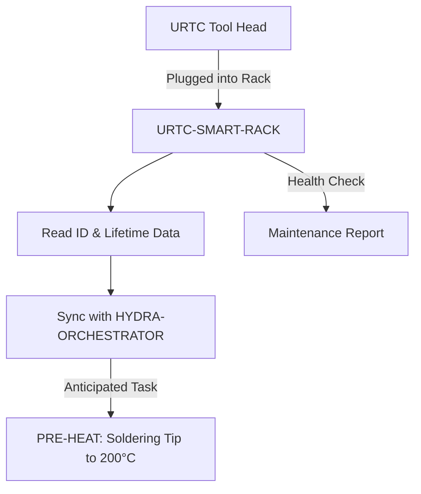

<p align="center">
  
</p>

# 🗄️ URTC-SMART-RACK

<p align="center"><a href="README.md">🇺🇸 English</a> | <a href="README_spa.md">🇪🇸 Español</a> | <a href="README_fra.md">🇫🇷 Français</a> | <a href="README_ita.md">🇮🇹 Italiano</a> | <a href="README_deu.md">🇩🇪 Deutsch</a> | <a href="README_zho.md">🇨🇳 简体中文</a> | 🇯🇵 <b>日本語</b></p>

### 🤖 ライフサイクルおよび温度追跡機能を備えたインテリジェントなエンドエフェクター管理システム

<p align="left">
  
  
  
  
</p>

---

## 1. 🛠️ 技術概要

**URTC-SMART-RACK** は、HYDRA-UMC エコシステム内のエンドエフェクター向け
インテリジェント収納システムです。STM32G4 マイクロコントローラーを基盤
とし、工具がロボットに装着されていない間、それを監視し準備します。

工具交換の直前に T12 はんだごて先を予熱するといった「スマートアイドル」
モードを可能にし、すべての URTC ヘッドの電子 ID、ファームウェアバージョン、
総使用サイクル数を追跡することで、最適なメンテナンスとゼロ秒デプロイを
実現します。

この基板にはまだ PCB/回路図が存在しません（`hardware/` 参照）——以下の
機能は目標設計を説明したものであり、今日実際に存在するのはファームウェア
ツールチェーンのみです。

### 主な機能：
* 🗄️ **工具追跡** — 5 ビット ID ジャンパーまたは F-RAM 経由での URTC ヘッドの自動識別。*（計画中——実際の PCB が必要）*
* 🌡️ **予熱ロジック** — はんだ付けおよび熱風工具向けのインテリジェントな温度管理。*（計画中）*
* 📈 **ライフサイクルログ** — 総アクチュエーションサイクル数と使用時間を工具の F-RAM に記録します。*（計画中）*
* 📡 **CAN 統合** — HYDRA-UMC 運動学ブレインと直接通信し、協調した ATC（自動工具交換）を実現します。*（計画中）*
* ✅ **Cortex-M4F ファームウェアツールチェーン** — 兄弟リポジトリ URTC が使用するのと同じツールチェーンを用いて、`arm-none-eabi-gcc` でクロスコンパイルおよびリンクされる、実際のベアメタルイメージ（起動コード + リンカ + `main.c`）。*（実装済み——下記の「ビルド」を参照）*

---

## 2. 🔄 スマートラックのワークフロー



---

## 3. 🧱 アーキテクチャと設計上の決定

* **この基板にまだ実際のピン配置/ハードウェア ID が定義されていない理由。** この基板にはまだ PCB が存在しません——`src/firmware_common.h` はハードウェア ID を持たないバージョン識別情報を携えており、起動/リンカファイルは、実際の STM32G4 部品が確定するまで ST 自身の CMSIS/HAL 起動コードの代わりを務める手書きのプレースホルダーです。
* **URTC 自体の子プロジェクトではない理由。** URTC-SMART-RACK は URTC ファミリーの子プロジェクトではなく、補完ツールです——独立した物理基板（工具ヘッドではなく工具保管ラック）でありながら、URTC 自身の CAN バスとファームウェアの慣例を共有していますが、その統合階層は共有していません。
* **`bump_version.py` が URTC 自身のものをそのままコピーしている理由。** 同じオドメーター式バージョニング規則、同じファームウェアヘッダー形式——スクリプトを再発明するのではなく正確に再利用することで、両者が構造的に自動的に同期を保ちます。
* **エコシステムの他の部分との関係。** URTC 自身の CAN バス/工具エコシステムを共有しており、実際にどの工具がラックに収納されているかを視覚的に認識する HYDRA-UMC-DETECTION-HEF と自然に組み合わされます。

---

## 📂 リポジトリ構成

```text
URTC-SMART-RACK/
├── src/                            # ファームウェアソース
│   ├── firmware_common.h           # FIRMWARE_VERSION_MAJOR/MINOR/PATCH = 0.0.0
│   ├── main.c                      # 最小限のエントリポイント（生存証明のハートビートループ）
│   ├── startup_stm32g4_minimal.c   # ベクターテーブル + Reset_Handler（ST HAL はまだなし、ファイルヘッダー参照）
│   └── STM32G4_MINIMAL.ld          # プレースホルダーリンカスクリプト（128K FLASH / 32K RAM の下限）
├── docs/                           # ドキュメントとユーザーマニュアル
├── hardware/                       # ハードウェア設計ファイル（PCB、3D）—— 現時点では空、回路図なし
├── firmware/                       # バージョン管理されたビルド出力（.bin/.elf/.hex）、兄弟リポジトリ URTC と同様にコミットされる
├── build/                          # 中間ビルドオブジェクト（gitignore 対象）
├── images/                         # メディアと図表
├── scripts/                        # ユーティリティスクリプト
├── bump_version.py                 # オドメーター式バージョンインクリメント（汎用スクリプト、URTC と共有）
├── build_firmware.sh / .bat        # 実際のビルド：バージョンインクリメント + コンパイル + リンク + firmware/ へ公開
└── README.md
```

---

## 4. ⚙️ ビルド

ARM GNU ツールチェーン（`arm-none-eabi-gcc`、`arm-none-eabi-objcopy`、
`arm-none-eabi-size`）と Python 3 が必要です。

```bash
# Linux/macOS
chmod +x build_firmware.sh   # 初回のみ
./build_firmware.sh

# Windows
build_firmware.bat
```

このビルドは `src/firmware_common.h` のバージョンを増加させ（オドメーター
規則、エコシステムの他の部分と同じ）、`main.c` と
`startup_stm32g4_minimal.c` を Cortex-M4F 向けにコンパイルし、プレース
ホルダーである `STM32G4_MINIMAL.ld` のメモリマップとリンクし、バージョン
管理された `.elf`/`.bin`/`.hex` ファイルを `firmware/` に公開します。

実際のハードウェアにフラッシュできるものは今のところ何もありません——
対象の STM32G4 部品、ピン配置、実際の flash/RAM サイズを確認できる PCB が
存在しないためです。リンカスクリプトのメモリマップは保守的なプレース
ホルダー（そのファイル自身のヘッダーコメントに記載）であり、実際の
ハードウェアが存在するようになった時点で置き換えられます。それと同じ
タイミングで、`startup_stm32g4_minimal.c` の手書きのベクターテーブルも
ST 自身の CMSIS/HAL 起動コードに置き換えられます（兄弟リポジトリ URTC の
STM32F303 基板向け `src/F303-master/` を踏襲）。

---

## 🔗 関連プロジェクト

本プロジェクトは、同一著者（JuanenRac / Electro Hobby 3D）による、
ファームウェア、制御ソフトウェア、AI ノード、フリート管理ツールにまたがる、
より大きなロボティクスエコシステムの一部です。ご要望が実際にはこれらの
プロジェクトのいずれかに関するものであり、本リポジトリのものではない
可能性もあるため、知っておく価値があります。

### 直接関連

- **[URTC](https://github.com/JuanenRac/URTC)** —— 同一の工具エコシステム/CAN バス。
- **[HYDRA-UMC-DETECTION-HEF](https://github.com/JuanenRac/HYDRA-UMC-DETECTION-HEF)** —— 本ラックが保管する工具の視覚的認識。

### エコシステムのその他のプロジェクト

**HYDRA-UMC プラットフォーム** — マルチロボット・マイクロファクトリーセル
- **[HYDRA-UMC](https://github.com/JuanenRac/HYDRA-UMC)** — 最大 8 台のロボットアームを統括する CM5 + STM32H745 マザーボード。
- **[HYDRA-UMC-SERVER](https://github.com/JuanenRac/HYDRA-UMC-SERVER)** — すべての制御クライアントが接続する Express/WebSocket バックエンド。
- **[HYDRA-UMC-STUDIO](https://github.com/JuanenRac/HYDRA-UMC-STUDIO)** — Web ベースの制御ダッシュボード、マルチロボット 3D 可視化。
- **[HYDRA-UMC-ANDROID-CONTROL](https://github.com/JuanenRac/HYDRA-UMC-ANDROID-CONTROL)** — Wi-Fi/Bluetooth 経由の Android 制御アプリ。
- **[HYDRA-UMC-IOS-CONTROL](https://github.com/JuanenRac/HYDRA-UMC-IOS-CONTROL)** — Flutter で構築された iOS/iPadOS 制御アプリ。
- **[HYDRA-UMC-SUITE](https://github.com/JuanenRac/HYDRA-UMC-SUITE)** — デスクトップ版群制御コマンドセンター（Python/PySide6）。
- **[HYDRA-UMC-EDITOR-URDF](https://github.com/JuanenRac/HYDRA-UMC-EDITOR-URDF)** — ロボットカタログ向けのデスクトップ版 URDF モデルエディター。
- **[HYDRA-UMC-DSI](https://github.com/JuanenRac/HYDRA-UMC-DSI)** — 機載 DSI タッチスクリーン用のネイティブタッチ UI。

**URTC プラットフォーム** — すべての HYDRA-UMC ロボットアームが搭載するツールヘッドコントローラー
- **[URTC](https://github.com/JuanenRac/URTC)** — CAN バスツールヘッドコントローラー、25 種類のツールプロファイル。
- **[URTC-FLASHER](https://github.com/JuanenRac/URTC-FLASHER)** — デスクトップ版 CAN-OTA + SWD/JTAG フラッシュツール。
- **[URTC-TESTER](https://github.com/JuanenRac/URTC-TESTER)** — デスクトップ版ライブ CAN バス診断ツール。
- **[URTC-WEB-STUDIO](https://github.com/JuanenRac/URTC-WEB-STUDIO)** — Web Serial API によるブラウザベースの代替版。

**🎥 ビジョン AI ノード（Hailo-8）**
- [HYDRA-UMC-VISION-NODE](https://github.com/JuanenRac/HYDRA-UMC-VISION-NODE)
- [HYDRA-UMC-VISION-STREAMER](https://github.com/JuanenRac/HYDRA-UMC-VISION-STREAMER)
- [HYDRA-UMC-DETECTION-HEF](https://github.com/JuanenRac/HYDRA-UMC-DETECTION-HEF)
- [HYDRA-UMC-SAFETY-ZONES](https://github.com/JuanenRac/HYDRA-UMC-SAFETY-ZONES)
- [HYDRA-UMC-VISUAL-SERVOING-API](https://github.com/JuanenRac/HYDRA-UMC-VISUAL-SERVOING-API)

**🧠 認知 AI ノード（Hailo-10）**
- [HYDRA-UMC-COGNITIVE-NODE](https://github.com/JuanenRac/HYDRA-UMC-COGNITIVE-NODE)
- [HYDRA-UMC-VLA-ENGINE](https://github.com/JuanenRac/HYDRA-UMC-VLA-ENGINE)
- [HYDRA-UMC-VOICE-UI](https://github.com/JuanenRac/HYDRA-UMC-VOICE-UI)
- [HYDRA-UMC-SEMANTIC-PLANNER](https://github.com/JuanenRac/HYDRA-UMC-SEMANTIC-PLANNER)
- [HYDRA-UMC-DOCS-QA](https://github.com/JuanenRac/HYDRA-UMC-DOCS-QA)

**🐝 オーケストレーションと群制御**
- [HYDRA-UMC-ORCHESTRATOR](https://github.com/JuanenRac/HYDRA-UMC-ORCHESTRATOR)
- [HYDRA-UMC-SWARM-SYNC](https://github.com/JuanenRac/HYDRA-UMC-SWARM-SYNC)
- [HYDRA-UMC-PATH-PLANNER-3D](https://github.com/JuanenRac/HYDRA-UMC-PATH-PLANNER-3D)
- [HYDRA-UMC-JOB-DISPATCHER](https://github.com/JuanenRac/HYDRA-UMC-JOB-DISPATCHER)
- [HYDRA-UMC-NODE-HEALING](https://github.com/JuanenRac/HYDRA-UMC-NODE-HEALING)

**🎮 デジタルツインとシミュレーション**
- [HYDRA-UMC-TWIN](https://github.com/JuanenRac/HYDRA-UMC-TWIN)
- [HYDRA-UMC-PHYSICS-REPLICA](https://github.com/JuanenRac/HYDRA-UMC-PHYSICS-REPLICA)
- [HYDRA-UMC-HIL-BRIDGE](https://github.com/JuanenRac/HYDRA-UMC-HIL-BRIDGE)
- [HYDRA-UMC-SYNTHETIC-DATA-GEN](https://github.com/JuanenRac/HYDRA-UMC-SYNTHETIC-DATA-GEN)

**📊 データと分析**
- [HYDRA-UMC-DATALAKE](https://github.com/JuanenRac/HYDRA-UMC-DATALAKE)
- [HYDRA-UMC-TELEMETRY-COLLECTOR](https://github.com/JuanenRac/HYDRA-UMC-TELEMETRY-COLLECTOR)
- [HYDRA-UMC-ANOMALY-DETECTOR](https://github.com/JuanenRac/HYDRA-UMC-ANOMALY-DETECTOR)
- [HYDRA-UMC-PRODUCTION-REPORTS](https://github.com/JuanenRac/HYDRA-UMC-PRODUCTION-REPORTS)

**🏭 産業用ゲートウェイ**
- [HYDRA-UMC-GATEWAY-INDUSTRIAL](https://github.com/JuanenRac/HYDRA-UMC-GATEWAY-INDUSTRIAL)
- [HYDRA-UMC-OPCUA-SERVER](https://github.com/JuanenRac/HYDRA-UMC-OPCUA-SERVER)
- [HYDRA-UMC-MQTT-BROKER](https://github.com/JuanenRac/HYDRA-UMC-MQTT-BROKER)
- [HYDRA-UMC-MTCONNECT-ADAPTER](https://github.com/JuanenRac/HYDRA-UMC-MTCONNECT-ADAPTER)

**🛠️ 補完ツール**
- [URTC-VISION-TOOL](https://github.com/JuanenRac/URTC-VISION-TOOL)
- [HYDRA-UMC-WATCH](https://github.com/JuanenRac/HYDRA-UMC-WATCH)
- [HYDRA-UMC-TOOL-CLI](https://github.com/JuanenRac/HYDRA-UMC-TOOL-CLI)
- [HYDRA-UMC-DASHBOARD-AI](https://github.com/JuanenRac/HYDRA-UMC-DASHBOARD-AI)


## 👤 作者
**JuanenRac**（Electro Hobby 3D）
📧 electrohobby3d@gmail.com

## 📜 ライセンス
GPL-3.0 —— 詳細は LICENSE を参照してください。

## 🛠️ BUILD & RUN

リリースビルドの前に、バージョンを変更しないビルドチェックを使用してください。

| 操作 | Windows | Linux / macOS |
|---|---|---|
| ビルドチェック（バージョンと CHANGELOG を変更しない） | `build-test.bat` | `./build-test.sh` |
| 実行 / 開発（提供されている場合） | `run*.bat` または `dev*.bat` | `./run*.sh` または `./dev*.sh` |

`build-test.bat` と `build-test.sh` は、`hydra-umc.project.json` をインクリメントせず、`CHANGELOG.md` も変更せずにプロジェクトのスタックをコンパイルまたは検証します。通常のコンパイラ出力だけが作成される場合があります。既存の `build*.bat`、`build*.sh`、`run*`、`dev*` は、各プロジェクト固有のバージョン化または実行時の動作を維持します。その動作が必要な場合はそれらを使用してください。