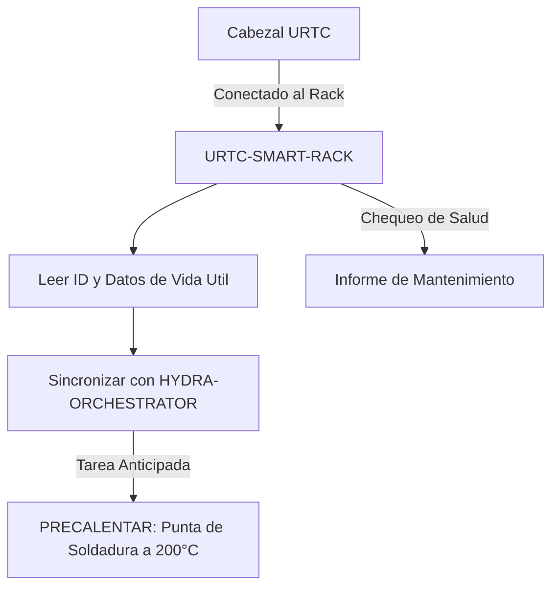

<p align="center">
  
</p>

# 🗄️ URTC-SMART-RACK

<p align="center"><a href="README.md">🇺🇸 English</a> | 🇪🇸 <b>Español</b> | <a href="README_fra.md">🇫🇷 Français</a> | <a href="README_ita.md">🇮🇹 Italiano</a> | <a href="README_deu.md">🇩🇪 Deutsch</a> | <a href="README_zho.md">🇨🇳 简体中文</a> | <a href="README_jpn.md">🇯🇵 日本語</a></p>

### 🤖 Gestión Inteligente de Cabezales con Seguimiento de Vida Útil y Térmico

<p align="left">
  
  
  
  
</p>

---

## 1. 🛠️ VISIÓN TÉCNICA GENERAL

**URTC-SMART-RACK** es un sistema de almacenamiento inteligente para cabezales de herramienta dentro del ecosistema HYDRA-UMC. Basado en el microcontrolador STM32G4, monitoriza y prepara las herramientas mientras no están acopladas a un robot.

Habilita modos "Smart Idle", como precalentar puntas de soldadura T12 justo antes de un cambio de herramienta, y registra el ID electrónico, la versión de firmware y los ciclos totales de uso de cada cabezal URTC, garantizando un mantenimiento óptimo y un despliegue de cero segundos.

Todavía no existe PCB/esquemático para esta placa (ver `hardware/`), así que nada de lo de abajo puede manejar GPIO/F-RAM/CAN real - pero la *lógica* en la que se reducen esas características (decodificar un ID, registrar el uso, decidir cuándo precalentar y a qué temperatura) es real, C puro, con tests hoy mismo.

### Características Clave:
* ✅ **Real v0 - lógica de ID, vida útil y precalentamiento:** `tool_id.c` decodifica una lectura de ID de 5 bits en una identidad de herramienta; `lifecycle.c` registra ciclos/tiempo de uso y marca cuando hace falta mantenimiento; `preheat.c` decide cuándo debe empezar el precalentamiento Smart Idle y a qué temperatura objetivo. 25 aserciones de test con el propio compilador C del host - no hace falta PCB, driver de GPIO ni F-RAM para ejecutar ni testear nada de esto.
* 🗄️ **Seguimiento de Herramientas** — identificación automática de cabezales URTC vía jumpers de ID de 5 bits o F-RAM. *(la lógica de decodificación de ID en sí es real - ver arriba; leer jumpers/F-RAM reales necesita el PCB.)*
* 🌡️ **Lógica de Precalentamiento** — gestión térmica inteligente para herramientas de soldadura y aire caliente. *(la decisión de activación y las temperaturas objetivo son reales - ver arriba; accionar un calentador real necesita el PCB.)*
* 📈 **Registros de Vida Útil** — registra ciclos totales de actuación y horas de uso en la F-RAM de la herramienta. *(los contadores y la lógica de mantenimiento debido son reales - ver arriba; persistirlos en F-RAM real necesita el PCB.)*
* 📡 **Integración CAN** — se comunica directamente con el Cerebro Cinemático de HYDRA-UMC para ATC coordinado (Cambio Automático de Herramienta). *(el protocolo en sí - framing, CRC, validación de comandos - es real, ver más abajo; todavía hace falta un transceptor CAN real para transportarlo.)*
* 🔒 **Límites de Seguridad del Protocolo** — framing versionado real con suma de verificación CRC8, validación real de rango de actuación, y un watchdog real de timeout de enlace/idempotencia con un estado seguro definido. *(implementado)*
* ✅ **Toolchain de firmware Cortex-M4F** — una imagen bare-metal real (startup + linker + `main.c`) que compila y enlaza de verdad con `arm-none-eabi-gcc`, el mismo toolchain que usa el repositorio hermano URTC. *(implementado — ver COMPILACIÓN abajo)*

---

## 2. 🔄 FLUJO DE TRABAJO DEL SMART RACK



---

## 3. 🧱 ARQUITECTURA Y DECISIONES DE DISEÑO

* **Por qué esta placa aún no tiene un pinout/ID de hardware real definido.** Todavía no existe una PCB para esta placa - `src/firmware_common.h` lleva una identidad de versión sin ID de hardware, y los archivos de arranque/enlazado están escritos a mano como marcadores de posición sustituyendo al propio arranque CMSIS/HAL de ST hasta que se fije una pieza STM32G4 real.
* **Por qué no es un hijo del propio URTC.** URTC-SMART-RACK es una Herramienta Complementaria, no un hijo de la familia URTC - es una placa física separada (un rack de almacenamiento de herramientas, no un cabezal de herramienta) que comparte el bus CAN y las convenciones de firmware de URTC, pero no su jerarquía de integración.
* **Por qué `bump_version.py` es una copia directa del propio de URTC.** Misma regla de versionado cuentakilómetros, mismo formato de cabecera de firmware - reutilizar el script exacto en vez de reinventarlo mantiene a los dos sincronizados por construcción.
* **Por qué `tool_id.c`/`lifecycle.c`/`preheat.c` se implementan antes que cualquier driver de GPIO/F-RAM/CAN.** Decodificar un ID, acumular uso y decidir cuándo precalentar son funciones puras de datos que ya se tienen en mano - no necesitan PCB para escribirse ni testearse, así que el v0 implementa primero esa lógica, testeada con el propio compilador C de la máquina en vez de `arm-none-eabi-gcc`. Los drivers que de verdad obtendrían esos datos de hardware real llegan cuando exista el PCB.
* **Cómo encaja en el resto del ecosistema.** Comparte el propio bus CAN/ecosistema de herramientas de URTC, y forma pareja natural con HYDRA-UMC-DETECTION-HEF para reconocer visualmente qué herramienta está realmente en el rack.
* **Por qué el protocolo, la validación de comandos y el watchdog de enlace son tres módulos separados.** `protocol.c` sólo conoce bytes, framing y un CRC - no tiene idea de qué es una temperatura "segura". `rack_command.c` es dueño de ese juicio, decodificando y verificando el rango de un comando real sin importarle cómo llegó por el cable. `link_watchdog.c` rastrea el timeout/idempotencia independientemente de ambos - una trama corrupta nunca debe siquiera llegar hasta él (ver la propia aserción real de `test_rack_link_scenarios.c` de que una trama con CRC incorrecto nunca revive el watchdog). Mantenerlos separados es lo que hace que cada uno sea testeable de forma independiente en el host, y mantiene delgado a un futuro manejador de recepción CAN - llama a cada capa en orden, no reimplementa el juicio de ninguna de ellas.
* **Por qué un enlace no verificado se trata exactamente igual que uno muerto.** `link_watchdog_is_link_lost()` es verdadero tanto después de un timeout real COMO antes de que haya llegado la primerísima trama - la propia auditoría de promoción lo llama "estado seguro al arrancar". Un rack que se enciende sin que todavía haya un host conectado debe arrancar en el estado seguro, no asumir en silencio que "está bien" hasta que se demuestre lo contrario.

---

## 📂 ESTRUCTURA DE DIRECTORIOS

```text
URTC-SMART-RACK/
├── src/                            # Código fuente del firmware
│   ├── firmware_common.h           # FIRMWARE_VERSION_MAJOR/MINOR/PATCH
│   ├── tool_id.h / .c              # Real: decodificación de lectura de 5 bits -> ID de herramienta
│   ├── lifecycle.h / .c            # Real: seguimiento de ciclos/tiempo de uso, chequeo de mantenimiento debido
│   ├── preheat.h / .c              # Real: activación de Smart Idle + temperatura objetivo + objetivo de estado seguro
│   ├── protocol.h / .c             # Real: formato de trama versionado + parseo/codificacion CRC8
│   ├── rack_command.h / .c         # Real: decodificación de comandos + validación de límites de actuación
│   ├── link_watchdog.h / .c        # Real: timeout de enlace + idempotencia de comandos
│   ├── main.c                      # Punto de entrada mínimo (bucle de latido de vida)
│   ├── startup_stm32g4_minimal.c   # Tabla de vectores + Reset_Handler (sin HAL de ST todavía, ver cabecera del archivo)
│   └── STM32G4_MINIMAL.ld          # Linker script placeholder (suelo de 128K FLASH / 32K RAM)
├── tests/                          # Harness de tests real host-native (tool_id, lifecycle, preheat, protocol, rack_command, link_watchdog, escenarios de enlace del rack)
├── docs/                           # Documentación y manual de usuario - vacío, sin crear todavía
├── hardware/                       # Archivos de diseño de hardware (PCB, 3D) - vacío, sin esquemático todavía
├── firmware/                       # Salida de build versionada (.bin/.elf/.hex), commiteada igual que el repo hermano URTC
├── build/                          # Objetos intermedios de build (ignorado por git)
├── images/                         # Medios y diagramas
├── tools/
│   ├── build_test.py               # Comprobación de build/compilación sin subir versión
│   └── ci_validate.py              # Validación de manifest/CHANGELOG/docs usada por la CI
├── bump_version.py                 # Incremento de versión estilo cuentakilómetros (genérico, compartido con URTC)
├── bump_manifest_version.py        # Sincroniza la versión de hydra-umc.project.json con la nativa (--sync)
├── build_firmware.sh / .bat        # Build real: tests de host + incrementa version + compila + enlaza + publica
├── build-test.sh / .bat            # Comprobación de build/compilación sin subir versión
└── README.md
```

---

## 4. ⚙️ COMPILACIÓN

Requiere el ARM GNU Toolchain (`arm-none-eabi-gcc`, `arm-none-eabi-objcopy`, `arm-none-eabi-size`) y Python 3.

```bash
# Linux/macOS
chmod +x build_firmware.sh   # una sola vez
./build_firmware.sh

# Windows
build_firmware.bat
```

El build primero compila y ejecuta `tests/` con el compilador C *del propio host* (nunca `arm-none-eabi-gcc` - son tests de lógica pura, no tocan registros de MCU) y falla el build entero si alguna aserción falla. Solo entonces incrementa la versión de `src/firmware_common.h` (regla cuentakilometros, igual que el resto del ecosistema), compila `main.c` y `startup_stm32g4_minimal.c` para Cortex-M4F, los enlaza contra el mapa de memoria placeholder `STM32G4_MINIMAL.ld`, y publica archivos `.elf`/`.bin`/`.hex` versionados en `firmware/`.

Todavía no hay nada que flashear a hardware real - no existe PCB que confirme la pieza STM32G4 objetivo, el pinout, o sus tamaños reales de flash/RAM. El mapa de memoria del linker script es un placeholder conservador (documentado en su propia cabecera) que se reemplazará cuando exista hardware real, el mismo momento en que la tabla de vectores escrita a mano de `startup_stm32g4_minimal.c` se reemplazará por el código de arranque CMSIS/HAL propio de ST (siguiendo el patrón del repositorio hermano URTC en `src/F303-master/` para sus placas STM32F303).

Ejemplo real - los tests del lado del host también se ejecutan solos, útil para comprobar la lógica sin un build de firmware completo:

```bash
cc -std=c11 -Wall -Wextra -Isrc -Itests -o build/host_tests \
  tests/test_main.c tests/test_tool_id.c tests/test_lifecycle.c tests/test_preheat.c \
  tests/test_protocol.c tests/test_rack_command.c tests/test_link_watchdog.c tests/test_rack_link_scenarios.c \
  src/tool_id.c src/lifecycle.c src/preheat.c src/protocol.c src/rack_command.c src/link_watchdog.c
./build/host_tests
# All tests passed.
```

---

## 🔗 Proyectos Relacionados

Este proyecto es parte del ecosistema de robótica HYDRA-UMC del mismo autor (JuanenRac / Electro Hobby 3D). Vale la pena conocerlo, ya que una petición podría en realidad ser sobre alguno de estos en vez de sobre este repositorio.

**Directamente Relacionados**
- **[URTC](https://github.com/JuanenRac/URTC)** — firmware para la placa física del Universal Robot Tool Controller, más de 25 perfiles de herramienta por bus CAN — el mismo ecosistema de herramientas, sobre el mismo bus CAN.
- **[HYDRA-UMC-DETECTION-HEF](https://github.com/JuanenRac/HYDRA-UMC-DETECTION-HEF)** — registro real de modelos compilados con verificación de carga segura por arquitectura Hailo/checksum — proporciona el reconocimiento visual de las herramientas que almacena este rack.

**También Forma Parte del Ecosistema**

*Hardware y Plataforma Base*
- **[HYDRA-UMC](https://github.com/JuanenRac/HYDRA-UMC)** — la placa madre física del brazo robótico: host CM5 + coprocesador STM32H745 de doble núcleo, coordinando hasta 8 brazos herramienta por CAN-OTA/SPI-OTA.
- **[HYDRA-UMC-OS](https://github.com/JuanenRac/HYDRA-UMC-OS)** — capa de producto reproducible sobre Raspberry Pi OS para el CM5: agente de solo lectura, config/perfiles validados, aprovisionamiento WiFi de primer contacto.
- **[HYDRA-UMC-SDK](https://github.com/JuanenRac/HYDRA-UMC-SDK)** — el contrato JSON-Schema compartido y la barrera de seguridad contra la que cada bridge valida sus comandos.

*Backend Central y Clientes*
- **[HYDRA-UMC-SERVER](https://github.com/JuanenRac/HYDRA-UMC-SERVER)** — el backend headless real (REST/WebSocket) con el que habla de verdad cada cliente de control.
- **[HYDRA-UMC-STUDIO](https://github.com/JuanenRac/HYDRA-UMC-STUDIO)** — panel de control web con visualización 3D multi-robot en tiempo real.
- **[HYDRA-UMC-SUITE](https://github.com/JuanenRac/HYDRA-UMC-SUITE)** — centro de mando de enjambre de escritorio (PySide6) para varios servidores a la vez, empaquetado como ejecutable independiente.
- **[HYDRA-UMC-ANDROID-CONTROL](https://github.com/JuanenRac/HYDRA-UMC-ANDROID-CONTROL)** — app nativa de control para Android con inicio de sesión biométrico y un compañero Wear OS emparejado.
- **[HYDRA-UMC-IOS-CONTROL](https://github.com/JuanenRac/HYDRA-UMC-IOS-CONTROL)** — app de control para iOS/iPadOS (Flutter) con sincronización en tiempo real por WebSocket.
- **[HYDRA-UMC-DSI](https://github.com/JuanenRac/HYDRA-UMC-DSI)** — interfaz táctil nativa para la pantalla táctil DSI de 7" a bordo, embebida en el propio CM5.
- **[HYDRA-UMC-EDITOR-URDF](https://github.com/JuanenRac/HYDRA-UMC-EDITOR-URDF)** — creador/editor gráfico de URDF de escritorio que envía los modelos terminados al propio catálogo de STUDIO.
- **[HYDRA-UMC-BRIDGE-AMR](https://github.com/JuanenRac/HYDRA-UMC-BRIDGE-AMR)** — barrera de coordinación para flotas AGV/AMR mediante un publicador MQTT VDA 5050 real.
- **[HYDRA-UMC-BRIDGE-CNC](https://github.com/JuanenRac/HYDRA-UMC-BRIDGE-CNC)** — coordinador de alto nivel para celdas CNC con acceso real a estado/bytes de control GRBL.
- **[HYDRA-UMC-BRIDGE-DROIDS](https://github.com/JuanenRac/HYDRA-UMC-BRIDGE-DROIDS)** — barrera de coordinación para droides con patas/humanoides, con un emisor de comandos real para Boston Dynamics Spot.
- **[HYDRA-UMC-BRIDGE-LASER](https://github.com/JuanenRac/HYDRA-UMC-BRIDGE-LASER)** — coordinador de seguridad para celdas láser que lee 3 salvaguardas GPIO reales de llave/carcasa/enclavamiento.
- **[HYDRA-UMC-BRIDGE-OPENPNP](https://github.com/JuanenRac/HYDRA-UMC-BRIDGE-OPENPNP)** — coordinador de alto nivel seguro para el flujo de placas de pick-and-place OpenPnP.
- **[HYDRA-UMC-BRIDGE-PRINTER3D](https://github.com/JuanenRac/HYDRA-UMC-BRIDGE-PRINTER3D)** — barrera de coordinación segura para impresoras 3D Moonraker/Klipper, con comandos de trabajo reales y controlados.
- **[HYDRA-UMC-BRIDGE-ROS2](https://github.com/JuanenRac/HYDRA-UMC-BRIDGE-ROS2)** — coordinador de seguridad con un transporte ROS 2 rclpy real, importado de forma perezosa.
- **[HYDRA-UMC-BRIDGE-UAV](https://github.com/JuanenRac/HYDRA-UMC-BRIDGE-UAV)** — barrera de coordinación para UAV equipados con cámara, con un emisor de comandos MAVLink real.

*Plataforma de Herramientas URTC*
- **[URTC-FLASHER](https://github.com/JuanenRac/URTC-FLASHER)** — herramienta de escritorio con GUI para flashear placas URTC, CAN-OTA más SWD/JTAG de chip completo.
- **[URTC-TESTER](https://github.com/JuanenRac/URTC-TESTER)** — herramienta de escritorio de diagnóstico CAN-bus en vivo para placas URTC, un panel por perfil de herramienta.
- **[URTC-WEB-STUDIO](https://github.com/JuanenRac/URTC-WEB-STUDIO)** — alternativa basada en navegador a URTC-TESTER mediante la Web Serial API, sin instalación local.

*Nodo IA de Visión (Hailo-8)*
- **[HYDRA-UMC-VISION-NODE](https://github.com/JuanenRac/HYDRA-UMC-VISION-NODE)** — nodo de integración para el pipeline de visión Hailo-8, con una comprobación real de disponibilidad de hardware por etapa.
- **[HYDRA-UMC-VISION-STREAMER](https://github.com/JuanenRac/HYDRA-UMC-VISION-STREAMER)** — generador real de pipeline GStreamer + config MediaMTX, con una frontera de integración HailoRT real.
- **[HYDRA-UMC-VISUAL-SERVOING-API](https://github.com/JuanenRac/HYDRA-UMC-VISUAL-SERVOING-API)** — ley de corrección real de Position-Based Visual Servoing, con puerta de seguridad según el estado de zona previo.
- **[HYDRA-UMC-SAFETY-ZONES](https://github.com/JuanenRac/HYDRA-UMC-SAFETY-ZONES)** — comprobación real de invasión de zona y solicitud de E-STOP, con exigencia de vigencia de calibración.

*Nodo IA Cognitivo (Hailo-10)*
- **[HYDRA-UMC-COGNITIVE-NODE](https://github.com/JuanenRac/HYDRA-UMC-COGNITIVE-NODE)** — nodo de integración para el pipeline cognitivo Hailo-10 (orquestación de LLM/VLA/voz).
- **[HYDRA-UMC-VLA-ENGINE](https://github.com/JuanenRac/HYDRA-UMC-VLA-ENGINE)** — codificación/decodificación real de tokens de acción y generación de trayectoria para un modelo Vision-Language-Action.
- **[HYDRA-UMC-VOICE-UI](https://github.com/JuanenRac/HYDRA-UMC-VOICE-UI)** — front-end de voz real (VAD + analizador de intención) con un relé a Watch acotado y con confirmación.
- **[HYDRA-UMC-SEMANTIC-PLANNER](https://github.com/JuanenRac/HYDRA-UMC-SEMANTIC-PLANNER)** — descomposición real de tareas basada en reglas y recuperación semántica de errores sobre códigos de error del MCU.
- **[HYDRA-UMC-DOCS-QA](https://github.com/JuanenRac/HYDRA-UMC-DOCS-QA)** — búsqueda real de documentos TF-IDF (solo librería estándar) sobre los propios documentos Markdown de este ecosistema.

*Orquestación y Enjambre*
- **[HYDRA-UMC-ORCHESTRATOR](https://github.com/JuanenRac/HYDRA-UMC-ORCHESTRATOR)** — nodo de integración con un contrato real de informe de salud gRPC/Protobuf y una máquina de estados de misión.
- **[HYDRA-UMC-JOB-DISPATCHER](https://github.com/JuanenRac/HYDRA-UMC-JOB-DISPATCHER)** — cola de trabajos real basada en prioridad con deduplicación, sobre una API HTTP real.
- **[HYDRA-UMC-NODE-HEALING](https://github.com/JuanenRac/HYDRA-UMC-NODE-HEALING)** — watchdog de salud de flota real basado en gRPC, con reintento/backoff y detección de discrepancia de identidad.
- **[HYDRA-UMC-PATH-PLANNER-3D](https://github.com/JuanenRac/HYDRA-UMC-PATH-PLANNER-3D)** — planificador de rutas 3D real basado en RRT, con validación real de colisión de obstáculos/espacio de trabajo.
- **[HYDRA-UMC-SWARM-SYNC](https://github.com/JuanenRac/HYDRA-UMC-SWARM-SYNC)** — sincronización de estado real mediante CRDT LWW-Element-Map, con pruebas de propiedades para convergencia multi-celda.

*Gemelo Digital y Simulación*
- **[HYDRA-UMC-TWIN](https://github.com/JuanenRac/HYDRA-UMC-TWIN)** — nodo de integración para el motor de gemelo digital, con un contrato real de sincronización por compatibilidad de versión.
- **[HYDRA-UMC-HIL-BRIDGE](https://github.com/JuanenRac/HYDRA-UMC-HIL-BRIDGE)** — enclavamiento de seguridad real hardware-in-the-loop que enruta comandos entre simulación y hardware real.
- **[HYDRA-UMC-PHYSICS-REPLICA](https://github.com/JuanenRac/HYDRA-UMC-PHYSICS-REPLICA)** — cinemática directa real y validación de límites articulares sobre un subconjunto real de URDF.
- **[HYDRA-UMC-SYNTHETIC-DATA-GEN](https://github.com/JuanenRac/HYDRA-UMC-SYNTHETIC-DATA-GEN)** — generador real de escenas 2D procedurales con exportación de anotaciones YOLO/COCO.

*Datos y Analítica*
- **[HYDRA-UMC-DATALAKE](https://github.com/JuanenRac/HYDRA-UMC-DATALAKE)** — almacén de series temporales real respaldado por sqlite3, con una API HTTP real de ingesta/consulta.
- **[HYDRA-UMC-ANOMALY-DETECTOR](https://github.com/JuanenRac/HYDRA-UMC-ANOMALY-DETECTOR)** — detector de anomalías real basado en FFT + línea base estadística, con monitorización de deriva.
- **[HYDRA-UMC-PRODUCTION-REPORTS](https://github.com/JuanenRac/HYDRA-UMC-PRODUCTION-REPORTS)** — cálculo real de OEE/disponibilidad sobre el histórico de DATALAKE, con exportación CSV reproducible.
- **[HYDRA-UMC-TELEMETRY-COLLECTOR](https://github.com/JuanenRac/HYDRA-UMC-TELEMETRY-COLLECTOR)** — pipeline real de ingesta CAN/WebSocket hacia DATALAKE, con deduplicación por secuencia.

*Pasarela Industrial*
- **[HYDRA-UMC-GATEWAY-INDUSTRIAL](https://github.com/JuanenRac/HYDRA-UMC-GATEWAY-INDUSTRIAL)** — nodo de integración que retransmite a protocolos industriales, con una capa real de lista blanca de comandos/contrapresión.
- **[HYDRA-UMC-OPCUA-SERVER](https://github.com/JuanenRac/HYDRA-UMC-OPCUA-SERVER)** — espacio de direcciones OPC-UA real, verificado con una sesión de cliente real del protocolo binario.
- **[HYDRA-UMC-MQTT-BROKER](https://github.com/JuanenRac/HYDRA-UMC-MQTT-BROKER)** — broker MQTT real con autenticación por cliente opcional y ACL de tópicos.
- **[HYDRA-UMC-MTCONNECT-ADAPTER](https://github.com/JuanenRac/HYDRA-UMC-MTCONNECT-ADAPTER)** — endpoints XML reales `/probe` y `/current` de MTConnect, con salida en modo degradado.

*Herramientas Complementarias y Operaciones del Ecosistema*
- **[HYDRA-UMC-DASHBOARD-AI](https://github.com/JuanenRac/HYDRA-UMC-DASHBOARD-AI)** — paneles de Resúmenes Inteligentes y Resaltado de Anomalías sobre DATALAKE/ANOMALY-DETECTOR, con un respaldo estadístico honesto.
- **[HYDRA-UMC-TOOL-CLI](https://github.com/JuanenRac/HYDRA-UMC-TOOL-CLI)** — CLI de flota con un contrato real y estable de códigos de salida, cliente real y en vivo de la propia API de HYDRA-UMC-SERVER.
- **[HYDRA-UMC-WATCH](https://github.com/JuanenRac/HYDRA-UMC-WATCH)** — app compañera de WearOS con alertas hápticas reales y un relé de voz al teléfono emparejado.
- **[URTC-VISION-TOOL](https://github.com/JuanenRac/URTC-VISION-TOOL)** — firmware más un compañero de visión real en Python para un cabezal de inspección térmica/RGB.
- **[HYDRA-UMC-UPDATER](https://github.com/JuanenRac/HYDRA-UMC-UPDATER)** — herramienta administrativa de escritorio que descubre, clona y actualiza cada repositorio de este ecosistema.


---

## 📚 Documentación y Comunidad

- **[CONTRIBUTING.md](CONTRIBUTING.md)** — stack tecnológico y pautas de codificación para un pull request.
- **[CODE_OF_CONDUCT.md](CODE_OF_CONDUCT.md)** — los estándares de comportamiento esperados en esta comunidad.
- **[SECURITY.md](SECURITY.md)** — cómo reportar una vulnerabilidad, y las áreas reales de enfoque en seguridad de este proyecto.
- **[SUPPORT.md](SUPPORT.md)** — dónde hacer preguntas y reportar errores.
- **[LICENSE.md](LICENSE.md)** — la licencia propia de este proyecto.

## 👤 AUTOR
**JuanenRac** (Electro Hobby 3D)
📧 electrohobby3d@gmail.com
📺 [youtube.com/@electrohobby3d](https://youtube.com/@electrohobby3d)

## 📜 LICENCIA
GPL-3.0 - Ver LICENSE para más detalles.
