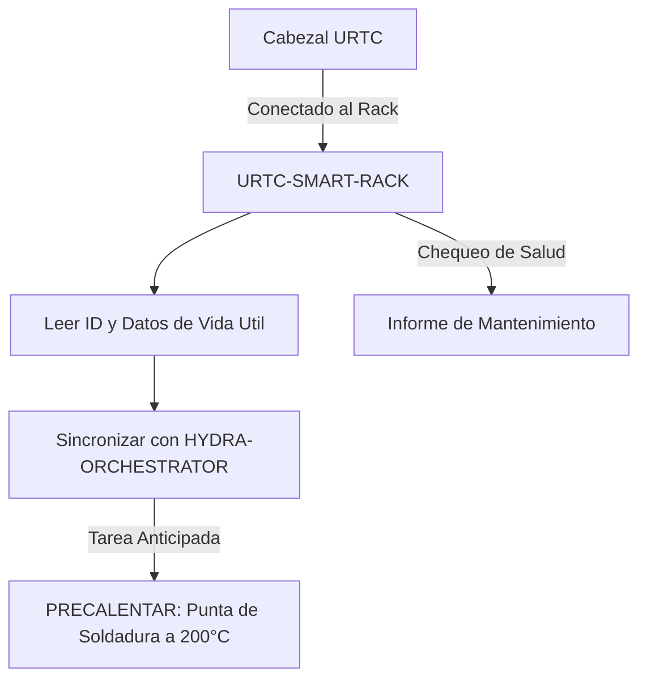

<p align="center">
  
</p>

# 🗄️ URTC-SMART-RACK

<p align="center"><a href="README.md">🇺🇸 English</a> | 🇪🇸 <b>Español</b> | <a href="README_fra.md">🇫🇷 Français</a> | <a href="README_ita.md">🇮🇹 Italiano</a> | <a href="README_deu.md">🇩🇪 Deutsch</a> | <a href="README_zho.md">🇨🇳 简体中文</a> | <a href="README_jpn.md">🇯🇵 日本語</a></p>

### 🤖 Gestion Inteligente de Cabezales con Seguimiento de Vida Util y Termico

<p align="left">
  
  
  
  
</p>

---

## 1. 🛠️ VISIÓN TÉCNICA GENERAL

**URTC-SMART-RACK** es un sistema de almacenamiento inteligente para cabezales de herramienta dentro del ecosistema HYDRA-UMC. Basado en el microcontrolador STM32G4, monitoriza y prepara las herramientas mientras no estan acopladas a un robot.

Habilita modos "Smart Idle", como precalentar puntas de soldadura T12 justo antes de un cambio de herramienta, y registra el ID electronico, la version de firmware y los ciclos totales de uso de cada cabezal URTC, garantizando un mantenimiento optimo y un despliegue de cero segundos.

Todavia no existe PCB/esquematico para esta placa (ver `hardware/`), asi que nada de lo de abajo puede manejar GPIO/F-RAM/CAN real - pero la *logica* en la que se reducen esas caracteristicas (decodificar un ID, registrar el uso, decidir cuando precalentar y a que temperatura) es real, C puro, con tests hoy mismo.

### Caracteristicas Clave:
* ✅ **Real v0 - logica de ID, vida util y precalentamiento:** `tool_id.c` decodifica una lectura de ID de 5 bits en una identidad de herramienta; `lifecycle.c` registra ciclos/tiempo de uso y marca cuando hace falta mantenimiento; `preheat.c` decide cuando debe empezar el precalentamiento Smart Idle y a que temperatura objetivo. 25 aserciones de test con el propio compilador C del host - no hace falta PCB, driver de GPIO ni F-RAM para ejecutar ni testear nada de esto.
* 🗄️ **Seguimiento de Herramientas** — identificacion automatica de cabezales URTC via jumpers de ID de 5 bits o F-RAM. *(la logica de decodificacion de ID en si es real - ver arriba; leer jumpers/F-RAM reales necesita el PCB.)*
* 🌡️ **Logica de Precalentamiento** — gestion termica inteligente para herramientas de soldadura y aire caliente. *(la decision de activacion y las temperaturas objetivo son reales - ver arriba; accionar un calentador real necesita el PCB.)*
* 📈 **Registros de Vida Util** — registra ciclos totales de actuacion y horas de uso en la F-RAM de la herramienta. *(los contadores y la logica de mantenimiento debido son reales - ver arriba; persistirlos en F-RAM real necesita el PCB.)*
* 📡 **Integracion CAN** — se comunica directamente con el Cerebro Cinematico de HYDRA-UMC para ATC coordinado (Cambio Automatico de Herramienta). *(el protocolo en si - framing, CRC, validacion de comandos - es real, ver mas abajo; todavia hace falta un transceptor CAN real para transportarlo.)*
* 🔒 **Limites de Seguridad del Protocolo** — framing versionado real con suma de verificacion CRC8, validacion real de rango de actuacion, y un watchdog real de timeout de enlace/idempotencia con un estado seguro definido. *(implementado)*
* ✅ **Toolchain de firmware Cortex-M4F** — una imagen bare-metal real (startup + linker + `main.c`) que compila y enlaza de verdad con `arm-none-eabi-gcc`, el mismo toolchain que usa el repositorio hermano URTC. *(implementado — ver COMPILACIÓN abajo)*

---

## 2. 🔄 FLUJO DE TRABAJO DEL SMART RACK



---

## 3. 🧱 ARQUITECTURA Y DECISIONES DE DISEÑO

* **Por qué esta placa aún no tiene un pinout/ID de hardware real definido.** Todavía no existe una PCB para esta placa - `src/firmware_common.h` lleva una identidad de versión sin ID de hardware, y los archivos de arranque/enlazado están escritos a mano como marcadores de posición sustituyendo al propio arranque CMSIS/HAL de ST hasta que se fije una pieza STM32G4 real.
* **Por qué no es un hijo del propio URTC.** URTC-SMART-RACK es una Herramienta Complementaria, no un hijo de la familia URTC - es una placa física separada (un rack de almacenamiento de herramientas, no un cabezal de herramienta) que comparte el bus CAN y las convenciones de firmware de URTC, pero no su jerarquía de integración.
* **Por qué `bump_version.py` es una copia directa del propio de URTC.** Misma regla de versionado cuentakilómetros, mismo formato de cabecera de firmware - reutilizar el script exacto en vez de reinventarlo mantiene a los dos sincronizados por construcción.
* **Por qué `tool_id.c`/`lifecycle.c`/`preheat.c` se implementan antes que cualquier driver de GPIO/F-RAM/CAN.** Decodificar un ID, acumular uso y decidir cuándo precalentar son funciones puras de datos que ya se tienen en mano - no necesitan PCB para escribirse ni testearse, así que el v0 implementa primero esa lógica, testeada con el propio compilador C de la máquina en vez de `arm-none-eabi-gcc`. Los drivers que de verdad obtendrían esos datos de hardware real llegan cuando exista el PCB.
* **Cómo encaja en el resto del ecosistema.** Comparte el propio bus CAN/ecosistema de herramientas de URTC, y forma pareja natural con HYDRA-UMC-DETECTION-HEF para reconocer visualmente qué herramienta está realmente en el rack.
* **Por qué el protocolo, la validación de comandos y el watchdog de enlace son tres módulos separados.** `protocol.c` sólo conoce bytes, framing y un CRC - no tiene idea de qué es una temperatura "segura". `rack_command.c` es dueño de ese juicio, decodificando y verificando el rango de un comando real sin importarle cómo llegó por el cable. `link_watchdog.c` rastrea el timeout/idempotencia independientemente de ambos - una trama corrupta nunca debe siquiera llegar hasta él (ver la propia aserción real de `test_rack_link_scenarios.c` de que una trama con CRC incorrecto nunca revive el watchdog). Mantenerlos separados es lo que hace que cada uno sea testeable de forma independiente en el host, y mantiene delgado a un futuro manejador de recepción CAN - llama a cada capa en orden, no reimplementa el juicio de ninguna de ellas.
* **Por qué un enlace no verificado se trata exactamente igual que uno muerto.** `link_watchdog_is_link_lost()` es verdadero tanto después de un timeout real COMO antes de que haya llegado la primerísima trama - la propia auditoría de promoción lo llama "estado seguro al arrancar". Un rack que se enciende sin que todavía haya un host conectado debe arrancar en el estado seguro, no asumir en silencio que "está bien" hasta que se demuestre lo contrario.

---

## 📂 ESTRUCTURA DE DIRECTORIOS

```text
URTC-SMART-RACK/
├── src/                            # Codigo fuente del firmware
│   ├── firmware_common.h           # FIRMWARE_VERSION_MAJOR/MINOR/PATCH
│   ├── tool_id.h / .c              # Real: decodificacion de lectura de 5 bits -> ID de herramienta
│   ├── lifecycle.h / .c            # Real: seguimiento de ciclos/tiempo de uso, chequeo de mantenimiento debido
│   ├── preheat.h / .c              # Real: activacion de Smart Idle + temperatura objetivo + objetivo de estado seguro
│   ├── protocol.h / .c             # Real: formato de trama versionado + parseo/codificacion CRC8
│   ├── rack_command.h / .c         # Real: decodificacion de comandos + validacion de limites de actuacion
│   ├── link_watchdog.h / .c        # Real: timeout de enlace + idempotencia de comandos
│   ├── main.c                      # Punto de entrada minimo (bucle de latido de vida)
│   ├── startup_stm32g4_minimal.c   # Tabla de vectores + Reset_Handler (sin HAL de ST todavia, ver cabecera del archivo)
│   └── STM32G4_MINIMAL.ld          # Linker script placeholder (suelo de 128K FLASH / 32K RAM)
├── tests/                          # Harness de tests real host-native (tool_id, lifecycle, preheat, protocol, rack_command, link_watchdog, escenarios de enlace del rack)
├── docs/                           # Documentacion y manual de usuario
├── hardware/                       # Archivos de diseno de hardware (PCB, 3D) - vacio, sin esquematico todavia
├── firmware/                       # Salida de build versionada (.bin/.elf/.hex), commiteada igual que el repo hermano URTC
├── build/                          # Objetos intermedios de build (ignorado por git)
├── images/                         # Medios y diagramas
├── scripts/                        # Scripts de utilidad
├── bump_version.py                 # Incremento de version estilo cuentakilometros (generico, compartido con URTC)
├── build_firmware.sh / .bat        # Build real: tests de host + incrementa version + compila + enlaza + publica
└── README.md
```

---

## 4. ⚙️ COMPILACIÓN

Requiere el ARM GNU Toolchain (`arm-none-eabi-gcc`, `arm-none-eabi-objcopy`, `arm-none-eabi-size`) y Python 3.

```bash
# Linux/macOS
chmod +x build_firmware.sh   # una sola vez
./build_firmware.sh

# Windows
build_firmware.bat
```

El build primero compila y ejecuta `tests/` con el compilador C *del propio host* (nunca `arm-none-eabi-gcc` - son tests de logica pura, no tocan registros de MCU) y falla el build entero si alguna aserción falla. Solo entonces incrementa la version de `src/firmware_common.h` (regla cuentakilometros, igual que el resto del ecosistema), compila `main.c` y `startup_stm32g4_minimal.c` para Cortex-M4F, los enlaza contra el mapa de memoria placeholder `STM32G4_MINIMAL.ld`, y publica archivos `.elf`/`.bin`/`.hex` versionados en `firmware/`.

Todavia no hay nada que flashear a hardware real - no existe PCB que confirme la pieza STM32G4 objetivo, el pinout, o sus tamanos reales de flash/RAM. El mapa de memoria del linker script es un placeholder conservador (documentado en su propia cabecera) que se reemplazara cuando exista hardware real, el mismo momento en que la tabla de vectores escrita a mano de `startup_stm32g4_minimal.c` se reemplazara por el codigo de arranque CMSIS/HAL propio de ST (siguiendo el patron del repositorio hermano URTC en `src/F303-master/` para sus placas STM32F303).

Ejemplo real - los tests del lado del host tambien se ejecutan solos, util para comprobar la logica sin un build de firmware completo:

```bash
cc -std=c11 -Wall -Wextra -Isrc -Itests -o build/host_tests \
  tests/test_main.c tests/test_tool_id.c tests/test_lifecycle.c tests/test_preheat.c \
  src/tool_id.c src/lifecycle.c src/preheat.c
./build/host_tests
# All tests passed.
```

---

## 🔗 Proyectos Relacionados

Este proyecto forma parte de un ecosistema de robótica más amplio del mismo autor (JuanenRac / Electro Hobby 3D), que abarca firmware, software de control, nodos de IA y herramientas de flota. Vale la pena conocerlo, ya que una petición podría en realidad ser sobre uno de estos proyectos en vez de sobre este repositorio.

### Relación Directa

- **[URTC](https://github.com/JuanenRac/URTC)** — mismo ecosistema de herramientas / bus CAN.
- **[HYDRA-UMC-DETECTION-HEF](https://github.com/JuanenRac/HYDRA-UMC-DETECTION-HEF)** — reconocimiento visual de las herramientas que almacena este rack.

### Resto del Ecosistema

**Plataforma HYDRA-UMC** — la célula de micro-fábrica multi-robot
- **[HYDRA-UMC](https://github.com/JuanenRac/HYDRA-UMC)** — la placa base CM5 + STM32H745 que orquesta hasta 8 brazos robóticos.
- **[HYDRA-UMC-SERVER](https://github.com/JuanenRac/HYDRA-UMC-SERVER)** — el backend Express/WebSocket con el que habla cada cliente de control.
- **[HYDRA-UMC-STUDIO](https://github.com/JuanenRac/HYDRA-UMC-STUDIO)** — panel de control web, visualización 3D multi-robot.
- **[HYDRA-UMC-ANDROID-CONTROL](https://github.com/JuanenRac/HYDRA-UMC-ANDROID-CONTROL)** — app de control Android por Wi-Fi/Bluetooth.
- **[HYDRA-UMC-IOS-CONTROL](https://github.com/JuanenRac/HYDRA-UMC-IOS-CONTROL)** — app de control iOS/iPadOS construida en Flutter.
- **[HYDRA-UMC-SUITE](https://github.com/JuanenRac/HYDRA-UMC-SUITE)** — centro de mando de enjambre de escritorio (Python/PySide6).
- **[HYDRA-UMC-EDITOR-URDF](https://github.com/JuanenRac/HYDRA-UMC-EDITOR-URDF)** — editor de modelos URDF de escritorio para el catálogo de robots.
- **[HYDRA-UMC-DSI](https://github.com/JuanenRac/HYDRA-UMC-DSI)** — interfaz táctil nativa para la pantalla DSI integrada.

**Plataforma URTC** — el controlador de cabezal de herramienta que lleva cada brazo HYDRA-UMC
- **[URTC](https://github.com/JuanenRac/URTC)** — controlador de cabezal de herramienta CAN, 25 perfiles de herramienta.
- **[URTC-FLASHER](https://github.com/JuanenRac/URTC-FLASHER)** — herramienta de escritorio de flasheo CAN-OTA + SWD/JTAG.
- **[URTC-TESTER](https://github.com/JuanenRac/URTC-TESTER)** — herramienta de escritorio de diagnóstico CAN en vivo.
- **[URTC-WEB-STUDIO](https://github.com/JuanenRac/URTC-WEB-STUDIO)** — alternativa basada en navegador vía Web Serial API.

**🎥 Vision AI Node (Hailo-8)**
- [HYDRA-UMC-VISION-NODE](https://github.com/JuanenRac/HYDRA-UMC-VISION-NODE)
- [HYDRA-UMC-VISION-STREAMER](https://github.com/JuanenRac/HYDRA-UMC-VISION-STREAMER)
- [HYDRA-UMC-DETECTION-HEF](https://github.com/JuanenRac/HYDRA-UMC-DETECTION-HEF)
- [HYDRA-UMC-SAFETY-ZONES](https://github.com/JuanenRac/HYDRA-UMC-SAFETY-ZONES)
- [HYDRA-UMC-VISUAL-SERVOING-API](https://github.com/JuanenRac/HYDRA-UMC-VISUAL-SERVOING-API)

**🧠 Cognitive AI Node (Hailo-10)**
- [HYDRA-UMC-COGNITIVE-NODE](https://github.com/JuanenRac/HYDRA-UMC-COGNITIVE-NODE)
- [HYDRA-UMC-VLA-ENGINE](https://github.com/JuanenRac/HYDRA-UMC-VLA-ENGINE)
- [HYDRA-UMC-VOICE-UI](https://github.com/JuanenRac/HYDRA-UMC-VOICE-UI)
- [HYDRA-UMC-SEMANTIC-PLANNER](https://github.com/JuanenRac/HYDRA-UMC-SEMANTIC-PLANNER)
- [HYDRA-UMC-DOCS-QA](https://github.com/JuanenRac/HYDRA-UMC-DOCS-QA)

**🐝 Orchestration & Swarm**
- [HYDRA-UMC-ORCHESTRATOR](https://github.com/JuanenRac/HYDRA-UMC-ORCHESTRATOR)
- [HYDRA-UMC-SWARM-SYNC](https://github.com/JuanenRac/HYDRA-UMC-SWARM-SYNC)
- [HYDRA-UMC-PATH-PLANNER-3D](https://github.com/JuanenRac/HYDRA-UMC-PATH-PLANNER-3D)
- [HYDRA-UMC-JOB-DISPATCHER](https://github.com/JuanenRac/HYDRA-UMC-JOB-DISPATCHER)
- [HYDRA-UMC-NODE-HEALING](https://github.com/JuanenRac/HYDRA-UMC-NODE-HEALING)

**🎮 Digital Twin & Simulation**
- [HYDRA-UMC-TWIN](https://github.com/JuanenRac/HYDRA-UMC-TWIN)
- [HYDRA-UMC-PHYSICS-REPLICA](https://github.com/JuanenRac/HYDRA-UMC-PHYSICS-REPLICA)
- [HYDRA-UMC-HIL-BRIDGE](https://github.com/JuanenRac/HYDRA-UMC-HIL-BRIDGE)
- [HYDRA-UMC-SYNTHETIC-DATA-GEN](https://github.com/JuanenRac/HYDRA-UMC-SYNTHETIC-DATA-GEN)

**📊 Data & Analytics**
- [HYDRA-UMC-DATALAKE](https://github.com/JuanenRac/HYDRA-UMC-DATALAKE)
- [HYDRA-UMC-TELEMETRY-COLLECTOR](https://github.com/JuanenRac/HYDRA-UMC-TELEMETRY-COLLECTOR)
- [HYDRA-UMC-ANOMALY-DETECTOR](https://github.com/JuanenRac/HYDRA-UMC-ANOMALY-DETECTOR)
- [HYDRA-UMC-PRODUCTION-REPORTS](https://github.com/JuanenRac/HYDRA-UMC-PRODUCTION-REPORTS)

**🏭 Industrial Gateway**
- [HYDRA-UMC-GATEWAY-INDUSTRIAL](https://github.com/JuanenRac/HYDRA-UMC-GATEWAY-INDUSTRIAL)
- [HYDRA-UMC-OPCUA-SERVER](https://github.com/JuanenRac/HYDRA-UMC-OPCUA-SERVER)
- [HYDRA-UMC-MQTT-BROKER](https://github.com/JuanenRac/HYDRA-UMC-MQTT-BROKER)
- [HYDRA-UMC-MTCONNECT-ADAPTER](https://github.com/JuanenRac/HYDRA-UMC-MTCONNECT-ADAPTER)

**🛠️ Complementary Tools**
- [URTC-VISION-TOOL](https://github.com/JuanenRac/URTC-VISION-TOOL)
- [HYDRA-UMC-WATCH](https://github.com/JuanenRac/HYDRA-UMC-WATCH)
- [HYDRA-UMC-TOOL-CLI](https://github.com/JuanenRac/HYDRA-UMC-TOOL-CLI)
- [HYDRA-UMC-DASHBOARD-AI](https://github.com/JuanenRac/HYDRA-UMC-DASHBOARD-AI)


## 👤 AUTOR
**JuanenRac** (Electro Hobby 3D)
📧 electrohobby3d@gmail.com

## 📜 LICENCIA
GPL-3.0 - Ver LICENSE para más detalles.

## 🛠️ BUILD & RUN

Usa la comprobación de compilación sin versionado antes de una compilación de publicación:

| Acción | Windows | Linux / macOS |
|---|---|---|
| Comprobación de compilación (sin cambiar versión ni CHANGELOG) | `build-test.bat` | `./build-test.sh` |
| Ejecución / desarrollo (cuando exista) | `run*.bat` o `dev*.bat` | `./run*.sh` o `./dev*.sh` |

`build-test.bat` y `build-test.sh` compilan o validan el stack del proyecto sin incrementar `hydra-umc.project.json` ni modificar `CHANGELOG.md`. Solo pueden crear salidas normales del compilador. Los scripts existentes `build*.bat`, `build*.sh`, `run*` y `dev*` conservan su comportamiento específico de versión o ejecución; úsalos cuando necesites ese comportamiento.