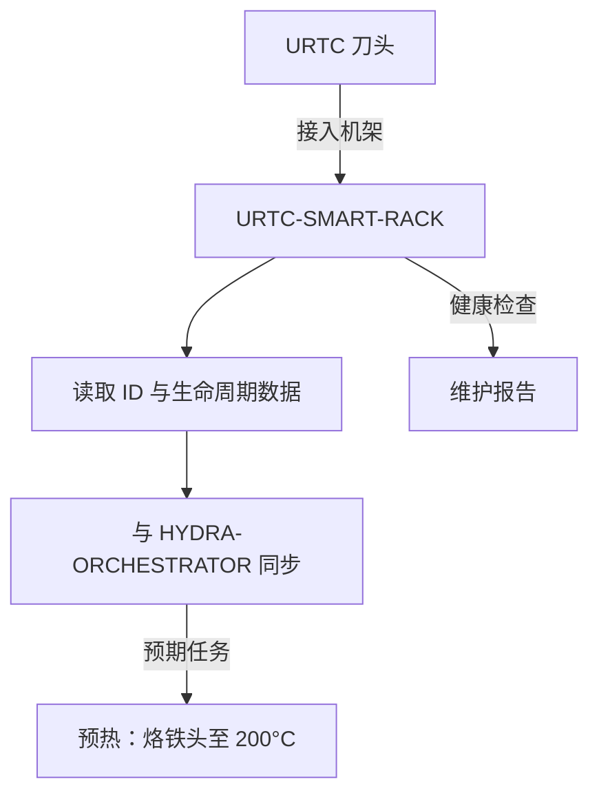

<p align="center">
  
</p>

# 🗄️ URTC-SMART-RACK

<p align="center"><a href="README.md">🇺🇸 English</a> | <a href="README_spa.md">🇪🇸 Español</a> | <a href="README_fra.md">🇫🇷 Français</a> | <a href="README_ita.md">🇮🇹 Italiano</a> | <a href="README_deu.md">🇩🇪 Deutsch</a> | 🇨🇳 <b>简体中文</b> | <a href="README_jpn.md">🇯🇵 日本語</a></p>

### 🤖 具备生命周期与热管理追踪的智能末端执行器管理系统

<p align="left">
  
  
  
  
</p>

---

## 1. 🛠️ 技术概述

**URTC-SMART-RACK** 是 HYDRA-UMC 生态系统内用于末端执行器的智能存储系统。
基于 STM32G4 微控制器，它在工具未安装到机器人上时对其进行监控和预处理。

它支持"智能待机"模式，例如在换刀前预热 T12 烙铁头，并跟踪每个 URTC
刀头的电子 ID、固件版本和总使用周期数，确保最佳维护和零延迟部署。

该板卡目前尚不存在 PCB/原理图（见 `hardware/`），因此下面的功能都无法驱动
真实的 GPIO/F-RAM/CAN 硬件——但这些功能所归结的*逻辑*（解码 ID、追踪使用
情况、决定何时以及以何种温度预热）是真实的、纯 C 编写的，并且今天已经过
单元测试。

### 关键特性：
* ✅ **真实 v0 —— ID、生命周期与预热逻辑：** `tool_id.c` 将原始 5 位 ID 读数解码为工具身份；`lifecycle.c` 追踪使用周期/时间并标记到期维护；`preheat.c` 决定智能待机预热应何时启动以及目标温度。使用宿主机自身的 C 编译器完成 25 个测试断言——无需 PCB、GPIO 驱动或 F-RAM 即可运行或测试这一切。
* 🗄️ **工具追踪** —— 通过 5 位 ID 跳线或 F-RAM 自动识别 URTC 刀头。*（ID 解码逻辑本身是真实的——见上文；读取真实跳线/F-RAM 需要 PCB。）*
* 🌡️ **预热逻辑** —— 针对焊接和热风工具的智能热管理。*（激活决策和目标温度是真实的——见上文；驱动真实加热器需要 PCB。）*
* 📈 **生命周期日志** —— 将总致动周期数和使用小时数记录到工具的 F-RAM 中。*（计数器和到期维护逻辑是真实的——见上文；将其持久化到真实 F-RAM 需要 PCB。）*
* 📡 **CAN 集成** —— 直接与 HYDRA-UMC 运动学大脑通信，实现协调的 ATC（自动换刀）。*（线路协议本身——帧格式、CRC、命令验证——是真实的，见下文；仍需要真实的 CAN 收发器才能真正承载它。）*
* 🔒 **协议安全限制** —— 真实的版本化帧格式与 CRC8 校验和，真实的执行范围验证，以及带有明确安全状态的真实链路超时/幂等性看门狗。*（已实现）*
* ✅ **Cortex-M4F 固件工具链** —— 一个真实的裸机镜像（启动文件 + 链接脚本 + `main.c`），使用与兄弟仓库 URTC 相同的工具链，通过 `arm-none-eabi-gcc` 交叉编译并链接。*（已实现——见下方"构建"）*

---

## 2. 🔄 智能架构工作流程



---

## 3. 🧱 架构与设计决策

* **为什么该板卡尚未定义真实的引脚布局/硬件 ID。** 该板卡目前尚无 PCB——`src/firmware_common.h` 携带一个没有硬件 ID 的版本标识，启动文件/链接脚本是手写的占位符，暂时代替 ST 自身的 CMSIS/HAL 启动代码，直到确定真实的 STM32G4 型号。
* **为什么它不是 URTC 自身的子项目。** URTC-SMART-RACK 是一个配套工具，而非 URTC 系列的子项目——它是一块独立的物理板卡（工具存储架，而非刀头本身），恰好共享 URTC 自身的 CAN 总线和固件惯例，而非其集成层级结构。
* **为什么 `bump_version.py` 直接复制自 URTC 自身。** 相同的里程表版本规则，相同的固件头格式——直接复用同一脚本而非重新发明，可以通过构造方式使两者天然保持同步。
* **为什么 `tool_id.c`/`lifecycle.c`/`preheat.c` 先于任何 GPIO/F-RAM/CAN 驱动交付。** 解码 ID、累积使用情况、决定何时预热，都是对已有数据的纯函数运算——无需 PCB 即可编写或测试，因此 v0 首先交付这部分逻辑，使用宿主机自身的 C 编译器而非 `arm-none-eabi-gcc` 进行宿主测试。真正从真实硬件获取这些数据的驱动程序，将在 PCB 存在后到来。
* **这如何融入生态系统的其余部分。** 共享 URTC 自身的 CAN 总线/工具生态系统，并与 HYDRA-UMC-DETECTION-HEF 自然搭配，用于视觉识别实际存放在架上的工具。
* **为什么协议、命令验证与链路看门狗是三个独立的模块。** `protocol.c` 只了解字节、帧格式和 CRC，它并不知道什么样的温度才算“安全”。`rack_command.c` 拥有那份判断，它解码并对一个真实的命令进行范围检查，而不关心它是如何在总线上到达的。`link_watchdog.c` 独立于二者追踪超时/幂等性——一个损坏的帧甚至不应该到达它（参见 `test_rack_link_scenarios.c` 自身的真实断言：一个 CRC 错误的帧永远不会让看门狗复活）。保持它们分离使得每一个都能在宿主机上独立测试，并让未来的 CAN 接收处理函数保持精简——它只需按顺序调用每一层，而不需要重新实现它们任何一个的判断。
* **为什么未经验证的链路会被当作已断开的链路处理。** `link_watchdog_is_link_lost()` 在真正超时之后为真，在第一个帧还从未到达之前也为真——正如提升审计自身所说的“estado seguro al arrancar”。一个开机时还没有主机连接的机架，必须以安全状态启动，而不是在未经证实之前默默假定“没问题”。

---

## 📂 目录结构

```text
URTC-SMART-RACK/
├── src/                            # 固件源代码
│   ├── firmware_common.h           # FIRMWARE_VERSION_MAJOR/MINOR/PATCH
│   ├── tool_id.h / .c              # 真实：原始 5 位读数解码 -> 工具 ID
│   ├── lifecycle.h / .c            # 真实：使用周期/时间追踪，到期维护检查
│   ├── preheat.h / .c              # 真实：智能待机激活 + 目标温度 + 安全状态目标
│   ├── protocol.h / .c             # 真实：版本化帧格式 + CRC8 解析/编码
│   ├── rack_command.h / .c         # 真实：命令解码 + 执行限制验证
│   ├── link_watchdog.h / .c        # 真实：链路超时 + 命令幂等性
│   ├── main.c                      # 最小入口点（存活证明心跳循环）
│   ├── startup_stm32g4_minimal.c   # 向量表 + Reset_Handler（暂无 ST HAL，见文件头说明）
│   └── STM32G4_MINIMAL.ld          # 占位链接脚本（128K FLASH / 32K RAM 下限）
├── tests/                          # 真实的宿主机原生测试工具集（tool_id、lifecycle、preheat、protocol、rack_command、link_watchdog、机架链路场景）
├── docs/                           # 文档与用户手册 —— 目前为空，尚未创建
├── hardware/                       # 硬件设计文件（PCB、3D）—— 目前为空，尚无原理图
├── firmware/                       # 版本化构建输出（.bin/.elf/.hex），与兄弟仓库 URTC 一样被提交
├── build/                          # 中间构建对象（已被 gitignore）
├── images/                         # 媒体与图表
├── tools/
│   ├── build_test.py               # 不递增版本号的构建/编译检查
│   └── ci_validate.py              # CI 使用的 manifest/CHANGELOG/docs 校验
├── bump_version.py                 # 里程表式版本递增（通用脚本，与 URTC 共享）
├── bump_manifest_version.py        # 将 hydra-umc.project.json 的版本与原生版本同步（--sync）
├── build_firmware.sh / .bat        # 真实构建：宿主测试 + 版本递增 + 编译 + 链接 + 发布
├── build-test.sh / .bat            # 不递增版本号的构建/编译检查
└── README.md
```

---

## 4. ⚙️ 构建

需要 ARM GNU 工具链（`arm-none-eabi-gcc`、`arm-none-eabi-objcopy`、
`arm-none-eabi-size`）以及 Python 3。

```bash
# Linux/macOS
chmod +x build_firmware.sh   # 仅需一次
./build_firmware.sh

# Windows
build_firmware.bat
```

该构建首先使用*宿主机自身*的 C 编译器（绝不是 `arm-none-eabi-gcc`——这些
是纯逻辑测试，不涉及任何 MCU 寄存器）编译并运行 `tests/`，若任何断言失败
则整个构建失败。只有在此之后，它才会递增 `src/firmware_common.h` 中的
版本号（里程表规则，与生态系统其余部分一致），针对 Cortex-M4F 编译
`main.c` 和 `startup_stm32g4_minimal.c`，将其与占位性质的
`STM32G4_MINIMAL.ld` 内存映射进行链接，并将版本化的 `.elf`/`.bin`/`.hex`
文件发布到 `firmware/`。

目前尚无内容可刷写到真实硬件——因为没有 PCB 可以确认目标 STM32G4 型号、
引脚布局或其真实的 flash/RAM 容量。链接脚本的内存映射是一个保守的占位符
（在其自身的文件头注释中有说明），一旦真实硬件问世将被替换，届时
`startup_stm32g4_minimal.c` 手写的向量表也会被 ST 自身的 CMSIS/HAL 启动
代码取代（对应兄弟仓库 URTC 中针对 STM32F303 板卡的 `src/F303-master/`）。

真实示例——宿主机侧测试也可以独立运行，便于在不进行完整固件构建的情况下
检查逻辑：

```bash
cc -std=c11 -Wall -Wextra -Isrc -Itests -o build/host_tests \
  tests/test_main.c tests/test_tool_id.c tests/test_lifecycle.c tests/test_preheat.c \
  tests/test_protocol.c tests/test_rack_command.c tests/test_link_watchdog.c tests/test_rack_link_scenarios.c \
  src/tool_id.c src/lifecycle.c src/preheat.c src/protocol.c src/rack_command.c src/link_watchdog.c
./build/host_tests
# All tests passed.
```

---

## 🔗 相关项目

本项目是同一作者(JuanenRac / Electro Hobby 3D)打造的 HYDRA-UMC 机器人生态系统的一部分。值得了解,因为某个请求实际上可能是关于这些项目之一,而非本仓库本身。

**直接相关**
- **[URTC](https://github.com/JuanenRac/URTC)** — 面向实体 Universal Robot Tool Controller 板卡的固件，通过 CAN 总线支持 25 种以上工具配置 —— 同一 CAN 总线上的同一工具生态系统。
- **[HYDRA-UMC-DETECTION-HEF](https://github.com/JuanenRac/HYDRA-UMC-DETECTION-HEF)** — 具备 Hailo 架构/校验和安全加载验证的真实编译模型注册表 —— 提供本机架所存储工具的视觉识别。

**生态系统中的其他项目**

*核心硬件与平台*
- **[HYDRA-UMC](https://github.com/JuanenRac/HYDRA-UMC)** — 机器人手臂的真实主板——CM5 主机 + 双核 STM32H745，通过 CAN-OTA/SPI-OTA 协调最多 8 条工具臂。
- **[HYDRA-UMC-OS](https://github.com/JuanenRac/HYDRA-UMC-OS)** — 面向 CM5 的可复现 Raspberry Pi OS 产品层——只读代理、经过验证的配置/配置文件、WiFi 首次配网。
- **[HYDRA-UMC-SDK](https://github.com/JuanenRac/HYDRA-UMC-SDK)** — 每个桥接都据此校验自身指令的共享 JSON-Schema 契约与安全门限边界。

*核心后端与客户端*
- **[HYDRA-UMC-SERVER](https://github.com/JuanenRac/HYDRA-UMC-SERVER)** — 每个控制客户端真正通信的真实无头后端(REST/WebSocket)。
- **[HYDRA-UMC-STUDIO](https://github.com/JuanenRac/HYDRA-UMC-STUDIO)** — 具有实时多机器人 3D 可视化的网页控制面板。
- **[HYDRA-UMC-SUITE](https://github.com/JuanenRac/HYDRA-UMC-SUITE)** — 面向多台服务器的桌面(PySide6)集群指挥中心，打包为独立可执行文件。
- **[HYDRA-UMC-ANDROID-CONTROL](https://github.com/JuanenRac/HYDRA-UMC-ANDROID-CONTROL)** — 具有生物识别登录和配对 Wear OS 伴侣应用的原生 Android 控制应用。
- **[HYDRA-UMC-IOS-CONTROL](https://github.com/JuanenRac/HYDRA-UMC-IOS-CONTROL)** — 具有实时 WebSocket 同步的 iOS/iPadOS 控制应用(Flutter)。
- **[HYDRA-UMC-DSI](https://github.com/JuanenRac/HYDRA-UMC-DSI)** — 面向机载 7 英寸 DSI 触摸屏的原生触控界面，直接嵌入 CM5 本体。
- **[HYDRA-UMC-EDITOR-URDF](https://github.com/JuanenRac/HYDRA-UMC-EDITOR-URDF)** — 将完成的模型推送到 STUDIO 自身目录的桌面版图形化 URDF 创建/编辑工具。
- **[HYDRA-UMC-BRIDGE-AMR](https://github.com/JuanenRac/HYDRA-UMC-BRIDGE-AMR)** — 通过真实的 VDA 5050 MQTT 发布者为 AGV/AMR 车队提供的协调边界。
- **[HYDRA-UMC-BRIDGE-CNC](https://github.com/JuanenRac/HYDRA-UMC-BRIDGE-CNC)** — 具备真实 GRBL 状态/控制字节访问能力的高层 CNC 单元协调器。
- **[HYDRA-UMC-BRIDGE-DROIDS](https://github.com/JuanenRac/HYDRA-UMC-BRIDGE-DROIDS)** — 面向足式/人形机器人的协调边界，具备真实的 Boston Dynamics Spot 指令发送器。
- **[HYDRA-UMC-BRIDGE-LASER](https://github.com/JuanenRac/HYDRA-UMC-BRIDGE-LASER)** — 读取 3 项真实钥匙/外壳/联锁 GPIO 安全信号的激光单元安全协调器。
- **[HYDRA-UMC-BRIDGE-OPENPNP](https://github.com/JuanenRac/HYDRA-UMC-BRIDGE-OPENPNP)** — 面向 OpenPnP 贴片机板级流程的安全高层协调器。
- **[HYDRA-UMC-BRIDGE-PRINTER3D](https://github.com/JuanenRac/HYDRA-UMC-BRIDGE-PRINTER3D)** — 面向 Moonraker/Klipper 3D 打印机的安全协调边界，具备真实的受控作业指令。
- **[HYDRA-UMC-BRIDGE-ROS2](https://github.com/JuanenRac/HYDRA-UMC-BRIDGE-ROS2)** — 具备真实的惰性导入 rclpy ROS 2 传输层的安全协调器。
- **[HYDRA-UMC-BRIDGE-UAV](https://github.com/JuanenRac/HYDRA-UMC-BRIDGE-UAV)** — 面向搭载摄像头的无人机的协调边界，具备真实的 MAVLink 指令发送器。

*URTC 工具平台*
- **[URTC-FLASHER](https://github.com/JuanenRac/URTC-FLASHER)** — 面向 URTC 板卡的桌面图形烧录工具，支持 CAN-OTA 以及全芯片 SWD/JTAG。
- **[URTC-TESTER](https://github.com/JuanenRac/URTC-TESTER)** — 面向 URTC 板卡的桌面实时 CAN 总线诊断工具，每种工具配置对应一个面板。
- **[URTC-WEB-STUDIO](https://github.com/JuanenRac/URTC-WEB-STUDIO)** — 通过 Web Serial API 实现的浏览器版 URTC-TESTER 替代方案，无需本地安装。

*视觉 AI 节点(Hailo-8)*
- **[HYDRA-UMC-VISION-NODE](https://github.com/JuanenRac/HYDRA-UMC-VISION-NODE)** — 面向 Hailo-8 视觉流水线的集成中枢，具备逐阶段的真实硬件就绪检测。
- **[HYDRA-UMC-VISION-STREAMER](https://github.com/JuanenRac/HYDRA-UMC-VISION-STREAMER)** — 具备真实 HailoRT 集成边界的真实 GStreamer 流水线 + MediaMTX 配置生成器。
- **[HYDRA-UMC-VISUAL-SERVOING-API](https://github.com/JuanenRac/HYDRA-UMC-VISUAL-SERVOING-API)** — 具备真实 Position-Based Visual Servoing 修正律，并依据上游区域状态进行安全门控。
- **[HYDRA-UMC-SAFETY-ZONES](https://github.com/JuanenRac/HYDRA-UMC-SAFETY-ZONES)** — 具备校准新鲜度强制检查的真实区域入侵检测与 E-STOP 请求。

*认知 AI 节点(Hailo-10)*
- **[HYDRA-UMC-COGNITIVE-NODE](https://github.com/JuanenRac/HYDRA-UMC-COGNITIVE-NODE)** — 面向 Hailo-10 认知流水线(LLM/VLA/语音编排)的集成中枢。
- **[HYDRA-UMC-VLA-ENGINE](https://github.com/JuanenRac/HYDRA-UMC-VLA-ENGINE)** — 面向 Vision-Language-Action 模型的真实动作 token 编解码与轨迹生成。
- **[HYDRA-UMC-VOICE-UI](https://github.com/JuanenRac/HYDRA-UMC-VOICE-UI)** — 具备受限、需确认的 Watch 中继的真实语音前端(VAD + 意图解析)。
- **[HYDRA-UMC-SEMANTIC-PLANNER](https://github.com/JuanenRac/HYDRA-UMC-SEMANTIC-PLANNER)** — 基于真实规则的任务分解，以及针对 MCU 错误码的语义化错误恢复。
- **[HYDRA-UMC-DOCS-QA](https://github.com/JuanenRac/HYDRA-UMC-DOCS-QA)** — 面向本生态系统自身 Markdown 文档的真实纯标准库 TF-IDF 文档检索。

*编排与集群*
- **[HYDRA-UMC-ORCHESTRATOR](https://github.com/JuanenRac/HYDRA-UMC-ORCHESTRATOR)** — 具备真实 gRPC/Protobuf 健康报告契约与任务状态机的集成中枢。
- **[HYDRA-UMC-JOB-DISPATCHER](https://github.com/JuanenRac/HYDRA-UMC-JOB-DISPATCHER)** — 基于真实 HTTP API 的真实优先级任务队列，支持去重。
- **[HYDRA-UMC-NODE-HEALING](https://github.com/JuanenRac/HYDRA-UMC-NODE-HEALING)** — 具备重试/退避与身份不匹配检测的真实基于 gRPC 的车队健康看门狗。
- **[HYDRA-UMC-PATH-PLANNER-3D](https://github.com/JuanenRac/HYDRA-UMC-PATH-PLANNER-3D)** — 具备真实障碍物/工作空间碰撞校验的真实基于 RRT 的三维路径规划器。
- **[HYDRA-UMC-SWARM-SYNC](https://github.com/JuanenRac/HYDRA-UMC-SWARM-SYNC)** — 经过多单元收敛属性测试的真实 CRDT LWW-Element-Map 状态同步。

*数字孪生与仿真*
- **[HYDRA-UMC-TWIN](https://github.com/JuanenRac/HYDRA-UMC-TWIN)** — 面向数字孪生引擎的集成中枢，具备真实的版本兼容性同步契约。
- **[HYDRA-UMC-HIL-BRIDGE](https://github.com/JuanenRac/HYDRA-UMC-HIL-BRIDGE)** — 在仿真与真实硬件之间路由指令的真实硬件在环安全联锁。
- **[HYDRA-UMC-PHYSICS-REPLICA](https://github.com/JuanenRac/HYDRA-UMC-PHYSICS-REPLICA)** — 面向真实 URDF 子集的真实正向运动学与关节限位校验。
- **[HYDRA-UMC-SYNTHETIC-DATA-GEN](https://github.com/JuanenRac/HYDRA-UMC-SYNTHETIC-DATA-GEN)** — 具备 YOLO/COCO 标注导出功能的真实程序化 2D 场景生成器。

*数据与分析*
- **[HYDRA-UMC-DATALAKE](https://github.com/JuanenRac/HYDRA-UMC-DATALAKE)** — 具备真实数据摄入/查询 HTTP API 的真实 sqlite3 时序数据存储。
- **[HYDRA-UMC-ANOMALY-DETECTOR](https://github.com/JuanenRac/HYDRA-UMC-ANOMALY-DETECTOR)** — 具备漂移监测能力的真实 FFT + 统计基线异常检测器。
- **[HYDRA-UMC-PRODUCTION-REPORTS](https://github.com/JuanenRac/HYDRA-UMC-PRODUCTION-REPORTS)** — 基于 DATALAKE 历史数据的真实 OEE/可用率计算，支持可复现的 CSV 导出。
- **[HYDRA-UMC-TELEMETRY-COLLECTOR](https://github.com/JuanenRac/HYDRA-UMC-TELEMETRY-COLLECTOR)** — 面向 DATALAKE 的真实 CAN/WebSocket 数据摄入管道，支持序列去重。

*工业网关*
- **[HYDRA-UMC-GATEWAY-INDUSTRIAL](https://github.com/JuanenRac/HYDRA-UMC-GATEWAY-INDUSTRIAL)** — 中继至工业协议的集成中枢，具备真实的指令白名单/背压控制层。
- **[HYDRA-UMC-OPCUA-SERVER](https://github.com/JuanenRac/HYDRA-UMC-OPCUA-SERVER)** — 经真实二进制协议客户端会话验证的真实 OPC-UA 地址空间。
- **[HYDRA-UMC-MQTT-BROKER](https://github.com/JuanenRac/HYDRA-UMC-MQTT-BROKER)** — 具备可选按客户端认证与主题 ACL 的真实 MQTT 代理。
- **[HYDRA-UMC-MTCONNECT-ADAPTER](https://github.com/JuanenRac/HYDRA-UMC-MTCONNECT-ADAPTER)** — 具备降级模式输出的真实 MTConnect `/probe` 与 `/current` XML 端点。

*辅助工具与生态系统运维*
- **[HYDRA-UMC-DASHBOARD-AI](https://github.com/JuanenRac/HYDRA-UMC-DASHBOARD-AI)** — 基于 DATALAKE/ANOMALY-DETECTOR 的智能摘要与异常高亮面板，具备诚实的统计回退机制。
- **[HYDRA-UMC-TOOL-CLI](https://github.com/JuanenRac/HYDRA-UMC-TOOL-CLI)** — 具备真实、稳定退出码契约的车队 CLI，是 HYDRA-UMC-SERVER 自身 API 的真实在线客户端。
- **[HYDRA-UMC-WATCH](https://github.com/JuanenRac/HYDRA-UMC-WATCH)** — 具备真实触觉提醒与配对手机语音中继功能的 WearOS 伴侣应用。
- **[URTC-VISION-TOOL](https://github.com/JuanenRac/URTC-VISION-TOOL)** — 面向热成像/RGB 检测工具头的固件及真实 Python 视觉伴侣程序。
- **[HYDRA-UMC-UPDATER](https://github.com/JuanenRac/HYDRA-UMC-UPDATER)** — 发现、克隆并更新本生态系统中每个仓库的管理类桌面工具。


---

## 📚 文档与社区

- **[CONTRIBUTING.md](CONTRIBUTING.md)** —— 提交 Pull Request 所需的技术栈和编码规范。
- **[CODE_OF_CONDUCT.md](CODE_OF_CONDUCT.md)** —— 本社区所期望的行为准则。
- **[SECURITY.md](SECURITY.md)** —— 如何报告漏洞，以及本项目真实的安全关注重点。
- **[SUPPORT.md](SUPPORT.md)** —— 在哪里提问和报告缺陷。
- **[LICENSE.md](LICENSE.md)** —— 本项目自身的许可证。

## 👤 作者
**JuanenRac** (Electro Hobby 3D)
📧 electrohobby3d@gmail.com
📺 [youtube.com/@electrohobby3d](https://youtube.com/@electrohobby3d)

## 📜 许可证
GPL-3.0 —— 详见 LICENSE。
