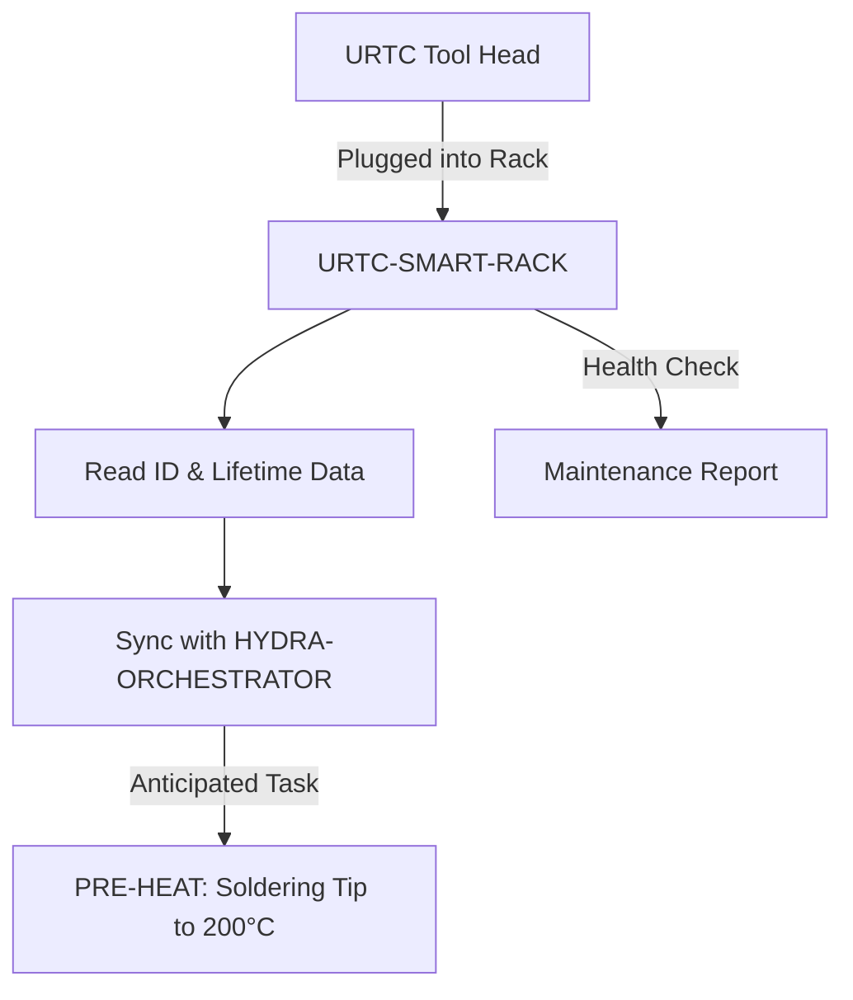

<p align="center">
  
</p>

# 🗄️ URTC-SMART-RACK

<p align="center"><a href="README.md">🇺🇸 English</a> | <a href="README_spa.md">🇪🇸 Español</a> | <a href="README_fra.md">🇫🇷 Français</a> | <a href="README_ita.md">🇮🇹 Italiano</a> | <a href="README_deu.md">🇩🇪 Deutsch</a> | 🇨🇳 <b>简体中文</b> | <a href="README_jpn.md">🇯🇵 日本語</a></p>

### 🤖 具备生命周期与热管理追踪的智能末端执行器管理系统

<p align="left">
  
  
  
  
</p>

---

## 1. 🛠️ 技术概述

**URTC-SMART-RACK** 是 HYDRA-UMC 生态系统内用于末端执行器的智能存储系统。
基于 STM32G4 微控制器，它在工具未安装到机器人上时对其进行监控和预处理。

它支持"智能待机"模式，例如在换刀前预热 T12 烙铁头，并跟踪每个 URTC
刀头的电子 ID、固件版本和总使用周期数，确保最佳维护和零延迟部署。

该板卡目前尚不存在 PCB/原理图（见 `hardware/`），因此下面的功能都无法驱动
真实的 GPIO/F-RAM/CAN 硬件——但这些功能所归结的*逻辑*（解码 ID、追踪使用
情况、决定何时以及以何种温度预热）是真实的、纯 C 编写的，并且今天已经过
单元测试。

### 关键特性：
* ✅ **真实 v0 —— ID、生命周期与预热逻辑：** `tool_id.c` 将原始 5 位 ID 读数解码为工具身份；`lifecycle.c` 追踪使用周期/时间并标记到期维护；`preheat.c` 决定智能待机预热应何时启动以及目标温度。使用宿主机自身的 C 编译器完成 25 个测试断言——无需 PCB、GPIO 驱动或 F-RAM 即可运行或测试这一切。
* 🗄️ **工具追踪** —— 通过 5 位 ID 跳线或 F-RAM 自动识别 URTC 刀头。*（ID 解码逻辑本身是真实的——见上文；读取真实跳线/F-RAM 需要 PCB。）*
* 🌡️ **预热逻辑** —— 针对焊接和热风工具的智能热管理。*（激活决策和目标温度是真实的——见上文；驱动真实加热器需要 PCB。）*
* 📈 **生命周期日志** —— 将总致动周期数和使用小时数记录到工具的 F-RAM 中。*（计数器和到期维护逻辑是真实的——见上文；将其持久化到真实 F-RAM 需要 PCB。）*
* 📡 **CAN 集成** —— 直接与 HYDRA-UMC 运动学大脑通信，实现协调的 ATC（自动换刀）。*（计划中——需要真实的 CAN 收发器。）*
* ✅ **Cortex-M4F 固件工具链** —— 一个真实的裸机镜像（启动文件 + 链接脚本 + `main.c`），使用与兄弟仓库 URTC 相同的工具链，通过 `arm-none-eabi-gcc` 交叉编译并链接。*（已实现——见下方"构建"）*

---

## 2. 🔄 智能架构工作流程



---

## 3. 🧱 架构与设计决策

* **为什么该板卡尚未定义真实的引脚布局/硬件 ID。** 该板卡目前尚无 PCB——`src/firmware_common.h` 携带一个没有硬件 ID 的版本标识，启动文件/链接脚本是手写的占位符，暂时代替 ST 自身的 CMSIS/HAL 启动代码，直到确定真实的 STM32G4 型号。
* **为什么它不是 URTC 自身的子项目。** URTC-SMART-RACK 是一个配套工具，而非 URTC 系列的子项目——它是一块独立的物理板卡（工具存储架，而非刀头本身），恰好共享 URTC 自身的 CAN 总线和固件惯例，而非其集成层级结构。
* **为什么 `bump_version.py` 直接复制自 URTC 自身。** 相同的里程表版本规则，相同的固件头格式——直接复用同一脚本而非重新发明，可以通过构造方式使两者天然保持同步。
* **为什么 `tool_id.c`/`lifecycle.c`/`preheat.c` 先于任何 GPIO/F-RAM/CAN 驱动交付。** 解码 ID、累积使用情况、决定何时预热，都是对已有数据的纯函数运算——无需 PCB 即可编写或测试，因此 v0 首先交付这部分逻辑，使用宿主机自身的 C 编译器而非 `arm-none-eabi-gcc` 进行宿主测试。真正从真实硬件获取这些数据的驱动程序，将在 PCB 存在后到来。
* **这如何融入生态系统的其余部分。** 共享 URTC 自身的 CAN 总线/工具生态系统，并与 HYDRA-UMC-DETECTION-HEF 自然搭配，用于视觉识别实际存放在架上的工具。

---

## 📂 目录结构

```text
URTC-SMART-RACK/
├── src/                            # 固件源代码
│   ├── firmware_common.h           # FIRMWARE_VERSION_MAJOR/MINOR/PATCH
│   ├── tool_id.h / .c              # 真实：原始 5 位读数解码 -> 工具 ID
│   ├── lifecycle.h / .c            # 真实：使用周期/时间追踪，到期维护检查
│   ├── preheat.h / .c              # 真实：智能待机激活 + 目标温度
│   ├── main.c                      # 最小入口点（存活证明心跳循环）
│   ├── startup_stm32g4_minimal.c   # 向量表 + Reset_Handler（暂无 ST HAL，见文件头说明）
│   └── STM32G4_MINIMAL.ld          # 占位链接脚本（128K FLASH / 32K RAM 下限）
├── tests/                          # 真实的宿主机原生测试工具集（tool_id、lifecycle、preheat）
├── docs/                           # 文档与用户手册
├── hardware/                       # 硬件设计文件（PCB、3D）—— 目前为空，尚无原理图
├── firmware/                       # 版本化构建输出（.bin/.elf/.hex），与兄弟仓库 URTC 一样被提交
├── build/                          # 中间构建对象（已被 gitignore）
├── images/                         # 媒体与图表
├── scripts/                        # 实用脚本
├── bump_version.py                 # 里程表式版本递增（通用脚本，与 URTC 共享）
├── build_firmware.sh / .bat        # 真实构建：宿主测试 + 版本递增 + 编译 + 链接 + 发布
└── README.md
```

---

## 4. ⚙️ 构建

需要 ARM GNU 工具链（`arm-none-eabi-gcc`、`arm-none-eabi-objcopy`、
`arm-none-eabi-size`）以及 Python 3。

```bash
# Linux/macOS
chmod +x build_firmware.sh   # 仅需一次
./build_firmware.sh

# Windows
build_firmware.bat
```

该构建首先使用*宿主机自身*的 C 编译器（绝不是 `arm-none-eabi-gcc`——这些
是纯逻辑测试，不涉及任何 MCU 寄存器）编译并运行 `tests/`，若任何断言失败
则整个构建失败。只有在此之后，它才会递增 `src/firmware_common.h` 中的
版本号（里程表规则，与生态系统其余部分一致），针对 Cortex-M4F 编译
`main.c` 和 `startup_stm32g4_minimal.c`，将其与占位性质的
`STM32G4_MINIMAL.ld` 内存映射进行链接，并将版本化的 `.elf`/`.bin`/`.hex`
文件发布到 `firmware/`。

目前尚无内容可刷写到真实硬件——因为没有 PCB 可以确认目标 STM32G4 型号、
引脚布局或其真实的 flash/RAM 容量。链接脚本的内存映射是一个保守的占位符
（在其自身的文件头注释中有说明），一旦真实硬件问世将被替换，届时
`startup_stm32g4_minimal.c` 手写的向量表也会被 ST 自身的 CMSIS/HAL 启动
代码取代（对应兄弟仓库 URTC 中针对 STM32F303 板卡的 `src/F303-master/`）。

真实示例——宿主机侧测试也可以独立运行，便于在不进行完整固件构建的情况下
检查逻辑：

```bash
cc -std=c11 -Wall -Wextra -Isrc -Itests -o build/host_tests \
  tests/test_main.c tests/test_tool_id.c tests/test_lifecycle.c tests/test_preheat.c \
  src/tool_id.c src/lifecycle.c src/preheat.c
./build/host_tests
# All tests passed.
```

---

## 🔗 相关项目

本项目是同一作者（JuanenRac / Electro Hobby 3D）打造的更大规模机器人生态
系统的一部分，涵盖固件、控制软件、AI 节点和车队工具。值得了解，因为某个
需求实际上可能是关于这些项目之一，而非本仓库。

### 直接相关

- **[URTC](https://github.com/JuanenRac/URTC)** —— 同一工具生态系统/CAN 总线。
- **[HYDRA-UMC-DETECTION-HEF](https://github.com/JuanenRac/HYDRA-UMC-DETECTION-HEF)** —— 对本工具架所存放工具的视觉识别。

### 生态系统的其余部分

**HYDRA-UMC 平台** —— 多机器人微工厂单元
- **[HYDRA-UMC](https://github.com/JuanenRac/HYDRA-UMC)** —— 协调最多 8 条机械臂的 CM5 + STM32H745 主板。
- **[HYDRA-UMC-SERVER](https://github.com/JuanenRac/HYDRA-UMC-SERVER)** —— 每个控制客户端所对接的 Express/WebSocket 后端。
- **[HYDRA-UMC-STUDIO](https://github.com/JuanenRac/HYDRA-UMC-STUDIO)** —— 基于 Web 的控制仪表盘，多机器人 3D 可视化。
- **[HYDRA-UMC-ANDROID-CONTROL](https://github.com/JuanenRac/HYDRA-UMC-ANDROID-CONTROL)** —— 通过 Wi-Fi/蓝牙的 Android 控制应用。
- **[HYDRA-UMC-IOS-CONTROL](https://github.com/JuanenRac/HYDRA-UMC-IOS-CONTROL)** —— 基于 Flutter 构建的 iOS/iPadOS 控制应用。
- **[HYDRA-UMC-SUITE](https://github.com/JuanenRac/HYDRA-UMC-SUITE)** —— 桌面端集群指挥中心（Python/PySide6）。
- **[HYDRA-UMC-EDITOR-URDF](https://github.com/JuanenRac/HYDRA-UMC-EDITOR-URDF)** —— 用于机器人目录的桌面端 URDF 模型编辑器。
- **[HYDRA-UMC-DSI](https://github.com/JuanenRac/HYDRA-UMC-DSI)** —— 机载 DSI 触摸屏的原生触控 UI。

**URTC 平台** —— 每台 HYDRA-UMC 机械臂搭载的工具头控制器
- **[URTC](https://github.com/JuanenRac/URTC)** —— CAN 总线工具头控制器，25 种工具配置。
- **[URTC-FLASHER](https://github.com/JuanenRac/URTC-FLASHER)** —— 桌面端 CAN-OTA + SWD/JTAG 刷写工具。
- **[URTC-TESTER](https://github.com/JuanenRac/URTC-TESTER)** —— 桌面端实时 CAN 总线诊断工具。
- **[URTC-WEB-STUDIO](https://github.com/JuanenRac/URTC-WEB-STUDIO)** —— 通过 Web Serial API 的浏览器端替代方案。

**🎥 视觉 AI 节点（Hailo-8）**
- [HYDRA-UMC-VISION-NODE](https://github.com/JuanenRac/HYDRA-UMC-VISION-NODE)
- [HYDRA-UMC-VISION-STREAMER](https://github.com/JuanenRac/HYDRA-UMC-VISION-STREAMER)
- [HYDRA-UMC-DETECTION-HEF](https://github.com/JuanenRac/HYDRA-UMC-DETECTION-HEF)
- [HYDRA-UMC-SAFETY-ZONES](https://github.com/JuanenRac/HYDRA-UMC-SAFETY-ZONES)
- [HYDRA-UMC-VISUAL-SERVOING-API](https://github.com/JuanenRac/HYDRA-UMC-VISUAL-SERVOING-API)

**🧠 认知 AI 节点（Hailo-10）**
- [HYDRA-UMC-COGNITIVE-NODE](https://github.com/JuanenRac/HYDRA-UMC-COGNITIVE-NODE)
- [HYDRA-UMC-VLA-ENGINE](https://github.com/JuanenRac/HYDRA-UMC-VLA-ENGINE)
- [HYDRA-UMC-VOICE-UI](https://github.com/JuanenRac/HYDRA-UMC-VOICE-UI)
- [HYDRA-UMC-SEMANTIC-PLANNER](https://github.com/JuanenRac/HYDRA-UMC-SEMANTIC-PLANNER)
- [HYDRA-UMC-DOCS-QA](https://github.com/JuanenRac/HYDRA-UMC-DOCS-QA)

**🐝 编排与集群**
- [HYDRA-UMC-ORCHESTRATOR](https://github.com/JuanenRac/HYDRA-UMC-ORCHESTRATOR)
- [HYDRA-UMC-SWARM-SYNC](https://github.com/JuanenRac/HYDRA-UMC-SWARM-SYNC)
- [HYDRA-UMC-PATH-PLANNER-3D](https://github.com/JuanenRac/HYDRA-UMC-PATH-PLANNER-3D)
- [HYDRA-UMC-JOB-DISPATCHER](https://github.com/JuanenRac/HYDRA-UMC-JOB-DISPATCHER)
- [HYDRA-UMC-NODE-HEALING](https://github.com/JuanenRac/HYDRA-UMC-NODE-HEALING)

**🎮 数字孪生与仿真**
- [HYDRA-UMC-TWIN](https://github.com/JuanenRac/HYDRA-UMC-TWIN)
- [HYDRA-UMC-PHYSICS-REPLICA](https://github.com/JuanenRac/HYDRA-UMC-PHYSICS-REPLICA)
- [HYDRA-UMC-HIL-BRIDGE](https://github.com/JuanenRac/HYDRA-UMC-HIL-BRIDGE)
- [HYDRA-UMC-SYNTHETIC-DATA-GEN](https://github.com/JuanenRac/HYDRA-UMC-SYNTHETIC-DATA-GEN)

**📊 数据与分析**
- [HYDRA-UMC-DATALAKE](https://github.com/JuanenRac/HYDRA-UMC-DATALAKE)
- [HYDRA-UMC-TELEMETRY-COLLECTOR](https://github.com/JuanenRac/HYDRA-UMC-TELEMETRY-COLLECTOR)
- [HYDRA-UMC-ANOMALY-DETECTOR](https://github.com/JuanenRac/HYDRA-UMC-ANOMALY-DETECTOR)
- [HYDRA-UMC-PRODUCTION-REPORTS](https://github.com/JuanenRac/HYDRA-UMC-PRODUCTION-REPORTS)

**🏭 工业网关**
- [HYDRA-UMC-GATEWAY-INDUSTRIAL](https://github.com/JuanenRac/HYDRA-UMC-GATEWAY-INDUSTRIAL)
- [HYDRA-UMC-OPCUA-SERVER](https://github.com/JuanenRac/HYDRA-UMC-OPCUA-SERVER)
- [HYDRA-UMC-MQTT-BROKER](https://github.com/JuanenRac/HYDRA-UMC-MQTT-BROKER)
- [HYDRA-UMC-MTCONNECT-ADAPTER](https://github.com/JuanenRac/HYDRA-UMC-MTCONNECT-ADAPTER)

**🛠️ 配套工具**
- [URTC-VISION-TOOL](https://github.com/JuanenRac/URTC-VISION-TOOL)
- [HYDRA-UMC-WATCH](https://github.com/JuanenRac/HYDRA-UMC-WATCH)
- [HYDRA-UMC-TOOL-CLI](https://github.com/JuanenRac/HYDRA-UMC-TOOL-CLI)
- [HYDRA-UMC-DASHBOARD-AI](https://github.com/JuanenRac/HYDRA-UMC-DASHBOARD-AI)


## 👤 作者
**JuanenRac**（Electro Hobby 3D）
📧 electrohobby3d@gmail.com

## 📜 许可证
GPL-3.0 —— 详见 LICENSE。

## 🛠️ BUILD & RUN

请在发布构建前使用不改动版本的构建检查：

| 操作 | Windows | Linux / macOS |
|---|---|---|
| 构建检查（不修改版本或 CHANGELOG） | `build-test.bat` | `./build-test.sh` |
| 运行 / 开发（如提供） | `run*.bat` 或 `dev*.bat` | `./run*.sh` 或 `./dev*.sh` |

`build-test.bat` 和 `build-test.sh` 会编译或验证项目技术栈，但不会递增 `hydra-umc.project.json`，也不会修改 `CHANGELOG.md`。它们仅可能生成正常的编译器输出。现有的 `build*.bat`、`build*.sh`、`run*` 和 `dev*` 脚本保留各自的版本化或运行时行为；需要该行为时请使用它们。